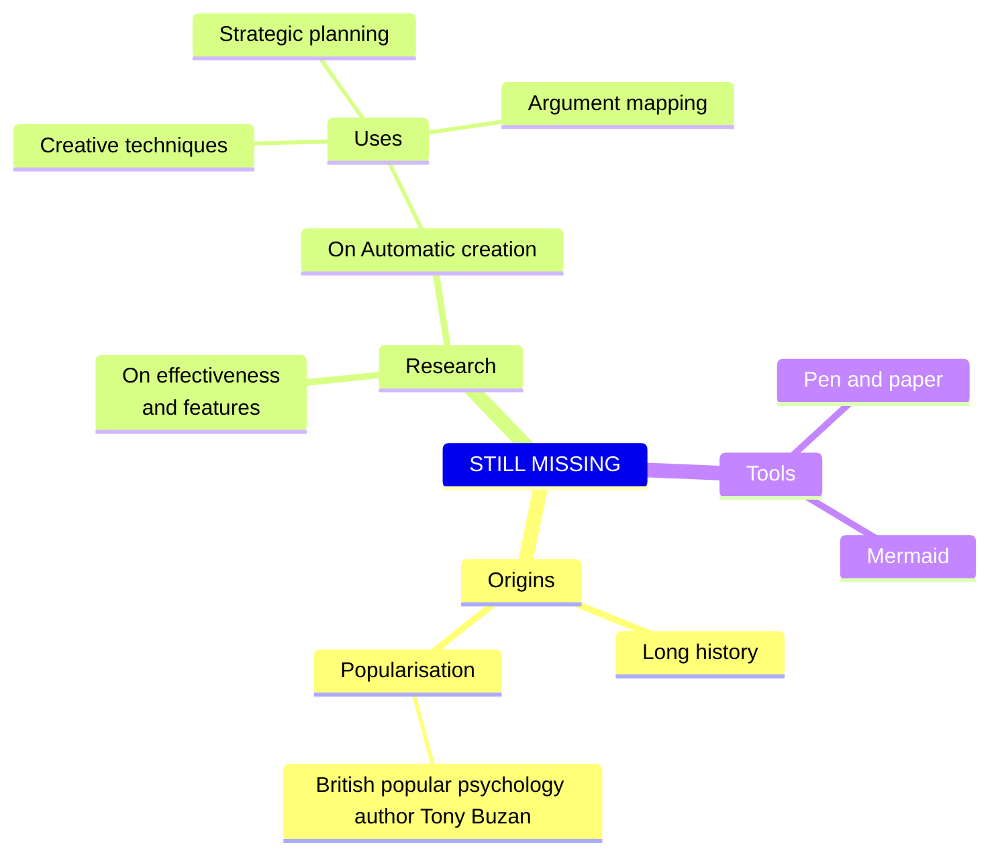
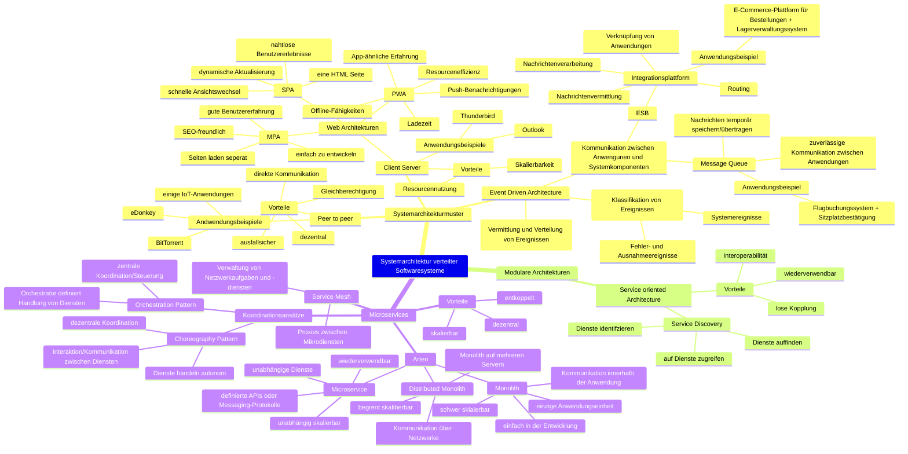
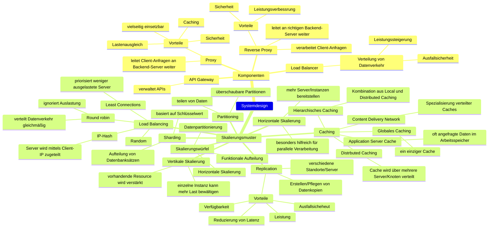

## Kapitelüberschrift

**Autor:** Jannis Wilmsmeier

Folgende Mindmaps zeigen die Inhalte des Kapitels 2.

## Verteilte Softwaresysteme

## Systemarchitektur verteilter Softwaresysteme

## Systemdesign

