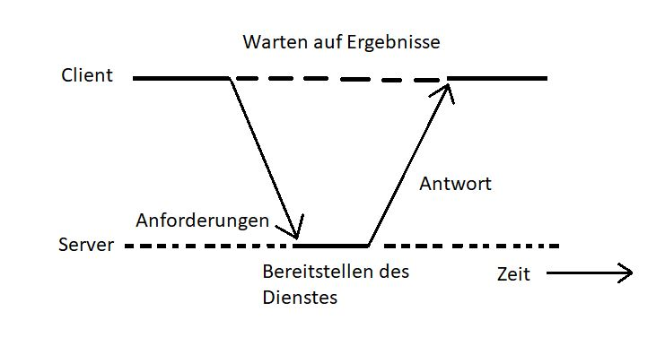

class: center, middle

## [Software Engineering](../../praesentationen.html)

#### Kapitel 2

Simon Fedrau, Jannis Wilmsmeier, Sascha Hahn

---
# Inhalt
***

1. Verteilte Softwaresysteme

1. Systemarchitektur verteilter Softwaresysteme

1. Systemdesign

1. Zusammenfassung

1. Quellen

---

# Verteilte Softwaresysteme

- ## Eigenschaften, Vorteile, Nachteile
- ## Motivation
- ## Ditributed vs Decentralized
- ## Concurrent vs Parallel

---

## Eigenschaften, Vorteile, Nachteile
- #### erhöhung der Leistungsfähigkeit
- #### Skalierbarkeit
- #### Ausfallsicherheit
[1,2]

---
## Eigenschaften, Vorteile, Nachteile

| Vorteile|Nachteile|
|:-------|:-------|
|einfache Sklierbarkeit bei steigenden Anforderungen|Synchronisierung und Koordinierung aufwändig|
|durch Redundante Geräte bessere Ausfallsicherheit|Suche nach Fehlern möglicherweise schwierig wenn man Gerät nicht kennt|
|Entwickler und Benutzer müssen die Verteilung nicht kennen(Transparenz)|Daten müssen bessere gesichert werden|
|Verscheidene Software und Hardwresysteme einbaubar(Heterogenität)||
[1,2]

---

## Motivation (Warum man Verteilung braucht)
Wie schon bei den Vor- und Nachteilen zu sehen bieten verteilte Systeme viele möglichkeiten zur Systemverbesserung, wie z.B. die Skalierbarkeit, Ausfallsicherheit, Transparenz und Heterognetität. Diese Eigenschaften sind in der heutigen Zeit sehr wichtig, da die Anforderungen an die Systeme immer weiter steigen. Verteilte Systeme sind zwar deutlich komplexer und aufwändiger zu entwickeln, bieten aber die Möglichkeiten große Systeme anforderungsgerecht aufzubauen
- #### Skalierbarkeit
- ### -> immer höhere werdende Anforderungen
- #### Ausfallsicherheit
- #### bei geoßen Systemen überwiegen Vorteile die Komplexität
[1,2]

---

## Distributed vs decentralized
### Distributed:
- #### Verteilung der Software auf physisch getrennte Geräte
### Decentralized:
- #### Entscheidungen werden von mehreren Instanzen getroffen
[3]

---

## Concurrent vs parallel
### Def.: Mehrere Aufgaben gleichteitig bearbeiten
### Concurrent:
- #### schnell hintereinander/abwechselnd
### Parallel:
- #### tatsächlich gleichzeitige verrarbeitung
[17]

## Systemarchitektur verteilter Softwaresysteme
***

- ### Visualisierung von Systemarchitekturen
- ### Systemarchitekturmuster
- ### Modulare Architekturen

---

## Visualisierung von Systemarchitekturen
***
Muss noch gemacht werden, vlt paar Bilder oder so 

1. # Muss noch gemacht werden 

2. # Muss noch gemacht werden 

3. # Muss noch gemacht werden 

---

## Systemarchitekturmuster
***
Auch bekannt als Architekturmuster oder Entwurfsmuster, sind erprobte Lösungsansätze für wiederkehrende Herausforderungen im Softwarearchitekturdesign

- Muster fungieren als Leitfaden und Vorlage

- Sie tragen zur Effizienz und Wartbarkeit der Software bei

- Nachfolgend sind häufig verwendete Systemarchitekturmuster aufgeführt

- Client Server/ Peer to Peer/ Event Driven Architecture
 
---

  ## Client-Server
  ***
  - Besteht aus zwei Komponenten, Client und Server

  - Client verarbeitet Benutzeranfragen
  - Server stellt Daten und Dienste bereit

  - Anwendungsbespiel wären Web Architekturen

[3,17]
---
## Web Architekturen
***

- Einfach ausgedrückt, ist die Architektur einer Webanwendung eine Übersicht darüber, wie die verschiedenen Komponenten deiner Webanwendung miteinander interagieren.

- Webanwendungen könne so einfach wie die Beziehung zwischen dem Client und dem Server sein, aber auch so komplex sein, dass sie die Beziehungen zwischen einem Schwarm von Container-Backend-Servern, Load Balancern, API-Gateways und benutzerorientierten Single-Page-Frontends definiert

- Beispiele für Web Architekturen sind die im vollgenden beschriebenen PWAs, SPAs und MPAs

---

### PWA
***

##### PWAs sind webbasierte Anwendungen, die eine App-ähnliche Erfahrung bieten. Sie zeichnen sich durch Ressourceneffizienz, Offline-Fähigkeiten, Push-Benachrichtigungen und schnelle Ladezeiten aus. PWAs sind auf verschiedenen Geräten und Betriebssystemen nutzbar.

|  | Vorteile | Nachteile | 
|:------:|:----------:|:----------:| :----------:|
| **PWA** | Apps laufen sehr flüssig und bieten plattformübergreifende Kompatibilität, Die Skalierbarkeit ist einfach, Offline-Zugriff und gerätenative APIs wie Background Worker und Push-Benachrichtigungen sind für Entwickler/innen zugänglich | Es gibt eine begrenzte Unterstützung für Linkmanagement und SEO, Die Übertragung von Updates auf Offline-PWAs ist komplexer als bei nativen Apps |
| **SPA** | SPAs sind einfach zu skalieren, ie Optimierung von SPAs für die Leistung erfordert keinen großen Aufwand, Du kannst hochgradig interaktive Webanwendungen erstellen,  | SPAs schränken die Flexibilität bei Hyperlinks und SEO ein, Das anfängliche Rendern ist in der Regel langsam, Die Navigation durch die App kann unintuitiv sein |
| **MPA** | MPA sind tendenziell besser für SEO, da jede Seite eine eindeutige URL hat,  MPA bieten eine traditionelle Navigationsstruktur mit klaren Seitentrennungen, die für Benutzer vertraut ist, Da nur der Inhalt einer Seite geladen wird, sind MPA oft schneller beim initialen Laden | Die Entwicklung von MPA kann komplexer sein, da Entwickler sich mit der Handhabung von Seitennavigation und -zuständen befassen müssen, MPAs sind weniger geeignet für dynamische Inhalte, die häufige Aktualisierungen erfordern, ohne die gesamte Seite neu zu laden |  | 
[4,5,17]
---
## Systemarchitekturmuster Peer to Peer
***
Das Peer-to-Peer (P2P)-Systemarchitekturmuster ist eine Art von Architektur, bei der Computer oder Knoten (Peers) gleichberechtigt miteinander kommunizieren, um Ressourcen, Dienste oder Informationen gemeinsam zu nutzen, ohne die Notwendigkeit eines zentralen Servers oder einer zentralen Autorität.

Beispiele:
- Filesharing-Netzwerken wie BitTorrent oder das ursprüngliche Napster

- Internet of Things, in einigen IoT-Anwendungen kommunizieren IoT-Geräte direkt miteinander über P2P-Netzwerke, um Daten auszutauschen und Aufgaben zu automatisieren
[2,5,17]
---
# Event Driven Architecture
***

Event-Driven Architecture (EDA), ist ein architektonisches Muster, bei dem die Kommunikation und Informationsverarbeitung zwischen Systemkomponenten durch das Senden und Empfangen von Ereignissen strukturiert ist

- Event Types

- Message Broker
- ESB vs Message Broker

[6,17]
---
## Event Types
***
In einer ereignisgesteuerten Architektur (Event-Driven Architecture, EDA) repräsentieren Event-Typen verschiedene Kategorien oder Klassifikationen von Ereignissen, die in einem System auftreten können

- Systemereignisse: Systemereignisse sind Ereignisse, die durch den Betriebssystem oder niedrigeren Ebenen des Systems ausgelöst werden.

- Fehler- und Ausnahmeereignisse: Diese Event-Typen repräsentieren Fehler, Ausnahmen oder unerwartete Bedingungen im System. Sie umfassen etwa Fehlerprotokolle, Absturzmeldungen und Fehlerbenachrichtigungen.

---
## Message Broker 
***
Ein Message Broker in einer EDA ist eine spezialisierte Softwarekomponente oder ein Dienst, der die Vermittlung und Verteilung von Ereignissen oder Nachrichten zwischen verschiedenen Komponenten, Anwendungen oder Diensten im System ermöglicht. Der Message Broker übernimmt die Aufgabe eines Vermittlers, indem er Nachrichten empfängt, weiterleitet und an die entsprechenden Empfänger weitergibt

- Nachrichtenvermittlung: Der Message Broker fungiert als Zwischenschicht, um die Kommunikation zwischen verschiedenen Komponenten zu ermöglichen. Er nimmt Nachrichten von Produzenten Ereignisproduzenten entgegen und leitet sie an die entsprechenden Konsumenten Ereignisverbraucher weiter

---
## ESB vs Message Queue
***
Ein Enterprise Service Bus (ESB) und eine Message Queue (Nachrichtenwarteschlange) sind zwei unterschiedliche Technologien, die in EDAs verwendet werden, um die Kommunikation und Koordination zwischen Anwendungen und Systemkomponenten zu ermöglichen. Sie erfüllen spezifische Funktionen und haben unterschiedliche Einsatzzwecke

Funktionalität: 

- ESB ist eine umfassende Integrationsplattform, die verschiedene Anwendungen miteinander verknüpft und Nachrichtenvermittlung, Routing und umfangreiche Nachrichtenverarbeitungsfunktionen bietet.
- Message Queues sind Mechanismen zur Nachrichtenvermittlung und Fokussieren sich darauf, Nachrichten temporär zu speichern und zu übertragen, um eine zuverlässige Kommunikation zwischen Anwendungen zu ermöglichen.

[7,17]
---

## ESB vs Message Queue 
***
 ESB bietet umfassende Integrationsmöglichkeiten, Routing- und Transformationsfunktionen sowie Protokollübersetzung für komplexe Integrationsszenarien. Message Queues sind die zuverlässige Nachrichtenübermittlung und die Bewahrung der Entkopplung zwischen Anwendungen ausgerichtet, wobei sie weniger komplexe Routing- und Transformationsmöglichkeiten bieten.

Gemeinsamkeiten: 

Trotz dieser Unterschiede weisen beide Technologien einige Gemeinsamkeiten auf, darunter die Entkopplung, Nachrichtenvermittlung, Skalierbarkeit und Fehlertoleranz. Diese Merkmale sind für viele ereignisgesteuerte Architekturen von großer Bedeutung.

[7,17]
---

## Anwendunsbeispiele Event Type, ESB, Message Broker 
***

- Event Type:

  Ereignistyp: "Benutzerregistrierung"
  Beschreibung: Dieser Ereignistyp wird ausgelöst, wenn ein neuer Benutzer sich in einer Webanwendung registriert.
  Beispielereignis: Ein Benutzer mit dem Namen "Max" hat sich erfolgreich registriert.

- Message Broker:

  Sender: Eine Webanwendung, die Benutzerregistrierungen verarbeitet.
  Empfänger: Ein Benachrichtigungsdienst, der E-Mails an Administratoren sendet.
  Ablauf:
  Die Webanwendung sendet eine Benutzerregistrierungsanfrage an den Message Broker "EventHub".
  Der EventHub leitet das Ereignis an den Benachrichtigungsdienst weiter.
  Der Benachrichtigungsdienst sendet eine E-Mail an die Administratoren über die neue Benutzerregistrierung.

---
## Anwendunsbeispiele Event Type, ESB, Message Broker 
***
- Anwendungsbeispiel ESB:

  Anwendung A: Eine E-Commerce-Plattform für Bestellungen.
  Anwendung B: Ein Lagerverwaltungssystem für die Bestandsverwaltung.
  Ablauf:
  Ein Kunde tätigt eine Bestellung auf der E-Commerce-Plattform (Anwendung A).
  Die E-Commerce-Plattform sendet die Bestellnachricht an den ESB.
  Der ESB wandelt die Nachricht in ein für das Lagerverwaltungssystem (Anwendung B) verständliches Format um und leitet sie dorthin weiter.
  Das Lagerverwaltungssystem aktualisiert den Lagerbestand und sendet eine Bestätigungsnachricht an den ESB.
  Der ESB leitet die Bestätigungsnachricht zurück an die E-Commerce-Plattform.
---
## Anwendunsbeispiele Event Type, ESB, Message Broker 
***
- Anwendungsbeispiel Message Queue:

  Message Queue:
  Anwendung A: Ein Flugbuchungssystem.
  Anwendung B: Ein Sitzplatzbestätigungsdienst.
  Ablauf:
  Ein Kunde bucht einen Flug über das Flugbuchungssystem (Anwendung A).
  Die Buchungsanfrage wird in die Message Queue gestellt.
  Der Sitzplatzbestätigungsdienst (Anwendung B) überwacht die Message Queue und empfängt die Buchungsanfrage.
  Der Sitzplatzbestätigungsdienst bestätigt den Sitzplatz und legt die Buchungsbestätigung in die Message Queue.
  Die Buchungsbestätigung wird an das Flugbuchungssystem zurückgegeben, und der Kunde erhält eine Bestätigung

---

## Modulare Architekturen
***
Modulare Architekturen in verteilten Softwaresystemen beziehen sich auf eine Designmethode, bei der das Gesamtsystem in separate, unabhängige Module oder Komponenten aufgeteilt wird. Jedes Modul erfüllt eine spezifische Funktion und ist so gestaltet, dass es eigenständig agieren kann. Diese Module sind in der Lage, miteinander zu kommunizieren und zusammenzuarbeiten, um die gewünschte Gesamtfunktionalität des verteilten Systems bereitzustellen.

- Service oriented architecture (SOA)

- Microservices

---
## Service Discovery
***

Service-Oriented Architecture ist ein Softwareentwurfsansatz, bei dem Softwarefunktionen als eigenständige Dienste organisiert sind. Diese Dienste bieten klare Schnittstellen für den Aufruf und sind wiederverwendbar. SOA fördert die lose Kopplung zwischen Diensten, verbessert die Interoperabilität und ermöglicht die Orchestrierung von Diensten zur Erstellung komplexer Geschäftsprozesse.

#### Service Discovery

- Service Discovery ist von großer Bedeutung in einer SOA und anderen verteilten Systemen. Dieser Prozess bezieht sich darauf, wie Dienste in einem verteilten Netzwerk automatisch identifiziert und aufgefunden werden. In SOA ist Service Discovery entscheidend, um Dienste zu entdecken, auf sie zuzugreifen und sie in Anwendungen zu verwenden.

[9,17]
---

## Microservices
***
Microservices sind spezielle Module in modularen Architekturen, die häufig in einer Service-Oriented Architecture (SOA) oder einer verteilten Systemarchitektur zum Einsatz kommen. Diese Module repräsentieren eigenständige, in sich geschlossene Dienste, die spezifische Geschäftsfunktionen oder Aufgaben in einer Anwendung bereitstellen. Der Hauptfokus von Microservices liegt auf einer stark entkoppelten, dezentralen und skalierbaren Architektur.

---
## Monolith vs. Distributed Monolith vs. Microservice
***

Architektur 
- Monolith: Eine einzige, zusammenhängende Anwendungseinheit.

- Distributed Monolith: Ein Monolith, bei dem Teile auf mehrere Server verteilt sind, aber die Struktur eines Monolithen beibehalten  wird.
- Microservices: Eine Sammlung kleiner, unabhängiger Dienste.

Kommunikation

 - Monolith: Interne Kommunikation erfolgt direkt innerhalb der Anwendung, normalerweise über Funktionen oder Methodenaufrufe.

 - Distributed Monolith: Interne Kommunikation erfolgt in der Regel über das Netzwerk, aber die Struktur ähnelt einem Monolithen.

 - Microservices: Dienste kommunizieren über definierte APIs, oft über HTTP-REST oder Messaging-Protokolle.

[10,17]
---
## Monolith vs. Distributed Monolith vs. Microservice
***
Skalierbarkei
- Monolith: In der Regel schwieriger zu skalieren, da die gesamte Anwendung zusammenhängt.
- Distributed Monolith: Skalierung kann auf einzelne Teile des Monolithen beschränkt sein.
- Microservices: Dienste sind unabhängig skalierbar, was eine fein abgestimmte Skalierung ermöglicht.

Fazit

Monolithen sind einfacher und schneller zu entwickeln, haben jedoch Schwierigkeiten bei der Skalierung und Wartung. Distributed Monoliths sind eine Möglichkeit, eine größere Anwendung auf mehrere Server zu verteilen, behalten jedoch einige Nachteile von Monolithen bei. Microservices bieten Flexibilität und Skalierbarkeit, erfordern jedoch mehr Entwicklungs- und Wartungsaufwand. Die Entscheidung sollte auf Grundlage der Projektanforderungen, der Teamfähigkeiten und der Zukunftsaussichten getroffen werden.

[10,17]
---
## Choreography Pattern
***

- Choreography Pattern betont die dezentrale Interaktion und Autonomie der Dienste.

- Dienste handeln autonom und reagieren auf Ereignisse oder Nachrichten von anderen Diensten.
- Keine zentrale Steuerungseinheit - Dienste initiieren Aktionen basierend auf empfangenen Nachrichten.

- Häufig in Microservices-Architekturen verwendet.

[11,17]
---

## Orchestration Pattern
***

- Orchestration Pattern konzentriert sich auf zentrale Steuerung und Koordination."

- Enthält eine zentrale Entität, den Orchestrator, der den Ablauf und die Reihenfolge der Aufgaben festlegt.

- Definiert, wie Dienste miteinander interagieren und initiiert Aufgaben basierend auf einem Workflow.

- In BPM, Workflow-Systemen und Service-Oriented Architecture eingesetzt.

[11,17]
---
## Choreography Pattern vs Orchestration Pattern
***

Zusammenfassend lassen sich die Unterschiede zwischen dem Choreography Pattern und dem Orchestration Pattern wie folgt festhalten:
Das Choreography Pattern legt den Fokus auf dezentrale Interaktion und die Autonomie der Dienste.
Das Orchestration Pattern betont eine zentrale Steuerung und Koordination durch einen Orchestrator.

Die Wahl zwischen Choreography und Orchestration hängt von den spezifischen Anforderungen eines Systems und der gewünschten Art der Steuerung ab. Choreography bietet Autonomie und Flexibilität für Dienste, während Orchestration eine genauere Kontrolle über den Ablauf von Aufgaben ermöglicht. In vielen Fällen können sie auch miteinander kombiniert werden, um komplexe Systeme zu erstellen, die sowohl die Autonomie der Dienste als auch eine zentrale Steuerung nutzen.

Trotz dieser Unterschiede haben beide Muster gemeinsame Ziele
Die Organisation und Steuerung der Zusammenarbeit und Interaktion zwischen Diensten oder Komponenten in verteilten Systemen.

[11,17]
---

## Service Mesh
***

Ein Service Mesh ist eine spezielle Komponente in Microservices-Architekturen. Es besteht aus einer Gruppe von Proxies, die zwischen den einzelnen Mikrodiensten in einer verteilten Anwendung platziert sind. Diese Proxies übernehmen die Verwaltung verschiedener Netzwerkaufgaben und -dienste, um die Kommunikation, Sicherheit, Zuverlässigkeit und Überwachung der Dienste in einem Microservices-System zu gewährleisten.

Bsp:
  Sie betreiben ein E-Commerce-System, das auf einer Microservices-Architektur basiert. In diesem System gibt es verschiedene Dienste, wie den Benutzerservice, den Produktservice und den Bestellungsservice, die miteinander interagieren müssen. Ein Service Mesh unterstützt Sie bei der Verwaltung dieser Interaktionen.

[12,17]
---

## Systemdesign
***
Systemdesign beinhaltet architektonische Entscheidungen darüber, wie verschiedene Komponenten eines Systems interagieren und funktionieren sollten. In diesem Zusammenhang sind API-Gateway, Proxy, Reverse Proxy und Lastenausgleicher Komponenten, die unterschiedliche Zwecke in einem System erfüllen. Lassen Sie uns jede von ihnen besprechen

---

## API Gateway vs Proxy vs Reverse Proxy vs Load Balancer
***
- API-Gateway: Verwaltet APIs, einschließlich Routen, Sicherheit und Analyse. Bietet Funktionen wie API-Dokumentation und   Versionierung. Schwerpunkt auf API-Verwaltung.

- Proxy: Leitet Client-Anfragen an Backend-Server weiter. Kann Lastenausgleich, Caching und Sicherheit bieten, ist vielseitig   einsetzbar.

- Reverse Proxy: Verarbeitet Client-Anfragen, um sie an die richtigen Backend-Server weiterzuleiten. Fokussiert auf Sicherheit und Leistungsverbesserung.

- Lastenausgleicher: Verteilt Datenverkehr auf Server zur Leistungssteigerung und Ausfallsicherheit. Spezialisiert auf gleichmäßige Lastenverteilung und Serverüberwachung.

---

## Skalierungsmuster
***

Ein Skaliermuster bezieht sich auf bewährte Praktiken und Techniken, die verwendet werden, um die Skalierbarkeit eines Systems zu ermöglichen oder zu verbessern. Die Skalierbarkeit eines Systems bezieht sich auf seine Fähigkeit, eine wachsende Anzahl von Benutzern, Daten oder Lasten zu bewältigen, ohne dass die Leistung erheblich beeinträchtigt wird. Skaliermuster dienen dazu, die Struktur und die Komponenten eines Systems so zu gestalten, dass es in der Lage ist, mit steigender.

[17]
---

## Horizontale Skalierung
***
Bei diesem Muster werden zusätzliche Ressourcen hinzugefügt, indem mehr Server oder Instanzen eines Dienstes bereitgestellt werden. Dies erhöht die Kapazität des Systems, indem die Last auf mehrere Ressourcen verteilt wird. Es ist besonders nützlich für Systeme, die viele parallele Anfragen verarbeiten müssen.

[17]
---
## Vertikale Skalierung
***

Hierbei wird die Leistungsfähigkeit einer vorhandenen Ressource durch Hinzufügen von CPU, RAM oder anderen Ressourcen erhöht. Dies ist effektiv, wenn ein einzelner Server oder eine einzelne Instanz mehr Last bewältigen muss.

[17]
---

## Horizontale Skalierung vs vertikale Skalierung
***

Sowohl horizontale als auch vertikale Skalierung sind Skalierungsstrategien, die darauf abzielen, die Leistungsfähigkeit und Kapazität eines Systems zu erhöhen, um mehr Benutzer, Daten oder Lasten zu bewältigen.

[17]
---

## Replication
***

Replikation bedeutet das Erstellen und Pflegen von Kopien von Daten an verschiedenen Standorten oder Servern. Das Hauptziel ist, Leistung, Verfügbarkeit und Ausfallsicherheit zu verbessern. Daten werden redundant gespeichert, um Ausfallsicherheit zu erhöhen und Lasten zu verteilen. Replikation kann auch zur Reduzierung der Latenz für Benutzer in verschiedenen Regionen verwendet werden und ist entscheidend für die Skalierung und Zuverlässigkeit von Systemen.

---
## Partitioning und Sharding
***

Der Begriff "Partitioning" und "Sharding" werden oft synonym verwendet, da beide Konzepte auf die Aufteilung großer Datenmengen in kleinere Teile abzielen, um die Leistung und Skalierbarkeit zu verbessern. Der Hauptunterschied besteht im Kontext, in dem sie verwendet werden, und in den damit verbundenen Konzepten

- Partitioning bezieht sich auf das Teilen von Daten oder Ressourcen in überschaubare Teile oder Partitionen. Partitionierung kann auf der Ebene von Dateien, Datenbanktabellen oder beliebigen Ressourcen erfolgen

- Sharding ist ein spezifischer Begriff im Kontext von Datenbanken. Sharding bezieht sich auf die Aufteilung von Datenbankdatensätzen in separate Server oder Datenbankinstanzen (Shards) basierend auf einem Schlüsselwert, wie z. B. Benutzername oder Region. In Sharding-Szenarien müssen Mechanismen zur Synchronisation und Aufrechterhaltung der Konsistenz zwischen den Shards implementiert werden.

[14,17]
---
## Load Balancing
***
Load Balancing ist eine Technik im Systemdesign und in der Netzwerkarchitektur. Sie verteilt eingehenden Netzwerkverkehr oder Anfragen auf verschiedene Server oder Ressourcen, um die Last gleichmäßig zu verteilen und die Leistung, Zuverlässigkeit und Verfügbarkeit des Systems zu steigern. Der Hauptzweck des Lastenausgleichs besteht darin, sicherzustellen, dass keine einzelne Serverinstanz oder Ressource überlastet wird, während andere unterausgelastet sind.

---

## Round Robin und andere Algorithmen
***
- Round Robin: Dieser Algorithmus verteilt den Datenverkehr gleichmäßig auf eine Liste von Servern oder Ressourcen. Jede Anfrage wird nacheinander an den nächsten Server in der Liste weitergeleitet. 

- Least Connections (Wenigste Verbindungen): Bei diesem Algorithmus werden Anfragen an den Server mit der geringsten Anzahl aktiver Verbindungen weitergeleitet. Dies gewährleistet, dass weniger ausgelastete Server priorisiert werden und ist hilfreich, wenn die Server unterschiedliche Lasten aufweisen.

- IP-Hash: Bei diesem Ansatz wird die IP-Adresse des Clients zur Ermittlung des Zielservers verwendet. Dies sorgt dafür, dass ein bestimmter Client bei wiederholten Anfragen immer zum gleichen Server weitergeleitet wird. Dies kann wichtig sein, wenn Sitzungsinformationen oder zustandsbezogene Daten auf dem Server gespeichert sind

[15,17]
---

## Caching
*** 
Caching bedeutet, häufig verwendete Daten vorübergehend zu speichern, um den Zugriff zu beschleunigen und die Belastung der ursprünglichen Datenquelle zu verringern. Das verbessert die Leistung und Skalierbarkeit von Systemen, indem wiederholte Anfragen schneller bedient werden.

- Bei Local Caching wird der Cache auf einer einzelnen lokalen Maschine oder einem Server gespeichert.
- Beim Distributed Caching wird der Cache über mehrere Server oder Knoten im Netzwerk verteilt.
- Hierarchical Caching beinhaltet eine Kombination aus Local und Distributed Caching in einem hierarchischen Aufbau.
- Hierarchical Caching beinhaltet eine Kombination aus Local und Distributed Caching in einem hierarchischen Aufbau.
- Ein Content Delivery Network ist eine spezialisierte Form des verteilten Cachings, das auf die Bereitstellung von Inhalten, wie   Bilder, Videos und Webseiten, spezialisiert ist. 

[17,18]
---

## Skalierungswürfel
***
-  X-Achse (Horizontale Skalierung)
Zusätzliche Instanzen oder Server werden hinzugefügt, um die Last zu verteilen.
In Cloud-Umgebungen zur Bewältigung von Lastspitzen und zur Steigerung der Ausfallsicherheit verwendet.

- Y-Achse (Funktionale Aufteilung)
Die Anwendung wird in separate Funktionen oder Dienste aufgeteilt.
Verbessert Skalierbarkeit und Wartbarkeit.
Jeder Dienst kann unabhängig skaliert und gewartet werden.

- Z-Achse (Datenpartitionierung):
Daten werden in separate Partitionen aufgeteilt.
Steigert Leistung und Skalierbarkeit der Datenverarbeitung.
Kann durch Sharding oder Replikation erfolgen, um große Datenmengen zu bewältigen.

[17,19]

---
## Fragen 

- Warum braucht man verteilung für Softwaresysteme
- Was ist der unterschied zwischen destributed und decentralized
- Welche Systemarchitekturmuster gibt es?
- Was für Event Types gibt es?
- Was für arten von Microservices gibt es 
- Worin unterscheiden sich Choreography Pattern und Orchestration Pattern
- Was für Komponenten gibt es in einem System
- Was für Load Balancing Alogrithmen gibt es?
- Was für arten von Caching gibt es?
- Was sind die drei Achsen des Skalierungswürfels

---
#### Referenzen
***
###### [1]  :https://de.wikipedia.org/wiki/IT-Architektur  
###### [2]  :https://www.heise.de/blog/Was-ist-Architektur-4931898.html
###### [3]  :https://www.fonial.de/wissen/begriff/client-server-modell/
###### [4]  :https://www.linkedin.com/pulse/mpa-spa-pwa-whats-difference-how-does-work-together-marek-kubacak 
###### [5]  :https://kinsta.com/de/blog/web-anwendungs-architektur/
###### [6]  :https://innowise-group.com/de/blog/best-software-architecture-patterns/
###### [7]  :https://en.wikipedia.org/wiki/Event-driven_architecture 
###### [8]  :https://nordicapis.com/whats-the-difference-between-event-brokers-and-message-queues/
###### [9]  :https://www.redhat.com/de/topics/integration/what-is-event-driven-architecture
###### [10] :https://www.sciencedirect.com/science/article/abs/pii/S0306437920300028
###### [11] :https://scoutapm.com/blog/distributed-monoliths-vs-microservices

---
#### Referenzen
***
###### [12]:https://camunda.com/blog/2023/02/orchestration-vs-choreography/
###### [13]:https://www.redhat.com/de/topics/microservices/what-is-a-service-mesh
###### [14]:https://www.designgurus.io/blog/Load-Balancer-Reverse-Proxy-API-Gateway
###### [15]:https://www.singlestore.com/blog/database-sharding-vs-partitioning-whats-the-difference/
###### [16]:https://www.enjoyalgorithms.com/blog/types-of-load-balancing-algorithms
###### [17]:https://chat.openai.com/
###### [18]:https://www.geeksforgeeks.org/caching-system-design-concept-for-beginners/
###### [19]:Quelle: https://www.geeksforgeeks.org/the-scale-cube/
###### [1]: https://www.youtube.com/watch?v=MYjQWiDDdVQ&list=PLcVYkCRLcLtGHzfmkfYjdN8Ai9tkHaHvi&index=2
###### [2]: https://www.youtube.com/watch?v=RR_iiLYTdDM
###### [3]: https://www.hivenet.com/post/decentralized-or-distributed-whats-the-big-difference#:~:text=In%20a%20decentralized%20system%2C%20control,sharing%20of%20resources%20and%20workloads.