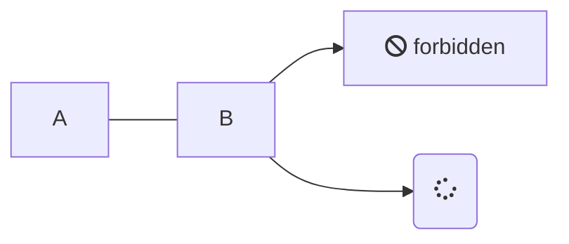
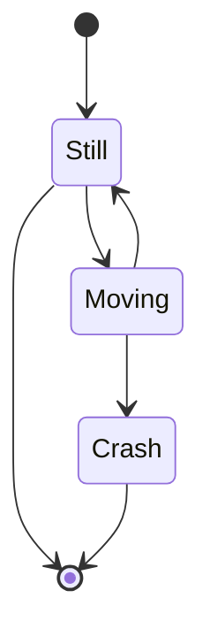

# Aufgabe 2

**Autor:** Simon Fedrau, Sascha Hahn


### Debugging 

  Unter Debugging versteht man den Prozess der Identifizierung und Behebung von Fehlern oder Bugs in einem Softwaresystem. Es ist ein wichtiger Aspekt der Softwareentwicklung, denn Fehler können dazu führen, dass ein Softwaresystem nicht richtig funktioniert, was wiederum eine schlechte Leistung oder falsche Ergebnisse zur Folge haben kann. Die Fehlersuche kann eine zeitaufwändige und komplexe Aufgabe sein, aber sie ist unerlässlich, um sicherzustellen, dass ein Softwaresystem korrekt funktioniert.

https://www.geeksforgeeks.org/software-engineering-debugging/
Aufgerufen 18.10.23


## Problem solving, Root cause analysis 


## Debugging vs. Testen

  Das Debuggen unterscheidet sich vom Testen. Das Testen konzentriert sich auf das Auffinden von Bugs, Fehlern usw., während das debuggen beginnt, nachdem ein Fehler in der Software identifiziert wurde. Das Testen dient dazu, sicherzustellen, dass das Programm korrekt ist und mit einer bestimmten Mindesterfolgsquote funktioniert. Das Testen kann manuell oder automatisiert erfolgen. Es gibt verschiedene Arten von Tests: Unit-Tests, Integrationstests, Alpha- und Beta-Tests usw. Die Fehlersuche erfordert eine Menge Wissen, Fähigkeiten und Erfahrung. Sie kann durch einige automatisierte Tools unterstützt werden, ist aber eher ein manueller Prozess, da jeder Fehler anders ist und eine andere Technik erfordert, im Gegensatz zu einem vordefinierten Testmechanismus.


https://www.geeksforgeeks.org/software-engineering-debugging/
Aufgerufen 18.10.23


## Rubber Duck Debugging 


## Time-travel debugging (reverse debugging)


## Logging / Tracing 


## Ablauf des Debuggings


## Beispiel


## Werkzeuge


# Listen

* ungeordnete Liste: `* Element 1 und nächste Zeile Tab * untergeordnetes Element 2`

* Element 1
  * untergeordnetes Element 2

-- geordnete Liste: `1. Element, 2. Element ...`

1. Element
2. Element

## Unterkapitel

 **Softwaresystem**:
  Die *innere* Sicht des Informatikers nimmt Software als Softwaresystem wahr.

 **Softwareprodukt**: Die *äußere* Sicht eines Auftraggeber nimmt ein Softwaresystem als Softwareprodukt wahr. 

### Tabelle

| A          |     B       |           C               | 
|:----------:|:-----------:|:-------------------------:|
| Eins | Zwei | Drei |
| Vier | Fünf | Sechs |

## Links

[Markdown] ist eine Sprache, die nach HTML konvertiert werden kann. 

[Markdown]: http://daringfireball.net/projects/markdown/

## Aufzählung

Es unterteilt sich in:

* A
  * A1
* B
  * B1
  * B2
* C


# Überschrift

"...the **go to** statement should be abolished..." [1].

Dieser Link führt intern zu einem anderen [Thema](qualitaet/README)

Dieser Link führt extern zu [Youtube](https://www.youtube.com/)

> Dieser Text ist völlig sinnlos, aber steht trotzdem hier. Dieser Text geht über mehrere Zeilen, wenn der Text lang genug ist, um über mehrere Zeilen zu passen.

## Unterüberschrift

* Eins
  * eins.eins
  * eins.zwei
* Zwei
  * Zwei.zwei
* Drei

### Code

```javascript
public class A {
  Integer a;
  public A() {
    this.a = 1
  }
}
```

Syntax Highlighting für Javascript. Weitere Sprachen müssen in 'index.html' konfiguriert werden.

### Mermaid





### Bilder


## Referenzen

[1]: Dijkstra, E. W. (1968). Go to statement considered harmful. 
Communications of the ACM, 11(3), 147-148.
