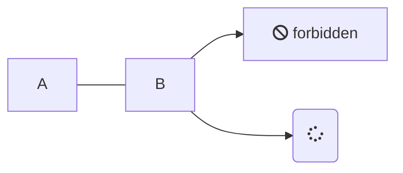
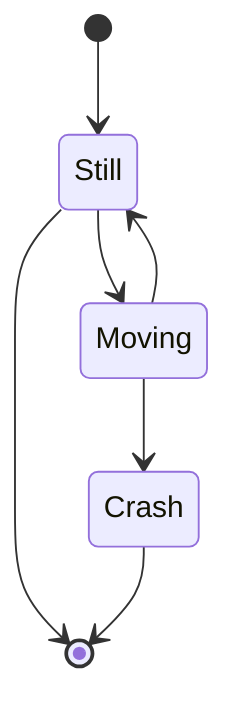

# Aufgabe 2

**Autor:** Simon Fedrau, Sascha Hahn


### Debugging 

  Unter Debugging versteht man den Prozess der Identifizierung und Behebung von Fehlern oder Bugs in einem Softwaresystem. Es ist ein wichtiger Aspekt der Softwareentwicklung, denn Fehler können dazu führen, dass ein Softwaresystem nicht richtig funktioniert, was wiederum eine schlechte Leistung oder falsche Ergebnisse zur Folge haben kann. Die Fehlersuche kann eine zeitaufwändige und komplexe Aufgabe sein, aber sie ist unerlässlich, um sicherzustellen, dass ein Softwaresystem korrekt funktioniert.

https://www.geeksforgeeks.org/software-engineering-debugging/
Aufgerufen 18.10.23


## Problem solving, Root cause analysis 


## Debugging vs. Testen

  Das Debuggen unterscheidet sich vom Testen. Das Testen konzentriert sich auf das Auffinden von Bugs, Fehlern usw., während das debuggen beginnt, nachdem ein Fehler in der Software identifiziert wurde. Das Testen dient dazu, sicherzustellen, dass das Programm korrekt ist und mit einer bestimmten Mindesterfolgsquote funktioniert. Das Testen kann manuell oder automatisiert erfolgen. Es gibt verschiedene Arten von Tests: Unit-Tests, Integrationstests, Alpha- und Beta-Tests usw. Die Fehlersuche erfordert eine Menge Wissen, Fähigkeiten und Erfahrung. Sie kann durch einige automatisierte Tools unterstützt werden, ist aber eher ein manueller Prozess, da jeder Fehler anders ist und eine andere Technik erfordert, im Gegensatz zu einem vordefinierten Testmechanismus.


https://www.geeksforgeeks.org/software-engineering-debugging/
Aufgerufen 18.10.23


## Rubber Duck Debugging 

Oder zu deutsch "Quietscheentchen-Debugging"

Quietscheentchen-Debugging (englisch „Rubber Ducking“) bezeichnet eine Methode zum Debuggen, also dem Finden von Programmfehlern in Computerprogrammen. Es existieren mehrere Bezeichnungen für diese Methode, oft mit anderen unbelebten Objekten.

Beim Quietscheentchen-Debugging erklärt der Programmierer den Quelltext Zeile für Zeile einem Quietscheentchen (oder zum Beispiel einer Person, die nichts vom Programmieren versteht). Die Erklärung erfordert ein tieferes Verständnis des Programmcodes. Bei der zeilenweisen Erklärung, was das Programm machen soll, im Vergleich zu dem, was es tatsächlich macht, fallen eventuelle Ungleichheiten auf. Während des Erklärungsprozesses fällt dem Programmierer der Fehler auf. Der Vorteil des Quietscheentchens gegenüber einer anderen Person ist, dass niemand gestört werden muss. 

Nicht zuletzt sei gesagt, dass ein Austausch des klassischen Quietscheentchens durch einen individuell bevorzugten ‚Gesprächspartner‘ die Erfolgsaussichten des Debuggings keinesfalls trübt …

https://de.wikipedia.org/wiki/Quietscheentchen-Debugging#cite_note-2

https://web.archive.org/web/20170907213645/http://quietscheentchen.net/quietscheentchen-debugging


## Time-travel debugging (reverse debugging)

Zeitreise-Debugging (auch Reverse-Debugging genannt) ermöglicht es Entwicklern, alle Programmaktivitäten zur Laufzeit aufzuzeichnen (jeden Speicherzugriff, jede Berechnung und jeden Aufruf des Betriebssystems) und dann zurückzuspulen und wieder abzuspielen, um den Programmzustand zu untersuchen.

Diese riesige Datenmenge lässt sich mit einer aussagekräftigen Metapher beschreiben: die Möglichkeit, in der Zeit zurückzureisen (und wieder vorwärts), um den Programmzustand zu untersuchen.

Um die Leistung zu optimieren, nehmen die Entwickler in der Regel eine Feinabstimmung des Zeitreise-Debuggers vor, um nur die Informationen zu sammeln, die für eine genaue Wiedergabe des untersuchten Programms erforderlich sind.


Nehmen wir an, Sie erhalten eine E-Mail-Benachrichtigung, dass ein Dienst abstürzt, kurz nachdem Ihre letzte Codeänderung implementiert wurde. Der Absturz tritt nur bei 0,1 Prozent der Server auf, auf denen der Dienst läuft. Da Sie aber in einem großen Unternehmen arbeiten, entsprechen 0,1 Prozent Tausenden von Servern - und dieses Problem wird schwer zu reproduzieren sein. Einige Stunden später können Sie das Problem immer noch nicht reproduzieren, und Sie haben einen ganzen Tag damit verbracht, diesem Problem nachzugehen.

An dieser Stelle kommt das Reverse Debugging ins Spiel. Bestehende Methoden ermöglichen es Ingenieuren, ein angehaltenes (oder abgestürztes) Programm aufzuzeichnen und dann zurückzuspulen und wieder abzuspielen, um die Grundursache zu finden. Für große Unternehmen wie Facebook sind diese Lösungen jedoch zu aufwändig, um in der Produktion eingesetzt werden zu können. Deshalb haben wir eine neue Technik entwickelt, die es Ingenieuren ermöglicht, einen fehlgeschlagenen Lauf zu verfolgen und seinen Verlauf zu untersuchen, um die Ursache zu finden, ohne das Programm erneut ausführen zu müssen, was eine enorme Zeitersparnis bedeutet. Wir tun dies, indem wir die CPU-Aktivitäten auf unseren Servern effizient verfolgen und bei Abstürzen die Prozesshistorie speichern, die später mit Hilfe des LLDB-Debuggers in einem für den Menschen lesbaren Format angezeigt wird, das von der Ansicht der Befehlshistorie bis zum Reverse Debugging alles bietet.


https://undo.io/resources/6-things-time-travel-debugging
https://engineering.fb.com/2021/04/27/developer-tools/reverse-debugging/

## Logging / Tracing 


### Logging 
Der Begriff Logging beschreibt im IT-Umfeld das automatisierte Protokollieren von System- und Prozessmeldungen. Bei den protokollierten Logdaten handelt es sich um Statusinformationen oder Ereignisse, die beim Betrieb von IT-Systemen oder bei der Ausführung von Hard- und Softwareprozessen auftreten.

Ergebnisse des Loggings sind Logdateien, die häufig in Form von Textdateien vorliegen. Die in diesen Dateien protokollierten Informationen und Ereignisse sind mit einem Zeitstempel versehen und innerhalb der Logdatei in der Regel chronologisch angeordnet. Oft sind Logdateien in ihrer maximalen Größe beschränkt, weshalb die Informationen und Ereignisse nach einer bestimmten Zeit überschrieben werden.
In einigen Bereichen und Branchen ist das Log-Management verpflichtend vorgeschrieben, um beispielsweise gesetzlichen Pflichten nachzukommen, Compliance-Richtlinien zu erfüllen oder die Nachvollziehbarkeit von Transaktionen sicherzustellen.

https://www.ip-insider.de/was-ist-logging-event-log-management-a-efd311ecd8621b98baa59d2405d870ad/

### Tracing

Wir starten am besten erneut mit einer Definition: Ein Trace ist eine direkte Visualisierung eines Requests beim Durchlauf durch eine Anwendung oder einer kompletten Anwendungslandschaft. Hierbei wird er durch eine eindeutige Trace ID identifiziert und nimmt bei jedem Arbeitsschritt Spans auf.

Spans sind die kleinste Einheit des Distributed Tracings und bilden den eigentlichen Workflow ab. Hierzu zählen beispielsweise HTTP Requests, der Aufruf einer Datenbank oder die Verarbeitung einer Nachricht beim Eventing. Analog zu einem Trace erhalten auch sie eine eindeutige Span ID und zusätzlich noch Angaben über das genaue Timing, optionale weitere Attribute, Events oder Status, je nach Use Case.

https://www.adesso.de/de/news/blog/logging-vs-tracing-2.jsp

https://www.embedded-software-engineering.de/durch-traceability-lassen-sich-unbaendige-projekte-zaehmen-a-919617/


## Ablauf des Debuggings

Das Debugging ist der Prozess des Identifizierens, Isolierens und Behebens von Fehlern oder Bugs in Software oder Hardware. Hier ist eine allgemeine Beschreibung des Ablaufs des Debuggings:

Fehlereridentifikation:
Identifiziere Anzeichen für einen Fehler, wie unerwartetes Verhalten, Fehlermeldungen oder Abstürze der Anwendung. Benutzer-Feedback und Protokolldateien sind oft hilfreiche Quellen, um auf Probleme hinzuweisen.

  Reproduzierbarkeit sicherstellen:
        Versuche, den Fehler reproduzierbar zu machen. Das bedeutet, dass du eine genaue Abfolge von Schritten dokumentieren musst, die notwendig sind, um den Fehler jedes Mal zu provozieren. Dies erleichtert die Fehleranalyse.

    Fehlerisolation:
        Begrenze den Bereich, in dem du den Fehler vermutest. Dies kann bedeuten, dass du Teile des Codes oder Hardware-Komponenten ausschließt, die keinen Zusammenhang mit dem Fehler zu haben scheinen.

    Fehleranalyse:
        Untersuche den isolierten Bereich gründlich, um die Ursache des Fehlers zu identifizieren. Dies beinhaltet das Lesen des Quellcodes, das Überprüfen von Variablen und das Verfolgen der Ausführungsschritte. Werkzeuge wie Debugging-Tools, Protokollierung und Profiling können hilfreich sein.

    Hypothesenbildung:
        Basierend auf deinen Erkenntnissen erstellst du Hypothesen darüber, was den Fehler verursachen könnte. Du könntest vermuten, dass ein bestimmter Codeabschnitt, eine Variable oder eine Konfiguration fehlerhaft ist.

    Experimente durchführen:
        Um deine Hypothesen zu überprüfen, führe gezielte Experimente durch, indem du Codeänderungen vornimmst, Variablenwerte änderst oder Konfigurationseinstellungen anpasst. Überwache die Auswirkungen dieser Experimente und stelle fest, ob der Fehler behoben wurde oder sich verändert hat.

    Schrittweises Testen:
        Teste jede Änderung schrittweise und systematisch, um sicherzustellen, dass der Fehler nicht nur behoben wurde, sondern auch keine neuen Fehler eingeführt wurden.

    Behebung und Validierung

      Entwickler beheben den Fehler und führen Tests durch, um sicherzustellen, dass die Software weiterhin wie erwartet funktioniert. Sie werden möglicherweise neue Tests schreiben, um zu prüfen, ob der Fehler in Zukunft wieder auftritt.

    Dokumentation:
        Halte alle durchgeführten Experimente und gefundenen Lösungen in einer geeigneten Form (wie Notizen oder Kommentaren im Code) fest, um anderen Entwicklern zu helfen und zukünftige Debugging-Bemühungen zu unterstützen.

    Abschluss:
        Wenn der Fehler behoben ist und die Anwendung wieder wie erwartet funktioniert, teste gründlich, um sicherzustellen, dass keine weiteren Probleme auftreten. Informiere bei Bedarf Benutzer oder Teammitglieder über die Behebung des Fehlers.

Debugging kann ein zeitaufwändiger Prozess sein, erfordert Geduld und systematisches Vorgehen, ist jedoch entscheidend, um stabile und zuverlässige Software oder Hardware zu entwickeln. Die Verwendung von geeigneten Debugging-Tools und Techniken kann diesen Prozess erleichtern und beschleunigen.


https://aws.amazon.com/de/what-is/debugging/

https://chat.openai.com/ Frage: beschreibe mir den Ablauf des 
Debuggings

## Beispiel


## Werkzeuge

Es gibt viele Debugging-Werkzeuge, die Entwickler verwenden können, um Fehler in Software zu identifizieren und zu beheben. Hier sind einige typische Debugging-Werkzeuge:

Integrierte Entwicklungsumgebungen (IDEs): Viele moderne IDEs bieten eingebaute Debugging-Tools, die es Entwicklern ermöglichen, den Code Schritt für Schritt auszuführen, Variablenwerte zu überwachen, Breakpoints zu setzen und Stack-Traces anzuzeigen. Beispiele sind Visual Studio für C#, PyCharm für Python und Eclipse für Java.

Debugger für spezielle Sprachen:
GDB (GNU Debugger): Ein leistungsstarker Debugger für C, C++, und andere Sprachen.
PDB (Python Debugger): Ein Debugger für Python.
Xcode Debugger: Der Debugger für Anwendungen, die auf Apple-Plattformen entwickelt werden.

Version Control Systeme: Diese Systeme (z. B. Git) ermöglichen es, den Verlauf von Code-Änderungen zu verfolgen und zu vergleichen, um Fehler zu finden, die durch Codeänderungen eingeführt wurden.

Protokollierung (Logging): Das Hinzufügen von Protokollierungsinformationen zu deinem Code kann dir dabei helfen, den Zustand deiner Anwendung zu verstehen und Fehler nachzuverfolgen.

Profiling-Tools: Diese Tools helfen dabei, die Leistung deiner Anwendung zu analysieren und Engpässe oder ineffiziente Codeabschnitte zu identifizieren.

Memory Debugging-Tools: Speicherleckagen und Speicherfehler können schwer zu finden sein. Tools wie Valgrind für C/C++ oder Memory Profiler für C# können hier helfen.

Browser-Entwicklertools: Wenn du webbasierte Anwendungen entwickelst, bieten moderne Webbrowser Entwicklertools, mit denen du JavaScript-Code debuggen, Netzwerkaktivitäten überwachen und den DOM (Document Object Model) inspizieren kannst.

Fehlerberichterstattungstools: Diese Tools sammeln Fehlerberichte von Benutzern, um Entwicklern bei der Identifizierung und Behebung von Problemen zu helfen. Ein Beispiel ist Sentry.

Remote Debugging-Tools: Für mobile und eingebettete Systeme können Entwickler Remote-Debugging-Werkzeuge verwenden, um Fehler auf Geräten oder in der Cloud zu analysieren.

Testwerkzeuge: Automatisierte Testwerkzeuge wie JUnit für Java oder unittest für Python helfen, Fehler durch gezielte Tests zu identifizieren.

Virtuelle Maschinen und Container: Die Verwendung von VMs oder Containern ermöglicht es Entwicklern, die Umgebung zu isolieren und Probleme in einer konsistenten Umgebung zu debuggen.

Die Wahl des richtigen Debugging-Werkzeugs hängt von der Entwicklungsumgebung, der Programmiersprache und der Art des Problems ab. Oftmals ist eine Kombination aus verschiedenen Werkzeugen notwendig, um komplexe Fehler zu identifizieren und zu beheben.

https://chat.openai.com/c/48dc5e10-62ff-4bad-af36-aed923432e5c

Frage: was sind typische Debugging werkzteuge


# Agile testing workflows

Agile Testing Workflows beziehen sich auf den Prozess des Testens von Software in einem agilen Entwicklungsumfeld. Agiles Testen ist eine Methode, die eng mit den Prinzipien agiler Softwareentwicklungsmethoden verbunden ist. Der Schwerpunkt liegt darauf, flexibel und kontinuierlich qualitativ hochwertige Software bereitzustellen, indem Tests in den gesamten Entwicklungsprozess integriert werden. Durch diese Arbeitweise lässt es sich vermeiden am Ende der entwicklung auf gravierende Fehler in der Software zu stoßen und somit die Veröffentlichung zu verschieben oder ein unfertiges Produkt zu veröffentlichen.

https://www.servicenow.com/de/products/strategic-portfolio-management/what-is-agile-testing.html
https://miro.com/de/agile/was-ist-ein-agile-workflow/


  ## TDD, BDD, ATDD

### TDD

Bei der testgetriebenen Entwicklung handelt es sich um eine Testmethodik oder eine Programmierpraxis, die aus der Perspektive eines Entwicklers umgesetzt wird. Bei dieser Technik beginnt ein QA-Ingenieur mit dem Entwurf und der Erstellung von Testfällen für jede kleine Funktionalität einer Anwendung. Mit dieser Technik wird versucht, eine einfache Frage zu beantworten: Ist der Code gültig?

Der Hauptzweck dieser Technik besteht darin, den Code nur dann zu ändern oder neu zu schreiben, wenn der Test fehlschlägt. Dies führt zu einer geringeren Duplizierung von Testskripten. Diese Technik ist vor allem in agilen Entwicklungsumgebungen verbreitet. Bei einem TDD-Ansatz werden die automatisierten Testskripte vor den funktionalen Teilen des Codes geschrieben. Die TDD-Methodik umfasst die folgenden Schritte:

Ein Entwickler schreibt einen automatisierten Testfall auf der Grundlage der in den Dokumenten festgelegten Anforderungen.
Diese Tests werden ausgeführt, und in einigen Fällen schlagen sie fehl, da sie vor der Entwicklung einer tatsächlichen Funktion entwickelt werden.
Das Entwicklungsteam überarbeitet dann den Code, damit der Test erfolgreich durchgeführt werden kann.
TDD kann von einem einzigen Entwickler durchgeführt werden, der sowohl Tests als auch Anwendungscode nebeneinander schreibt, um eine Funktion fertigzustellen.

### BDD

Die verhaltensorientierte Entwicklung (Behavioral-Driven Development, BDD) ist ein von der Methodik der testorientierten Entwicklung (Test-Driven Development, TDD) abgeleiteter Testansatz. Bei BDD basieren die Tests hauptsächlich auf dem Systemverhalten. Dieser Ansatz definiert verschiedene Möglichkeiten, eine Funktion auf der Grundlage ihres Verhaltens zu entwickeln. In den meisten Fällen wird der Given-When-Then-Ansatz für das Schreiben von Testfällen verwendet. Nehmen wir ein Beispiel zum besseren Verständnis von TDD gegenüber BDD:

* Vorausgesetzt, der Benutzer hat gültige Anmeldedaten eingegeben
* Wenn ein Benutzer auf die Anmeldeschaltfläche klickt
* Dann wird die Meldung über die erfolgreiche Validierung angezeigt
Wie oben gezeigt, wird das Verhalten in einer sehr einfachen englischen Sprache dargestellt, einer gemeinsamen Sprache. Dies hilft allen im Entwicklungsteam, das Verhalten der Funktion zu verstehen.

Gherkin-Sprache: In BDD wird oft eine spezielle Sprache namens Gherkin verwendet, um das erwartete Verhalten der Software zu beschreiben. Gherkin ist eine natürlichsprachige Syntax, die leicht verständlich ist und es Teammitgliedern ermöglicht, sich auf das Verhalten der Software zu konzentrieren, anstatt sich mit technischen Details zu beschäftigen. Beispiele für Gherkin-Schreibweise sind "Given-When-Then" oder "Als-Nächstes-Dann".

Kollaboration: BDD fördert die Zusammenarbeit zwischen Entwicklern, Testern und Nicht-Technikern, um sicherzustellen, dass alle Beteiligten ein gemeinsames Verständnis darüber haben, wie die Software funktionieren sollte. Dies erfolgt oft in Form von Besprechungen und Diskussionen.

Hilft, ein breiteres Publikum durch die Verwendung einer nichttechnischen Sprache zu erreichen
Konzentriert sich darauf, wie sich das System aus der Sicht des Kunden und des Entwicklers verhalten sollte
BDD ist eine kosteneffektive Technik
Verringert den Aufwand für die Verifizierung von Fehlern nach der Bereitstellung

https://www.browserstack.com/guide/tdd-vs-bdd-vs-atdd


### ATDD

ATDD steht für "Acceptance Test-Driven Development" und ist eine agile Praxis, die sich auf die Verbesserung der Kommunikation zwischen Entwicklern, Testern und Stakeholdern konzentriert, um sicherzustellen, dass die entwickelte Software die Akzeptanzkriterien und die Erwartungen der Benutzer erfüllt. ATDD ist eng mit BDD (Behavior-Driven Development) verbunden und baut auf ähnlichen Prinzipien auf. Hier sind die Hauptkomponenten von ATDD:

Akzeptanzkriterien: Wie bei BDD spielen Akzeptanzkriterien eine zentrale Rolle in ATDD. Diese Kriterien definieren, was von der Software erwartet wird und dienen als Grundlage für die Entwicklung und Tests. Sie werden in enger Zusammenarbeit mit den Stakeholdern erstellt.

Zusammenarbeit: ATDD fördert die Zusammenarbeit zwischen Entwicklern, Testern und Stakeholdern. Dies erfolgt in Form von Diskussionen und Besprechungen, bei denen die Akzeptanzkriterien und erwarteten Verhaltensweisen der Software geklärt werden.

Entwicklung von Akzeptanztests: Auf der Grundlage der Akzeptanzkriterien werden Akzeptanztests erstellt. Diese Tests beschreiben, wie die Software getestet wird, um sicherzustellen, dass sie die akzeptierten Kriterien erfüllt.

Testautomatisierung: Die Akzeptanztests werden in der Regel automatisiert, um sicherzustellen, dass sie regelmäßig und effizient durchgeführt werden können. Diese Tests überprüfen, ob die Software die spezifizierten Akzeptanzkriterien erfüllt.

Kontinuierliche Überprüfung und Validierung: Wie bei BDD werden die Akzeptanztests regelmäßig ausgeführt, um sicherzustellen, dass die Software weiterhin die Akzeptanzkriterien erfüllt. Dies ermöglicht eine kontinuierliche Validierung und Überprüfung des Softwareverhaltens.

Kommunikation und Transparenz: ATDD fördert die offene und transparente Kommunikation zwischen den verschiedenen Teammitgliedern und Stakeholdern. Dies hilft, Missverständnisse zu minimieren und sicherzustellen, dass die entwickelte Software den Erwartungen entspricht.

ATDD ist eine agile Praxis, die darauf abzielt, die Qualität der entwickelten Software sicherzustellen, indem sie die Erwartungen der Benutzer in den Mittelpunkt stellt. Durch die enge Zusammenarbeit, die Erstellung von klaren Akzeptanzkriterien und die Testautomatisierung wird sichergestellt, dass die entwickelte Software den Anforderungen gerecht wird und die Akzeptanzkriterien erfüllt.


  ### Motivation, Ablauf, Inhalte, Frameworks

Hier kommt die Tabelle hin, zusätlich wird sie noch beschreiben


## Test doubles

In der Computerprogrammierung und in der Informatik setzen Programmierer eine Technik ein, die als automatisierte Einheitstests bezeichnet wird, um die Wahrscheinlichkeit des Auftretens von Fehlern in der Software zu verringern. Häufig besteht die endgültige Software aus einem komplexen Satz von Objekten oder Prozeduren, die zusammenwirken, um das Endergebnis zu erzeugen. Bei automatisierten Unit-Tests kann es notwendig sein, Objekte oder Prozeduren zu verwenden, die wie ihre für die Veröffentlichung vorgesehenen Gegenstücke aussehen und sich auch so verhalten, aber eigentlich vereinfachte Versionen sind, die die Komplexität reduzieren und das Testen erleichtern. Ein Testdoppel ist ein allgemeiner (Meta-)Begriff, der für diese Objekte oder Prozeduren verwendet wird.

https://en.wikipedia.org/wiki/Test_double#:~:text=In%20automated%20unit%20testing%2C%20it,for%20these%20objects%20or%20procedures.

### Mocks vs Fakes vs Stubs vs Spy

Mock (Attrappe):
Ein Mock ist eine Attrappe oder ein Dummy-Objekt, das in Unit Tests verwendet wird, um die Interaktionen zwischen verschiedenen Teilen des Codes zu simulieren. Mock-Objekte werden verwendet, um zu überwachen, ob bestimmte Methoden aufgerufen wurden und welche Parameter übergeben wurden. Sie sind nützlich, um das Verhalten von Abhängigkeiten oder externen Systemen nachzuahmen, ohne diese tatsächlich aufrufen zu müssen. Mocks helfen, Tests zu isolieren und zu überprüfen, ob die getestete Komponente korrekt mit ihren Abhängigkeiten interagiert.

Fake (Vorgefertigtes Objekt):
Ein Fake ist ein vorgefertigtes Objekt oder eine Implementierung, die in Tests anstelle einer echten Implementierung eines Systems verwendet wird. Fakes sind oft einfacher als die echten Implementierungen, und sie können so konfiguriert werden, dass sie vorhersehbare Verhaltensweisen aufweisen. Sie sind hilfreich, wenn Sie eine echte Implementierung ersetzen müssen, die teuer ist oder nicht für den Testzweck geeignet ist. Beispiele für Fakes sind In-Memory-Datenbanken, die anstelle einer echten Datenbank verwendet werden, oder Dummy-Implementierungen von Schnittstellen.

Stub (Platzhalter):
Ein Stub ist eine einfache Implementierung oder ein Platzhalter für eine Methode oder ein Objekt. Stubs werden verwendet, um vordefinierte Antworten auf Methodenaufrufe bereitzustellen. Im Kontext von Tests werden Stubs häufig verwendet, um bestimmte Teile des Codes zu isolieren und zu testen, ohne auf tatsächliche Abhängigkeiten zuzugreifen. Ein Stub kann beispielsweise eine Methode aufrufen und eine vordefinierte Antwort zurückgeben, ohne die tatsächliche Logik der Methode auszuführen.

Spy (Überwacher):
Ein Spy ist ein Objekt, das verwendet wird, um Interaktionen in einem Test zu überwachen, ohne das eigentliche Verhalten des zu testenden Codes zu beeinflussen. Im Gegensatz zu einem Mock, der erwartet, dass bestimmte Methoden aufgerufen werden, zeichnet ein Spy die tatsächlichen Aufrufe auf und kann später überprüft werden. Spies sind nützlich, um zu sehen, wie oft und mit welchen Parametern bestimmte Methoden aufgerufen wurden, ohne das Testverhalten zu ändern.


https://www.c-sharpcorner.com/article/stub-vs-fake-vs-spy-vs-mock/


https://www.c-sharpcorner.com/article/stub-vs-fake-vs-spy-vs-mock/

### Frameworks

In Agile Testing Workflows werden verschiedene Frameworks und Tools verwendet, um die Testautomatisierung und die Verwaltung von Tests zu unterstützen. Hier sind einige der gängigen Frameworks und Tools, die in agilen Testumgebungen eingesetzt werden:

Selenium: Selenium ist eines der am weitesten verbreiteten Frameworks für die Automatisierung von Webanwendungen. Es ermöglicht das Aufzeichnen und Wiedergeben von Tests in verschiedenen Programmiersprachen und bietet Funktionen zur Interaktion mit Webseiten und zur Validierung von UI-Elementen.

Cucumber: Cucumber ist ein BDD (Behavior-Driven Development)-Framework, das die Erstellung von Tests in natürlicher Sprache ermöglicht. Es verwendet Gherkin-Syntax und fördert die Zusammenarbeit zwischen Entwicklern, Testern und Stakeholdern.

JUnit und TestNG: Diese Frameworks sind hauptsächlich für Java-Anwendungen und unterstützen das Testen von Einheiten und die Erstellung von Testklassen. Sie bieten Testreporting, Testausführung und Testverwaltungsfunktionen.

Robot Framework: Robot Framework ist ein Open-Source-Framework für Testautomatisierung und Akzeptanztests. Es verwendet eine leicht verständliche tabellarische Syntax und unterstützt Tests in natürlicher Sprache.

Appium: Appium ist ein Framework für die Testautomatisierung von mobilen Anwendungen auf verschiedenen Plattformen, einschließlich iOS und Android. Es ermöglicht die Verwendung von Standard-Webtechnologien und Programmiersprachen für die Testautomatisierung von mobilen Apps.

Jenkins: Jenkins ist ein bekanntes Continuous Integration (CI)- und Continuous Delivery (CD)-Tool, das häufig in agilen Umgebungen verwendet wird, um die automatische Ausführung von Tests nach jeder Code-Änderung zu ermöglichen.

TestRail: TestRail ist eine Testmanagement-Software, die in agilen Teams verwendet wird, um Testpläne, Testfälle und Testergebnisse zu verwalten. Es erleichtert die Organisation und Nachverfolgung von Tests und die Zusammenarbeit im Team.

Postman: Postman ist ein beliebtes Tool für das Testen von RESTful APIs. Es ermöglicht das Erstellen und Ausführen von API-Tests und die Überwachung der API-Leistung.

JIRA und Confluence: Diese Atlassian-Tools werden häufig zur Verwaltung von Aufgaben, Fehlerverfolgung und Testdokumentation in agilen Umgebungen verwendet. JIRA unterstützt die Agilen Methoden Scrum und Kanban, während Confluence für die Dokumentation und Zusammenarbeit genutzt wird.


# Pair programming

Bei der Erstellung des Quellcodes arbeiten jeweils zwei Programmierer gleichzeitig an einem Arbeitsplatz: Einer schreibt den Code, während der andere über die Problemstellungen nachdenkt, den geschriebenen Code kontrolliert sowie Probleme, die ihm dabei auffallen, sofort anspricht.[1] Diese können dann sofort im Gespräch gelöst werden. Die beiden Programmierer sollten sich in den beiden Rollen abwechseln. Auch die Zusammensetzung der Paare sollte sich häufig ändern.

Eine Voraussetzung für Paarprogrammierung ist ein gemeinsam vereinbarter Programmierstil des gesamten Teams.
Zunächst soll Paarprogrammierung die Softwarequalität steigern. Durch die Kontrollfunktion der zweiten Person sollen problematische Lösungen vermieden werden. Die Paarprogrammierung dient aber auch zur Verbreitung von Wissen über den Quellcode. Durch das regelmäßige Rotieren der Partner kann immer der jeweils neue Partner durch Learning by Doing etwas über die bearbeiteten Quelltexte lernen.

https://de.wikipedia.org/wiki/Paarprogrammierung


   ## Ablauf

Es gibt zwei Rollen: den Driver bzw. Piloten und den Navigator bzw. Observer. Der Driver bedient den Computer und schreibt den Code. Er kommentiert, was er tut, so dass der Navigator die zugrunde liegenden Gedanken nachvollziehen kann. Der Navigator beobachtet, gibt Feedback zur Implementierung und versucht Ideen zu entwickeln, um die Aufgabe noch besser zu lösen. Ziel der Rollenteilung ist es, zwei verschiedene Perspektiven auf den Code zu haben: Der Driver soll eher taktisch denken, er soll über die Details, über die vorhandenen Codezeilen nachdenken. Der Navigator kann in seiner beobachtenden Rolle strategischer denken. Er hat das Gesamtbild im Blick.
Die Rollen wechseln regelmäßig zwischen den Entwicklern, so dass jeder im Wechsel Driver oder Navigator ist.
Idealerweise entwickelt das Paar einen Teamgeist, kommuniziert kontinuierlich und klärt Unklarheiten zum Vorgehen, zur Programmierung, zum Testen so schnell wie möglich.
Es ist durchaus üblich, dass einer der beiden Entwickler nach einer Weile (2-3 Tage oder eine Woche) das Team verlässt und Platz für einen anderen Kollegen macht. Es kommt zu einer Paar-Rotation bzw. Pair Rotation. In manchen Publikationen wir die Person, die bleibt, als anchor bzw. Anker bezeichnet. Die Absicht dahinter (sofern es sich nicht um eine Rotation bedingt durch Urlaub oder Krankheit handelt): eine frische Perspektive, neue Energie und das Vermeiden von Silos. Natürlich sollte hier jede Organisation individuell entscheiden, ob und wann ein Wechsel sinnvoll ist.
In der Praxis variieren die Meinungen, ob sich die Entwickler wirklich einen Computer teilen oder ob jeder seinen eigenen Computer hat und man auf einem gemeinsamen Stand arbeitet. In Verbindung mit einem heute üblichen Versionsmanagement ist auch die Arbeit mit zwei parallelen Rechnern keine sonderliche Herausforderung.


https://t2informatik.de/wissen-kompakt/pair-programming/

   ## Best practices

  Klären Sie den generellen Umfang der Paarprogrammierung. Ist es eine temporäre Sache, ein erster Test oder eine auf Dauer angelegte Form der Zusammenarbeit.
Klären Sie die konkrete Zusammenarbeit, also bspw. wann beginnen Sie morgens, wann hören Sie auf, wann gibt es planmäßige Pausen, an welchem Arbeitsplatz wird gearbeitet etc.
Bearbeiten Sie stets nur eine Aufgabe. Eine Aufgabe, ein Ziel, ein Vorgehen.
Idealerweise gibt es in der Organisation Coding Conventions und Coding Styles. Der Navigator sollte auf die Einhaltung achten bzw. den Driver auf etwaige Verletzungen hinweisen.
Diskussionen gehören zum Pair Programming, allerdings findet die Zusammenarbeit häufig auch in Großraumbüros statt, so dass die Lautstärke “angemessen” sein sollte.
Nutzen Sie Zeilennummern, um konkrete Codezeilen leichter identifizieren zu können.
Spielen Sie “Ping Pong”, bspw. im Zuge von Test -Driven Development. Entwickler A scheibt einen Test (Ping), Entwickler B die Implementierung, um den Test zu bestehen (Pong). Entwickler A erweitert den Test (Ping) und Entwickler B erweitert die Implementierung (Pong).
Es kann nützlich sein, einen Timer zu verwenden, um so zu festen Zeiten – bspw. alle 20 Minuten – die Rollen zu wechseln. Je eingespielter ein Tandem ist, desto weniger wichtig wird die Verwendung eines Timers.
Tandem Programmierung ist auch eine Frage der Haltung. Anstelle von “Ich habe eine Idee, gib mir mal die Tastatur” wäre ein “Ich habe eine Idee. Nimm Du mal die Tastatur.” wünschenswert.
Und zu guter Letzt: vereinbaren Sie Lessons Learned bzw. Retrospektiven, um voneinander und miteinander zu lernen.

https://t2informatik.de/wissen-kompakt/pair-programming/

# Code reviews
  
  Beim automatischen E-Mail-Versand verschickt das Versions- bzw. Konfigurationsmanagement-System automatisch einen Hinweis mit einem Link auf die neuen oder geänderten Codezeilen an einen vorab definierten Überprüfer.
Beim Pair Programming arbeiten zwei Entwickler gemeinsam an demselben Code und überprüfen damit kontinuierlich die Arbeit des jeweils anderen. So ist das Code Review direkt im Prozess der Softwareentwicklung integriert und die Qualität der Software könnte zumindest in der Theorie höher sein als bei einer separierten Entwicklung. Als Nachteil gilt die evtl. fehlende Objektivität der Entwicklungspartner.
Beim “Über die Schulter gucken” oder dem “Walkthrough” sucht sich der Entwickler nach der Fertigstellung seines Codes einen qualifizierten Kollegen, der die Implementierung überprüft, während er vom Autor Erläuterungen zum Code und der Funktionalität erhält. Dieser Ansatz gilt als informell, ist dafür aber auch sehr einfach und leichtgewichtig, zumal sich die Erkenntnisse direkt im Code umsetzen und versionieren lassen.
Die softwarebasierten Code Reviews erfolgen entweder browserbasiert oder direkt in einer Entwicklungsumgebung. Sie folgen einem formalen Ansatz, in dem sie u.a. Kommentare und Lösungsvorschläge dokumentieren, so dass diese auch zu einem späteren Zeitpunkt noch nachvollzogen werden können. Darüber hinaus ermöglichen sie auch asynchrone Benachrichtigungen, die Definition von Verantwortlichkeiten oder die Durchführung der Überprüfungen vom eigenen Arbeitsplatz aus.

Welche Inhalte in einem Code Review untersucht und verbessert werden, lässt sich nicht allgemeingültig beantworten. Einige Teams ziehen es vor, jede Änderung zu überprüfen, während andere eine Art Schwelle definieren, unter der eine Überprüfung nicht erforderlich ist. Einerseits sollten Organisationen versuchen, ein gutes Verhältnis zwischen der effektiven Nutzung der Zeit der Beteiligten und der Aufrechterhaltung bzw. Steigerung der Codequalität zu finden. In bestimmten regulatorischen Umgebungen kann ein Code Review sogar für geringfügige Änderungen erforderlich sein. Andererseits reicht es auch nicht aus, den Code nur auf Funktionssicherheit und Fehlerfreiheit zu überprüfen, denn nicht der vorliegende Code ist der Maßstab, sondern die Aufgabe, die er erfüllen soll. Hier ist ein Abgleich mit der Spezifikation erforderlich.

Unabhängig von Erfahrung und Reputation der Entwickler ergibt es Sinn, Codeüberprüfungen durchzuführen, denn auch Codezeilen von erfahrenen Entwicklern lassen sich oftmals optimieren und von Code-Smells befreien. Idealerweise ist ein Code Review auch eine gute Gelegenheit für ein Mentoring oder die Verbesserung der Zusammenarbeit unter Kollegen.

https://t2informatik.de/wissen-kompakt/code-review/


  ## Conventional comments
  
  Konventionelle Kommentare sind ein strukturiertes Kommentarsystem für Code-Reviews und andere Formen des technischen Dialogs. Sie enthalten eine Reihe von vordefinierten Bezeichnungen, wie z.B. "nitpick", "issue", "suggestion", "praise", "question", "thought" und vor allem "non-blocking". Jedes Label entspricht einem bestimmten Kommentartyp und einer erwarteten Antwort.

praise: Hebt etwas Positives hervor. Suchen Sie immer nach etwas, das Sie aufrichtig loben können.
nitpick: Triviale, auf Vorlieben basierende Anfragen. Diese sollten von Natur aus nicht blockierend sein.
suggestion: Schlägt Verbesserungen zum aktuellen Thema vor. Seien Sie explizit und klar, was vorgeschlagen wird und warum es eine Verbesserung ist.
issue: Weist auf spezifische Probleme mit dem untersuchten Thema hin. Diese Probleme können auf der Benutzerseite oder hinter den Kulissen liegen. Es wird dringend empfohlen, diesen Kommentar mit einem Vorschlag zu verbinden.
todo: Kleine, triviale, aber notwendige Änderungen. Die Unterscheidung zwischen todo-Kommentaren und Problemen oder Vorschlägen hilft, die Aufmerksamkeit des Lesers auf Kommentare zu lenken, die mehr Engagement erfordern.
Question: Geeignet, wenn Sie ein mögliches Anliegen haben, aber nicht sicher sind, ob es relevant ist oder nicht. Die Bitte an den Autor um Klärung oder Nachforschung kann zu einer schnellen Lösung führen.
thougt: Stellt eine Idee dar, die bei der Durchsicht aufgetaucht ist. Diese Kommentare sind von Natur aus nicht blockierend, aber sie sind äußerst wertvoll und können zu gezielteren Initiativen und Mentoring-Möglichkeiten führen.

chore: Einfache Aufgaben, die erledigt werden müssen, bevor das Thema "offiziell" angenommen werden kann. Normalerweise beziehen sich diese Kommentare auf einen gemeinsamen Prozess.
note: Immer nicht blockierend und hebt einfach etwas hervor, das der Leser zur Kenntnis nehmen sollte.
typo: Tippfehler-Kommentare sind wie todo:, wobei das Hauptproblem ein Rechtschreibfehler ist.
polish: polish-Kommentare sind wie ein Vorschlag, bei dem nicht unbedingt etwas mit dem betreffenden Inhalt nicht stimmt, sondern es nur einige Möglichkeiten gibt, die Qualität sofort zu verbessern.
quibble: Quibbles sind ähnlich wie nitpick:, nur dass es keine Bilder von Läusen und tierischen Hygienepraktiken hervorruft.


Auch hier gibt es eine Tabelle !!!!

Dekoration Beschreibung

nicht blockierend:	Ein Kommentar mit dieser Auszeichnung sollte nicht verhindern, dass das zu prüfende Thema akzeptiert wird. Dies ist hilfreich für Organisationen, die Kommentare standardmäßig als blockierend betrachten.

blockierend:	Ein Kommentar mit dieser Auszeichnung sollte verhindern, dass der zu prüfende Gegenstand angenommen wird, bis er gelöst ist. Dies ist für Organisationen hilfreich, die Kommentare standardmäßig als nicht blockierend betrachten.

if-minor:	Diese Dekoration gibt dem Autor eine gewisse Freiheit, den Kommentar nur zu lösen, wenn die Änderungen geringfügig oder trivial sind.


  https://dev.to/tsotsi1/enhancing-code-reviews-with-conventional-comments-2j9i#:~:text=Conventional%20Comments%20are%20a%20structured,and%20notably%2C%20non%2Dblocking%20.
  
  ## Ablauf
  
Im Zentrum des Codereviews steht ein gemeinsames Treffen aller Beteiligten. Der Review-Leiter legt den Termin fest und führt durch das Treffen; der Protokollführer hält die anwesenden Teilnehmer und die Ergebnisse des Treffens fest. Der Code-Verantwortliche präsentiert den Code über Beamer; Verbesserungsvorschläge werden von den Reviewern eingebracht und diskutiert. Das Treffen sollte auf 1 Stunde angesetzt werden.
https://sdq.kastel.kit.edu/wiki/Codereview

Beim Code-Review wird ein Programmabschnitt nach oder während der Entwicklung von einem oder mehreren Gutachtern Korrektur gelesen, um mögliche Fehler, Vereinfachungen oder Testfälle zu finden. Dabei kann der Gutachter selbst ein Softwareentwickler sein
https://de.wikipedia.org/wiki/Review_(Softwaretest)#:~:text=Beim%20Code%2DReview%20wird%20ein,Gutachter%20selbst%20ein%20Softwareentwickler%20sein.


Autor stellt den Quellcodes bereit.
Autor initiiert eine Code Review Anfrage.
Autor führt den Prüfer durch den Code (Walktrough).
Prüfer identifiziert Probleme (Inspektion).
Prüfer prüft den Code und dokumentiert die Funde (Code_Review_Vorlage.docx).
Prüfer gibt das Dokument an den Autor zurück.
Autor arbeitet Befunde ein.
Autor initiiert eine neue Runde des Review-Prozesses (GOTO 1).
https://wiki.hshl.de/wiki/index.php/Anleitung_zum_Code_Review#Ablauf_Code-Review


  ## Best practices

1. Erstellen Sie eine Checkliste für die Codeüberprüfung
2. Einführung von Metriken für die Codeüberprüfung
3. Sicherstellen, dass Ihr Feedback Ihre Haltung rechtfertigt
4. Prüfen Sie nicht mehr als 200-400 Codezeilen auf einmal
5. Ergänzen Sie Ihre Best Practices durch Automatisierung

https://www.atlassian.com/blog/add-ons/code-review-best-practices

# Refactoring

Refactoring (auch Refaktorisierung, Refaktorierung oder Restrukturierung) bezeichnet in der Software-Entwicklung die manuelle oder automatisierte Strukturverbesserung von Quelltexten unter Beibehaltung des beobachtbaren Programmverhaltens. Dabei sollen Lesbarkeit, Verständlichkeit, Wartbarkeit und Erweiterbarkeit verbessert werden, mit dem Ziel, den jeweiligen Aufwand für Fehleranalyse und funktionale Erweiterungen deutlich zu senken.
https://de.wikipedia.org/wiki/Refactoring


  ## Ziele des Refactorings

Effizienter durch Beseitigung von Abhängigkeiten und Komplexitäten gestaltet.
Wartungsfreundlicher oder wiederverwendbar durch Erhöhung der Effizienz und Lesbarkeit macht.
Sauberer organisiert, so dass er leichter zu lesen und zu verstehen ist.
Softwareentwickler können Fehler oder Schwachstellen im Code leichter finden und beheben.

https://www.computerweekly.com/de/definition/Refactoring#:~:text=Ziel%20des%20Refactoring%20ist%20es,Implementierung%20von%20Software%20zu%20verbessern.


  ## Refactoring-Patterns

Refactoring-Patterns sind bewährte Techniken und Strategien, die in der Softwareentwicklung verwendet werden, um den bestehenden Code zu verbessern, ohne das Verhalten der Anwendung zu ändern. Sie sind hilfreich, um Code lesbarer, wartbarer und effizienter zu gestalten. Es gibt viele Refactoring-Patterns, aber hier sind einige der häufigsten:

Extract Method (Methode extrahieren): Diese Technik beinhaltet das Extrahieren von Code aus einer bestehenden Methode in eine neue Methode. Dies verbessert die Lesbarkeit und ermöglicht die Wiederverwendung von Code.

Rename Method (Methode umbenennen): Ändert den Namen einer Methode, um sicherzustellen, dass er die Funktion der Methode besser widerspiegelt.

Move Method (Methode verschieben): Diese Technik beinhaltet das Verschieben einer Methode von einer Klasse in eine andere, um die Verantwortlichkeiten zu organisieren und die Klassenhierarchie zu verbessern.

Extract Class (Klasse extrahieren): Teil eines bestehenden Objekts wird in eine neue Klasse verschoben, um die Verantwortlichkeiten aufzuteilen und den Code besser zu organisieren.

Encapsulate Field (Feld kapseln): Setzt auf die Verwendung von Getter- und Setter-Methoden, um auf private Klassenvariablen zuzugreifen, anstatt direkt auf sie zuzugreifen.

Replace Magic Number with Symbolic Constant (Magische Zahlen durch symbolische Konstanten ersetzen): Ersetzt harte Kodierung von Zahlen durch Konstanten, um die Lesbarkeit und Wartbarkeit des Codes zu verbessern.

Introduce Parameter Object (Parameterobjekt einführen): Wenn eine Methode viele Parameter akzeptiert, werden diese in ein Objekt zusammengefasst, um den Funktionsaufruf übersichtlicher zu gestalten.

Replace Conditional with Polymorphism (Bedingte Anweisung durch Polymorphismus ersetzen): Ersetzt lange if-else-Anweisungen durch die Verwendung von Polymorphismus und Vererbung, um den Code klarer und erweiterbarer zu machen.

Remove Duplication (Duplikation entfernen): Identischer Code wird an einer zentralen Stelle zusammengefasst, um Redundanz zu vermeiden und Wartungskosten zu senken.

Extract Interface (Schnittstelle extrahieren): Erstellt eine Schnittstelle, um den Code unabhängiger und austauschbarer zu machen.

Replace Inheritance with Delegation (Vererbung durch Delegation ersetzen): Ersetzt die Vererbung durch die Delegierung von Funktionalität an andere Klassen, um die Flexibilität zu erhöhen.

Replace Method with Method Object (Methode durch Methode-Objekt ersetzen): Wenn eine Methode zu komplex ist, wird sie in eine separate Klasse mit einer Methode transformiert, um den Code zu vereinfachen.


https://chat.openai.com/ 
Frage : welche Refactoring-Patterns gibt es


# Werkzeuge


  ## Testing / Build


  
  
  
  ### Github actions
  
  
  
  
## Bug and work tracking


# Listen

* ungeordnete Liste: `* Element 1 und nächste Zeile Tab * untergeordnetes Element 2`

* Element 1
  * untergeordnetes Element 2

-- geordnete Liste: `1. Element, 2. Element ...`

1. Element
2. Element

## Unterkapitel

 **Softwaresystem**:
  Die *innere* Sicht des Informatikers nimmt Software als Softwaresystem wahr.

 **Softwareprodukt**: Die *äußere* Sicht eines Auftraggeber nimmt ein Softwaresystem als Softwareprodukt wahr. 

### Tabelle

| A          |     B       |           C               | 
|:----------:|:-----------:|:-------------------------:|
| Eins | Zwei | Drei |
| Vier | Fünf | Sechs |

## Links

[Markdown] ist eine Sprache, die nach HTML konvertiert werden kann. 

[Markdown]: http://daringfireball.net/projects/markdown/

## Aufzählung

Es unterteilt sich in:

* A
  * A1
* B
  * B1
  * B2
* C


# Überschrift

"...the **go to** statement should be abolished..." [1].

Dieser Link führt intern zu einem anderen [Thema](qualitaet/README)

Dieser Link führt extern zu [Youtube](https://www.youtube.com/)

> Dieser Text ist völlig sinnlos, aber steht trotzdem hier. Dieser Text geht über mehrere Zeilen, wenn der Text lang genug ist, um über mehrere Zeilen zu passen.

## Unterüberschrift

* Eins
  * eins.eins
  * eins.zwei
* Zwei
  * Zwei.zwei
* Drei

### Code

```javascript
public class A {
  Integer a;
  public A() {
    this.a = 1
  }
}
```

Syntax Highlighting für Javascript. Weitere Sprachen müssen in 'index.html' konfiguriert werden.

### Mermaid
ahn




### Bilder


## Referenzen

[1]: Dijkstra, E. W. (1968). Go to statement considered harmful. 
Communications of the ACM, 11(3), 147-148.
