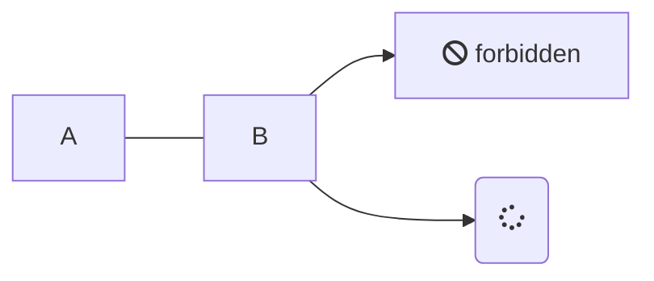
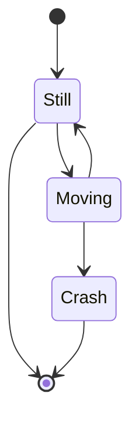

# Aufgabe 2

**Autor:** Simon Fedrau, Sascha Hahn


### Debugging 

  Unter Debugging versteht man den Prozess der Identifizierung und Behebung von Fehlern oder Bugs in einem Softwaresystem. Es ist ein wichtiger Aspekt der Softwareentwicklung, denn Fehler können dazu führen, dass ein Softwaresystem nicht richtig funktioniert, was wiederum eine schlechte Leistung oder falsche Ergebnisse zur Folge haben kann. Die Fehlersuche kann eine zeitaufwändige und komplexe Aufgabe sein, aber sie ist unerlässlich, um sicherzustellen, dass ein Softwaresystem korrekt funktioniert.

https://www.geeksforgeeks.org/software-engineering-debugging/
Aufgerufen 18.10.23


## Problem solving, Root cause analysis 


## Debugging vs. Testen

  Das Debuggen unterscheidet sich vom Testen. Das Testen konzentriert sich auf das Auffinden von Bugs, Fehlern usw., während das debuggen beginnt, nachdem ein Fehler in der Software identifiziert wurde. Das Testen dient dazu, sicherzustellen, dass das Programm korrekt ist und mit einer bestimmten Mindesterfolgsquote funktioniert. Das Testen kann manuell oder automatisiert erfolgen. Es gibt verschiedene Arten von Tests: Unit-Tests, Integrationstests, Alpha- und Beta-Tests usw. Die Fehlersuche erfordert eine Menge Wissen, Fähigkeiten und Erfahrung. Sie kann durch einige automatisierte Tools unterstützt werden, ist aber eher ein manueller Prozess, da jeder Fehler anders ist und eine andere Technik erfordert, im Gegensatz zu einem vordefinierten Testmechanismus.


https://www.geeksforgeeks.org/software-engineering-debugging/
Aufgerufen 18.10.23


## Rubber Duck Debugging 

Oder zu deutsch "Quietscheentchen-Debugging"

Quietscheentchen-Debugging (englisch „Rubber Ducking“) bezeichnet eine Methode zum Debuggen, also dem Finden von Programmfehlern in Computerprogrammen. Es existieren mehrere Bezeichnungen für diese Methode, oft mit anderen unbelebten Objekten.

Beim Quietscheentchen-Debugging erklärt der Programmierer den Quelltext Zeile für Zeile einem Quietscheentchen (oder zum Beispiel einer Person, die nichts vom Programmieren versteht). Die Erklärung erfordert ein tieferes Verständnis des Programmcodes. Bei der zeilenweisen Erklärung, was das Programm machen soll, im Vergleich zu dem, was es tatsächlich macht, fallen eventuelle Ungleichheiten auf. Während des Erklärungsprozesses fällt dem Programmierer der Fehler auf. Der Vorteil des Quietscheentchens gegenüber einer anderen Person ist, dass niemand gestört werden muss. 

Nicht zuletzt sei gesagt, dass ein Austausch des klassischen Quietscheentchens durch einen individuell bevorzugten ‚Gesprächspartner‘ die Erfolgsaussichten des Debuggings keinesfalls trübt …

https://de.wikipedia.org/wiki/Quietscheentchen-Debugging#cite_note-2

https://web.archive.org/web/20170907213645/http://quietscheentchen.net/quietscheentchen-debugging


## Time-travel debugging (reverse debugging)

Zeitreise-Debugging (auch Reverse-Debugging genannt) ermöglicht es Entwicklern, alle Programmaktivitäten zur Laufzeit aufzuzeichnen (jeden Speicherzugriff, jede Berechnung und jeden Aufruf des Betriebssystems) und dann zurückzuspulen und wieder abzuspielen, um den Programmzustand zu untersuchen.

Diese riesige Datenmenge lässt sich mit einer aussagekräftigen Metapher beschreiben: die Möglichkeit, in der Zeit zurückzureisen (und wieder vorwärts), um den Programmzustand zu untersuchen.

Um die Leistung zu optimieren, nehmen die Entwickler in der Regel eine Feinabstimmung des Zeitreise-Debuggers vor, um nur die Informationen zu sammeln, die für eine genaue Wiedergabe des untersuchten Programms erforderlich sind.


Nehmen wir an, Sie erhalten eine E-Mail-Benachrichtigung, dass ein Dienst abstürzt, kurz nachdem Ihre letzte Codeänderung implementiert wurde. Der Absturz tritt nur bei 0,1 Prozent der Server auf, auf denen der Dienst läuft. Da Sie aber in einem großen Unternehmen arbeiten, entsprechen 0,1 Prozent Tausenden von Servern - und dieses Problem wird schwer zu reproduzieren sein. Einige Stunden später können Sie das Problem immer noch nicht reproduzieren, und Sie haben einen ganzen Tag damit verbracht, diesem Problem nachzugehen.

An dieser Stelle kommt das Reverse Debugging ins Spiel. Bestehende Methoden ermöglichen es Ingenieuren, ein angehaltenes (oder abgestürztes) Programm aufzuzeichnen und dann zurückzuspulen und wieder abzuspielen, um die Grundursache zu finden. Für große Unternehmen wie Facebook sind diese Lösungen jedoch zu aufwändig, um in der Produktion eingesetzt werden zu können. Deshalb haben wir eine neue Technik entwickelt, die es Ingenieuren ermöglicht, einen fehlgeschlagenen Lauf zu verfolgen und seinen Verlauf zu untersuchen, um die Ursache zu finden, ohne das Programm erneut ausführen zu müssen, was eine enorme Zeitersparnis bedeutet. Wir tun dies, indem wir die CPU-Aktivitäten auf unseren Servern effizient verfolgen und bei Abstürzen die Prozesshistorie speichern, die später mit Hilfe des LLDB-Debuggers in einem für den Menschen lesbaren Format angezeigt wird, das von der Ansicht der Befehlshistorie bis zum Reverse Debugging alles bietet.


https://undo.io/resources/6-things-time-travel-debugging
https://engineering.fb.com/2021/04/27/developer-tools/reverse-debugging/

## Logging / Tracing 


### Logging 
Der Begriff Logging beschreibt im IT-Umfeld das automatisierte Protokollieren von System- und Prozessmeldungen. Bei den protokollierten Logdaten handelt es sich um Statusinformationen oder Ereignisse, die beim Betrieb von IT-Systemen oder bei der Ausführung von Hard- und Softwareprozessen auftreten.

Ergebnisse des Loggings sind Logdateien, die häufig in Form von Textdateien vorliegen. Die in diesen Dateien protokollierten Informationen und Ereignisse sind mit einem Zeitstempel versehen und innerhalb der Logdatei in der Regel chronologisch angeordnet. Oft sind Logdateien in ihrer maximalen Größe beschränkt, weshalb die Informationen und Ereignisse nach einer bestimmten Zeit überschrieben werden.
In einigen Bereichen und Branchen ist das Log-Management verpflichtend vorgeschrieben, um beispielsweise gesetzlichen Pflichten nachzukommen, Compliance-Richtlinien zu erfüllen oder die Nachvollziehbarkeit von Transaktionen sicherzustellen.

https://www.ip-insider.de/was-ist-logging-event-log-management-a-efd311ecd8621b98baa59d2405d870ad/

### Tracing

Wir starten am besten erneut mit einer Definition: Ein Trace ist eine direkte Visualisierung eines Requests beim Durchlauf durch eine Anwendung oder einer kompletten Anwendungslandschaft. Hierbei wird er durch eine eindeutige Trace ID identifiziert und nimmt bei jedem Arbeitsschritt Spans auf.

Spans sind die kleinste Einheit des Distributed Tracings und bilden den eigentlichen Workflow ab. Hierzu zählen beispielsweise HTTP Requests, der Aufruf einer Datenbank oder die Verarbeitung einer Nachricht beim Eventing. Analog zu einem Trace erhalten auch sie eine eindeutige Span ID und zusätzlich noch Angaben über das genaue Timing, optionale weitere Attribute, Events oder Status, je nach Use Case.


https://www.adesso.de/de/news/blog/logging-vs-tracing-2.jsp

https://www.embedded-software-engineering.de/durch-traceability-lassen-sich-unbaendige-projekte-zaehmen-a-919617/


## Ablauf des Debuggings

Das Debugging ist der Prozess des Identifizierens, Isolierens und Behebens von Fehlern oder Bugs in Software oder Hardware. Hier ist eine allgemeine Beschreibung des Ablaufs des Debuggings:

Fehlereridentifikation:
Identifiziere Anzeichen für einen Fehler, wie unerwartetes Verhalten, Fehlermeldungen oder Abstürze der Anwendung. Benutzer-Feedback und Protokolldateien sind oft hilfreiche Quellen, um auf Probleme hinzuweisen.

  Reproduzierbarkeit sicherstellen:
        Versuche, den Fehler reproduzierbar zu machen. Das bedeutet, dass du eine genaue Abfolge von Schritten dokumentieren musst, die notwendig sind, um den Fehler jedes Mal zu provozieren. Dies erleichtert die Fehleranalyse.

    Fehlerisolation:
        Begrenze den Bereich, in dem du den Fehler vermutest. Dies kann bedeuten, dass du Teile des Codes oder Hardware-Komponenten ausschließt, die keinen Zusammenhang mit dem Fehler zu haben scheinen.

    Fehleranalyse:
        Untersuche den isolierten Bereich gründlich, um die Ursache des Fehlers zu identifizieren. Dies beinhaltet das Lesen des Quellcodes, das Überprüfen von Variablen und das Verfolgen der Ausführungsschritte. Werkzeuge wie Debugging-Tools, Protokollierung und Profiling können hilfreich sein.

    Hypothesenbildung:
        Basierend auf deinen Erkenntnissen erstellst du Hypothesen darüber, was den Fehler verursachen könnte. Du könntest vermuten, dass ein bestimmter Codeabschnitt, eine Variable oder eine Konfiguration fehlerhaft ist.

    Experimente durchführen:
        Um deine Hypothesen zu überprüfen, führe gezielte Experimente durch, indem du Codeänderungen vornimmst, Variablenwerte änderst oder Konfigurationseinstellungen anpasst. Überwache die Auswirkungen dieser Experimente und stelle fest, ob der Fehler behoben wurde oder sich verändert hat.

    Schrittweises Testen:
        Teste jede Änderung schrittweise und systematisch, um sicherzustellen, dass der Fehler nicht nur behoben wurde, sondern auch keine neuen Fehler eingeführt wurden.

    Behebung und Validierung

      Entwickler beheben den Fehler und führen Tests durch, um sicherzustellen, dass die Software weiterhin wie erwartet funktioniert. Sie werden möglicherweise neue Tests schreiben, um zu prüfen, ob der Fehler in Zukunft wieder auftritt.

    Dokumentation:
        Halte alle durchgeführten Experimente und gefundenen Lösungen in einer geeigneten Form (wie Notizen oder Kommentaren im Code) fest, um anderen Entwicklern zu helfen und zukünftige Debugging-Bemühungen zu unterstützen.

    Abschluss:
        Wenn der Fehler behoben ist und die Anwendung wieder wie erwartet funktioniert, teste gründlich, um sicherzustellen, dass keine weiteren Probleme auftreten. Informiere bei Bedarf Benutzer oder Teammitglieder über die Behebung des Fehlers.

Debugging kann ein zeitaufwändiger Prozess sein, erfordert Geduld und systematisches Vorgehen, ist jedoch entscheidend, um stabile und zuverlässige Software oder Hardware zu entwickeln. Die Verwendung von geeigneten Debugging-Tools und Techniken kann diesen Prozess erleichtern und beschleunigen.


https://aws.amazon.com/de/what-is/debugging/

https://chat.openai.com/ Frage: beschreibe mir den Ablauf des 
Debuggings

## Beispiel


## Werkzeuge

Es gibt viele Debugging-Werkzeuge, die Entwickler verwenden können, um Fehler in Software zu identifizieren und zu beheben. Hier sind einige typische Debugging-Werkzeuge:

Integrierte Entwicklungsumgebungen (IDEs): Viele moderne IDEs bieten eingebaute Debugging-Tools, die es Entwicklern ermöglichen, den Code Schritt für Schritt auszuführen, Variablenwerte zu überwachen, Breakpoints zu setzen und Stack-Traces anzuzeigen. Beispiele sind Visual Studio für C#, PyCharm für Python und Eclipse für Java.

Debugger für spezielle Sprachen:
GDB (GNU Debugger): Ein leistungsstarker Debugger für C, C++, und andere Sprachen.
PDB (Python Debugger): Ein Debugger für Python.
Xcode Debugger: Der Debugger für Anwendungen, die auf Apple-Plattformen entwickelt werden.

Version Control Systeme: Diese Systeme (z. B. Git) ermöglichen es, den Verlauf von Code-Änderungen zu verfolgen und zu vergleichen, um Fehler zu finden, die durch Codeänderungen eingeführt wurden.

Protokollierung (Logging): Das Hinzufügen von Protokollierungsinformationen zu deinem Code kann dir dabei helfen, den Zustand deiner Anwendung zu verstehen und Fehler nachzuverfolgen.

Profiling-Tools: Diese Tools helfen dabei, die Leistung deiner Anwendung zu analysieren und Engpässe oder ineffiziente Codeabschnitte zu identifizieren.

Memory Debugging-Tools: Speicherleckagen und Speicherfehler können schwer zu finden sein. Tools wie Valgrind für C/C++ oder Memory Profiler für C# können hier helfen.

Browser-Entwicklertools: Wenn du webbasierte Anwendungen entwickelst, bieten moderne Webbrowser Entwicklertools, mit denen du JavaScript-Code debuggen, Netzwerkaktivitäten überwachen und den DOM (Document Object Model) inspizieren kannst.

Fehlerberichterstattungstools: Diese Tools sammeln Fehlerberichte von Benutzern, um Entwicklern bei der Identifizierung und Behebung von Problemen zu helfen. Ein Beispiel ist Sentry.

Remote Debugging-Tools: Für mobile und eingebettete Systeme können Entwickler Remote-Debugging-Werkzeuge verwenden, um Fehler auf Geräten oder in der Cloud zu analysieren.

Testwerkzeuge: Automatisierte Testwerkzeuge wie JUnit für Java oder unittest für Python helfen, Fehler durch gezielte Tests zu identifizieren.

Virtuelle Maschinen und Container: Die Verwendung von VMs oder Containern ermöglicht es Entwicklern, die Umgebung zu isolieren und Probleme in einer konsistenten Umgebung zu debuggen.

Die Wahl des richtigen Debugging-Werkzeugs hängt von der Entwicklungsumgebung, der Programmiersprache und der Art des Problems ab. Oftmals ist eine Kombination aus verschiedenen Werkzeugen notwendig, um komplexe Fehler zu identifizieren und zu beheben.

https://chat.openai.com/c/48dc5e10-62ff-4bad-af36-aed923432e5c

Frage: was sind typische Debugging werkzteuge


# Agile testing workflows


  ## TDD, BDD, ATDD


  ### Motivation, Ablauf, Inhalte, Frameworks

## Test doubles


### Mocks vs Fakes vs Stubs vs Spy


### Frameworks


# Pair programming


   ## Ablauf


   ## Best practices


# Code reviews
  
  
  ## Conventional comments
  
  
  ## Ablauf
  
  
  ## Best practices


# Refactoring


  ## Ziele des Refactorings


  ## Refactoring-Patterns


# Werkzeuge


  ## Testing / Build


  
  
  
  ### Github actions
  
  
  
  
## Bug and work tracking


# Listen

* ungeordnete Liste: `* Element 1 und nächste Zeile Tab * untergeordnetes Element 2`

* Element 1
  * untergeordnetes Element 2

-- geordnete Liste: `1. Element, 2. Element ...`

1. Element
2. Element

## Unterkapitel

 **Softwaresystem**:
  Die *innere* Sicht des Informatikers nimmt Software als Softwaresystem wahr.

 **Softwareprodukt**: Die *äußere* Sicht eines Auftraggeber nimmt ein Softwaresystem als Softwareprodukt wahr. 

### Tabelle

| A          |     B       |           C               | 
|:----------:|:-----------:|:-------------------------:|
| Eins | Zwei | Drei |
| Vier | Fünf | Sechs |

## Links

[Markdown] ist eine Sprache, die nach HTML konvertiert werden kann. 

[Markdown]: http://daringfireball.net/projects/markdown/

## Aufzählung

Es unterteilt sich in:

* A
  * A1
* B
  * B1
  * B2
* C


# Überschrift

"...the **go to** statement should be abolished..." [1].

Dieser Link führt intern zu einem anderen [Thema](qualitaet/README)

Dieser Link führt extern zu [Youtube](https://www.youtube.com/)

> Dieser Text ist völlig sinnlos, aber steht trotzdem hier. Dieser Text geht über mehrere Zeilen, wenn der Text lang genug ist, um über mehrere Zeilen zu passen.

## Unterüberschrift

* Eins
  * eins.eins
  * eins.zwei
* Zwei
  * Zwei.zwei
* Drei

### Code

```javascript
public class A {
  Integer a;
  public A() {
    this.a = 1
  }
}
```

Syntax Highlighting für Javascript. Weitere Sprachen müssen in 'index.html' konfiguriert werden.

### Mermaid
ahn




### Bilder


## Referenzen

[1]: Dijkstra, E. W. (1968). Go to statement considered harmful. 
Communications of the ACM, 11(3), 147-148.
