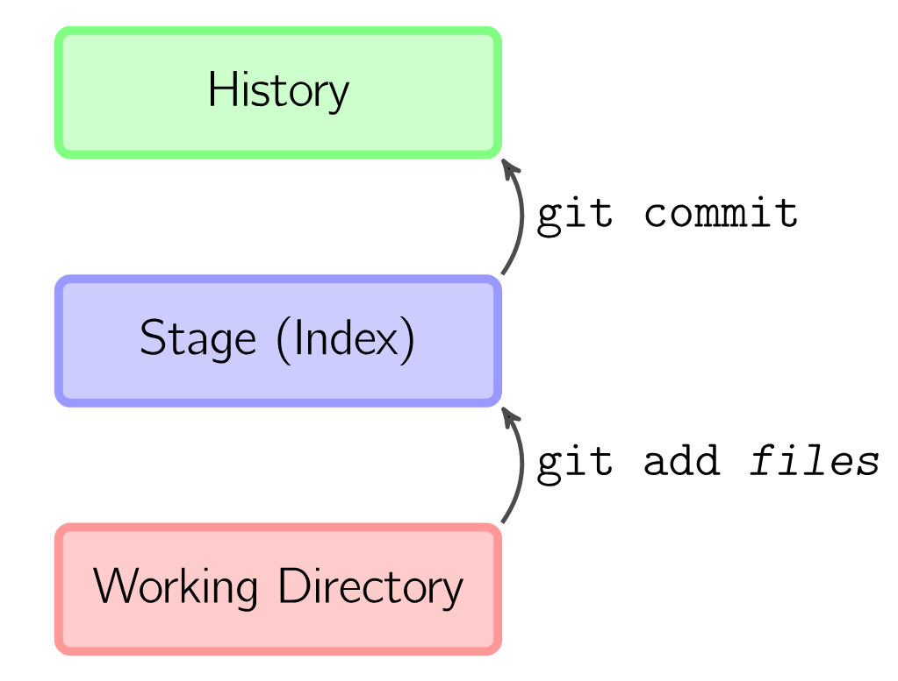
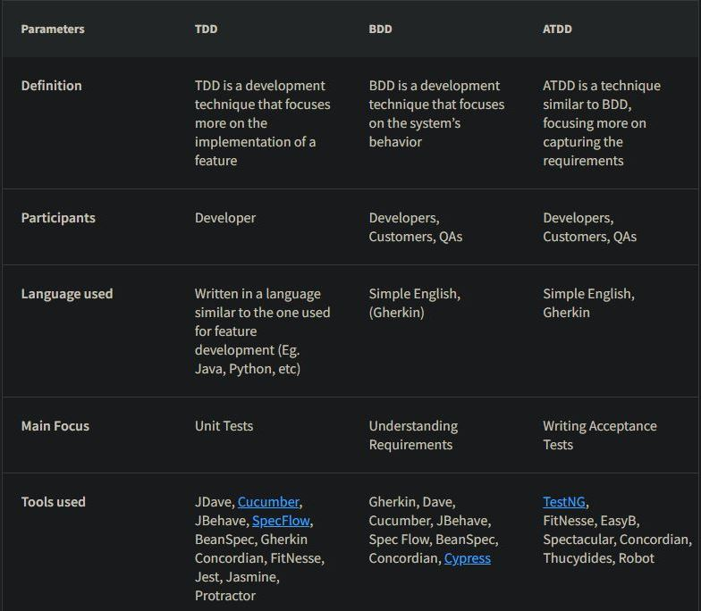

# Kpitel 3

**Autor:** Simon Fedrau, Sascha Hahn

# Lernziele

* Was sind Version control systems
* Wie benutzt man Git
* Was für Workflows gibt es
* Was für Branching strategien gibt es
* Was sind Submodules
* Was sind Pull Requests
* Was ist Ai driven development und welche Arten gibt es
* Was ist Debugging und wie geht man dabei vor
* Welche Methoden bittet das Debuggen
* Welche Werkzeuge gibt es
* Was sind Agile testing workflows
* Was sind Test doubles
* Wie geht Pair programming
* Was sind Code reviews
* Warum ist Refactoring so wichtig und was sind dessen Ziele
* Was ist Testing / Build

# Version control systems / Source code management
Version control Systems (VSC) sind Softwaretools, die Änderungen von Datein/Projekten verwalten und versionieren.
Sie werden auch benutzt um die Zusammenarbeit von mehreren Entwicklern zu ermöglichen und zu erleichtern.
Mit ihnen können zum Beispiel auch Buggs und deren Urpsrung gefunden werden, die Einflüsse der einzelnen Entwickler am Projekt
oder auch alte Teile des Projektes wiederhergestellt werden, von denen man dachte man bräuchte sie nicht mehr.
[33]

## Centralized vs Distributed Version Control
Bei einem zentralisierten VCS gibt es einen zentralen Server, auf dem die Änderungen und Versionsstränge(Repoitory) gespeichert sind. Die Entwickler sind darauf angewiesen immer mit dem Server verbunden zu sein wenn sie eine Änderung machen wollen, da sie nur eine lokale Kopie des Projektes haben(Workingcopy).
Bei einem Distributed VCS hat jeder Entwickler eine kopie des Repositories auf seinem Rechner. Wenn Sie Änderungen machen, dann werden diese in ihrem lokalen Repository gespeichert und später mit dem zentralen Repository synchronisiert.
[32]

## Git
Die meisten werden das VCS Git aus dem letzten Semester kennen. Git ist ein distributed VCS, das von Linus Torvalds entwickelt wurde.

### Relevanten git-Kommandos und -Workflows
Es gibt grundlegend drei verschiedene Bereiche mit denen man Arbeitet. Das ist die Working Copy/Directory, der Index und das Repository.

**Working Directory:** Sind alle lokalen Datein die im Bereich des Repositories fallen. Ein lokales Repository initialisiert man mit
```bash
git init
```
Alle Dateien in disem Verzeichnis sind jetzt *nur* Teil der Wirking copy


**Stage**: Dateien welche in das Repo mit aufgenommen werde sollen müssen erstmal in den stage Breich verschoben werden.
Dies geschieht mit:
```bash
git add <filename>
git add --all
```
**History/Commit:**
```bash
git commit
```
Mit diesem Befehl werden alle Änderungen der Datein die sich im Stage Bereich befinden in das Repository übernommen. Dadruch ensteht ein "Commit" welcher alle Änderungen zu seinem Vorherigen Commit enthält
<div style="display: flex; align-items: center;">
  
  <p>
  eine typische Abfolge an Befehlen wäre z.B:<br> <br>
    git add ausrbeitung.md <br>
    git add GitBasics.png <br>
    git commit -m "added chapter 3" <br>
</div>

[33,34]

### Remote repositories
Remote repositories sind jene, mit denen sich alle Entwickler Synchronisieren. Entwickler machen änderungen in ihrem lokalen repository und synchronisieren ihre änderungen dann später mit dem remote.
Wenn ein entwickler neue commits erstellt, muss der urpsrüngliche commit auch auf dem remote vorhanden sein, damit die änderungen übernommen werden können.
```bash
git push
```
#### Branches
Damit Entwickler ungestört an ihren änderungen arbeiten können, ohne die arbeit der anderen zu beeinflussen, werden branches benutzt. Jeder Entwickler hat seinen eigenen Branch der seine Änderungen enthält. Diese Branches können auch auf dem remote als einzelne Branches gepusht werden, so das andere Entwickler auf diese zugreifen können.
Wenn ein Entwickler mit seinen Änderungen fertig ist, kann er diese in den main Branch mergen. Dieser ist der Hauptbranch, der alle Änderungen enthält.
```bash
git switch -c <branchname>
git push -u origin <branchname>

git switch main
git merge <branchname>
```
[33]


### Multirepos vs. Monorepos
**Multirepo:** Jedes Projekt/Teile eines Projektes werden in einzelnen Repos Versioniert
**Monorepo:** Alle Projekte/Teile eines Projektes werden in einem Repo Versioniert

|      |Pro          |Con         |
|:-:   |:----------|:-----------|
|Multi| Reduziet unerwünschte Abhängigkeiten|Hinzufgügen von Abhängigkeiten schwieriger|
||Teams können unabhängiger an Teilen Arbeiten|Teilen von Code/Resourcen zwischen Projekten umständlicher|
||Einfachere Verwaltung und Skalierbarkeit durch Übersichtlichkeit einfacher|Keine Einheitliche Versionskontrolle(welche Version des einen Projekts ins kompatibel mit dem Anderen?)|
|Mono|Einfache Abhängigkeiten|Verwaltung und allgemeine Arbeit ist schwieriger, druch unübersichtlichkeit|
||Konsistente Versionskontrolle|Entwickler Teams behindern sich häufiger|
||einfache ResourcenTeilung||

**kleines Fazit:**<br>
Multirepos sind für kleinere Projekte besser geeignet, da sie einfacher zu verwalten sind. Bei größeren Projekten ist ein Monorepo besser geeignet, da es die Übersichtlichkeit erhöht und die Abhängigkeiten einfacher zu verwalten sind.
[35]

### Submodules
Submodules sind Repositories die in einem anderen Repository liegen. Sie werden benutzt um Code/Resourcen zwischen Projekten zu teilen, wie z.B. eine Bibliothek.
Man kann sie mit dem folgendem Befehl hinzufügen:
```bash
git add submodule <url>
```
Dabei erstellt git einen Ordner mit dem Namen des Submodules und eine Datei namens *.gitmodules* in dem der pfad und die url aller submodules gespeichert werden.

[36]
### Pull Requests
Pull Request sind ein Teil der Plattform Git-Hub.
Git-Hub ist ein unbhängiger anbieter von Git, der es ermöglicht Projekte auf einem Server zu hosten und mit anderen Entwicklern zu teilen.

Bei einem Pull request stellt ein Entwickler seine Änderungen anderen Entwicklern zur verfügung. Diese können dann die Änderungen übernehmen oder ablehnen.
Der Entwickler hat also einen eigenen Branch erstellt, auf diesem änderungen gemacht und stellt jetzt eine anfrage zum mergen dieses branches in den main branch.
[33]

### Branching strategies
Branching strategien sind Arbeitsweisen mit denen festfelegt wurde wie mit branches umgegangen wird und wie man das Projekt dmit sturkturiert.

#### Long-lived branches
Im Allgemeinen gibt es zwei Arten von Branches. Long-lived und Short-lived branches. Long-Lied Branches sind, jene die über einen längeren Zeitraum bestehen bleiben, wie zum Beispiel ein Release oder Version Branch.
[32]

#### Trunk-based Development
Dies ist die wohl einfachste Variante der Branching strategien. Es gibt nur einen Branch, den main branch. Alle Entwickler arbeiten auf diesem Branch und commiten ihre Änderungen direkt auf diesen Branch.
Man kann aber auch auf anderen Branches Arbeiten und diese dann in den main Branch mergen und rebasen.
[32]

#### Git Flow
Git Flow ist eine Branching strategie die von Vincent Driessen entwickelt wurde. Die besteht aus 3 verschiedenen Long Lived Branches und mindestens 2 Short Lived Branches.
##### Feature, develop, release, hotfix und main branch


**Develop:** Ist der Hauptbranch von dem alle anderen Branches abzweigen. Auf dem Hauptbranch direkt werden aber nur kleinere Bugfixes gemacht oder ähnliches gemacht.

**Feature:** Feature Branches entspringen aus dem Develop Branch und werden benutzt um neue Features zu entwickeln. Wenn ein Feature fertig ist, wird es in den Develop Branch gemerged. Es kann beliegbig viele Feature Branches geben.

**Release:** Release Branches werden benutzt um ein Release vorzubereiten. Auf diesem Branch werden nur noch letzte Bugfixes gemacht und andere für den Release wichtige Sachen fertigestellt. Der Vorteil an dem Release Branch ist, dass man auf dem Develop schon für den nächsten Release weiter arbeiten kann. Alle Änderungen die auf dem Release Branch gemacht werden, werden auch in den Develop Branch gemerged und in den Main Branch gemerged, wenn der Release fertig ist.

**Main:** Auf der Main Branch werden alle fertigen Releases festgehalten. Jeder Release wird mit einem Tag versehen, der die Versionsnummer enthält.

**Hotfix:** Bei schwerwiegenden Bugs die es in einen Release geschafft haben, wird ein Hotfix Branch erstellt. Auf diesem Branch werden die Bugs gefixt und direkt wieder in den Main und Develop Branch gemerged. Der neue commit auf dem Main branch bekommt auch wieder einen Tag mit der neuen Versionsnummer.
[33]

#### Github Flow
Bei dem Github Flow gibt es nur einen long-lived Branch, den Main Branch. Bei Features oder Bugfixes werden weitere kurzlebige Feature Branches erstellt, welche dann später in den main gemerged werden.
Die besonderheit beim Github Flow ist jetzt, dass die Entwickler einen Merge-Request auf GitHub stellen. Der Merge-Request wird dann von anderen Entwicklern geprüft, diskutiert und dann automatisch in den main gemerged.

[33]
### Merging strategies
Es gibt verscheidenen Möglichkeiten Branches zu vereinigen:

#### Merge Commit
```bash
git switch main
git merge <branchname>
```
Hier wird ein neuer Commit erzeigt, welcher die Änderungen der beiden Branches zusammenführt. Wenn nur einer der beiden neuen Branches Änderungen enthält, dann geschieht ein *fast-forward*. Beide Branches zeigen dann auf den selben Commit und es wird kein neuer erstellt.
Es kann auch ein bestimmtes verhalten geforced werden mit den Parametern *--no-ff* und *--ff-only*.
[33]

#### Squash and Merge
```bash
git switch main
git merge --squash <branchname>
```
Alle commits des Branches werden zu einem zusammengefasst und dann in den main Branch gemerged.
[33]
#### Rebase and Merge
```bash
git switch main
git merge --rebase <branchname>
```
Hier werden die Commits des Branches auf den main Branch gesetzt.
Am Ende sieht es also so aus als hätte der andere Branch nie existiert und es verbleit eine chronologische reihenfolge.
[33]

### Aufbau und Inhalt von Commit messages
**Aufbau:**
1. kurzer Zusammenfassung 72 zeichen oder weniger
2. detailierte Beschreibung

**Conventions:**
* Verwende den Imperativ: "Fix Bug" nicht "Fixed Bug"
* Großschreibung am Anfang
* Kein Punkt am Ende
* beschreibe was und warum, nicht wie
[37]

# AI-driven development
Einfach gesagt ist AI-driven development die unterstützung von Entwicklern durch KI.
Zum Beispiel durch automatisches generieren von Code, automatisches testen oder auch durch automatisches debuggen.
[32]

## Conversational AI vs. Generative AI
**Conversational:**
AI-Systeme, welche auf menschliche Weise mit dem User interagieren.
Diese Sind eher bekannt unter dem Begriff Chatbot oder Sprachassistent.
Sie können Frgen beantworten Aufgaben erledigen oder einfach Informationen bereitstellen.

**Generative:**
AI-Systeme, welche neue Inhalte generieren können. Sie können Text, Bilder, Videos oder andere Inahlte generieren.
Man kann sagen sie leisten kreative Arbeoit und erschaffen etwas neues.
[38]

Bei Vielen AI Tools überschneiden sich in diese beiden Bezeichnungen.
Für die meisten ist wahrschinlich ChatGPT das bekannteste Beispiel, welches zum einen Text generiert und informationen liefert,
aber auch neue Programmteile oder kreative Texte generieren kann.
[32]
## Prompt engineering
Prompt Engineering ist die Erstellung von Prompts oder Eingabeaufforderungen für künstliche Intelligenz-Modelle.
Der Zweck ist die gewüschten Antworten und Ausgaben des Modells zu beeinflussen.
[39]

## ChatGPT, Github Copilot
Wie schon erwähnt ist ChatGPT ein AI-System, welches eine Generative und conversational AI ist, die auf der GPT-3 Architektur basiert. Man kann ihr Fragen stellen, oder auffordern bestimmte Texte zu schreiben, Aufgaben zu lösen oder Code zu Programmieren.
Ähnlich dazu ist der GitHub-Copilot. Dieser funktioniert wie chatGPT, nur das er auf Code spezialisiert ist.
Man benutzt ihn direkt in seiner IDE und er erkennt automaitsch den Kontext anhander der Datein und schlägt Code oder Text vor.
[32]
## Best practices für "googling"
* klare Schlagwörter
* mit Anfühurngszeichen knn man nach einem genauen Satz/Begriff suchen
* Man kann "OR" benutzen für alternativen
* nach der Suchanfrage Filtern nach Bildern, Videos, etc.
[40]

## Debugging 

Unter Debugging versteht man den Prozess der Identifizierung und Behebung von Fehlern oder Bugs in einem Softwaresystem. Es ist ein wichtiger Aspekt der Softwareentwicklung, denn Fehler können dazu führen, dass ein Softwaresystem nicht richtig funktioniert, was wiederum eine schlechte Leistung oder falsche Ergebnisse zur Folge haben kann. Die Fehlersuche kann eine zeitaufwändige und komplexe Aufgabe sein, aber sie ist unerlässlich, um sicherzustellen, dass ein Softwaresystem korrekt funktioniert.

[1]

## Problem solving, Root cause analysis 

Die Root Cause Analysis (Ursachenanalyse oder Fehler-Ursache-Analyse) ist eine Möglichkeit, um zu bestimmen, wie ein problematisches Ereignis aufgetreten ist. Dazu wird untersucht, warum, wie und wann das Problem entstanden ist. Wenn ein System nicht mehr funktioniert oder sich verändert, sollte untersucht werden, wie es zu dem Problem kam. Nur so kann es vollständig analysiert werden. Die Analyse nach den Ursachen ist ein Schritt, der über die Problemlösung hinausgeht. Dies ist eine Korrekturmaßnahme, die durchgeführt wird, wenn ein Problem auftritt.

Methoden der Root Cause Analysis
Die gängigste Methode zur Fehler-Ursache-Analyse ist bekannt als die fünf Warum-Fragen
Definieren Sie das Problem und stellen Sie zu jeder Antwort eine Warum-Frage. Suchen Sie weiter, bis Sie wirklich zu den Gründen kommen, die das Warum erklären, was passiert ist. Die Zahl Fünf im Namen der Methode ist nur ein Anhaltspunkt, die wahre Anzahl an SChritten kann je nach Problem stark varieren.

Neben der Fünf-Warum-Fragen-Methode besteht ein weiterer beliebter Ansatz zur Root Cause Analysis darin, ein Ursache-Wirkungs-Diagramm zu erstellen, das auch als Fischgrätendiagramm bezeichnet wird.

[2]
## Debugging vs. Testen

  Debuggen und Testen sind zwei unterschiedliche dinge. Das Testen konzentriert sich auf das Auffinden von Bugs, Fehlern usw., während das debuggen beginnt, nachdem ein Fehler in der Software identifiziert wurde. Das Testen dient dazu, sicherzustellen, dass das Programm korrekt ist und mit einer bestimmten Mindesterfolgsquote funktioniert. Das Testen kann manuell oder automatisiert erfolgen. Es gibt verschiedene Arten von Tests: Unit-Tests, Integrationstests, Alpha- und Beta-Tests usw. Sie kann durch einige automatisierte Tools unterstützt werden, ist aber eher ein manueller Prozess, da jeder Fehler anders ist und eine andere Technik erfordert, im Gegensatz zu einem vordefinierten Testmechanismus.

[3]

## Rubber Duck Debugging 

Oder zu deutsch "Quietscheentchen-Debugging"
Es existieren mehrere Bezeichnungen für diese Methode, oft mit anderen unbelebten Objekten.

Beim Quietscheentchen-Debugging erklärt der Programmierer den Quelltext Zeile für Zeile einem Quietscheentchen, oder einer Person, die nichts vom Programmieren versteht. Die Erklärung erfordert ein tieferes Verständnis des Programmcodes. Bei der zeilenweisen Erklärung, was das Programm machen soll, im Vergleich zu dem, was es tatsächlich macht, fallen eventuelle Ungleichheiten auf. Während des Erklärungsprozesses fällt dem Programmierer der Fehler auf.  

[4] [5]
    
## Time-travel debugging (reverse debugging)

Zeitreise-Debugging oder auch Reverse-Debugging genannt ermöglicht es Entwicklern, alle Programmaktivitäten zur Laufzeit aufzuzeichnen z.B jeden Speicherzugriff, jede Berechnung und jeden Aufruf des Betriebssystems, dann zurückzuspulen und wieder abzuspielen, um den Programmzustand zu untersuchen.

Diese riesige Datenmenge lässt sich mit einer aussagekräftigen Metapher beschreiben: die Möglichkeit, in der Zeit zurückzureisen, um den Programmzustand zu untersuchen.

Nehmen wir an, Sie erhalten eine E-Mail-Benachrichtigung, dass ein Dienst abstürzt, kurz nachdem Ihre letzte Codeänderung implementiert wurde. Der Absturz tritt nur bei 0,1 Prozent der Server auf, auf denen der Dienst läuft. Das Problem ist zudem schwer zu reproduzieren.

An dieser Stelle kommt das Reverse Debugging ins Spiel. Bestehende Methoden ermöglichen es, ein angehaltenes oder abgestürztes Programm aufzuzeichnen und dann zurückzuspulen und wieder abzuspielen, um die Grundursache zu finden und das Problem zu beheben.

[6] [7] 

## Logging / Tracing 


### Logging 
Der Begriff Logging beschreibt im IT-Umfeld das automatisierte Protokollieren von System- und Prozessmeldungen. Bei den protokollierten Logdaten handelt es sich um Statusinformationen oder Ereignisse, die von IT-Systemen oder bei der Ausführung von Hard- und Softwareprozessen auftreten.

Ergebnisse des Loggings sind Logdateien, die häufig in Form von Textdateien vorliegen. Die in diesen Dateien protokollierten Informationen und Ereignisse sind mit einem Zeitstempel versehen und innerhalb der Logdatei in der Regel chronologisch angeordnet. Oft sind Logdateien in ihrer maximalen Größe beschränkt, weshalb die Informationen und Ereignisse nach einer bestimmten Zeit überschrieben werden. Durch die Logfiles kann ein bestehendes Problem innerhalb eines Programms lokaliesiert werden, da durch ein Aufrufen einer Methode z.B ein Log ausgelöst wird.

[8]

### Tracing

Ein Trace ist eine direkte Visualisierung eines Requests beim Durchlauf durch eine Anwendung oder einer kompletten Anwendungslandschaft. Hierbei wird er durch eine eindeutige Trace ID identifiziert und nimmt bei jedem Arbeitsschritt Spans auf.

Spans sind die kleinste Einheit des Distributed Tracings und bilden den eigentlichen Workflow ab. Hierzu zählen beispielsweise HTTP Requests, der Aufruf einer Datenbank oder die Verarbeitung einer Nachricht beim Eventing. Analog zu einem Trace erhalten auch sie eine eindeutige Span ID und zusätzlich noch Angaben über das genaue Timing, optionale weitere Attribute, Events oder Status, je nach Use Case.
Dadurch kann man wie beim Logging nachvollziehen warum sich ein Programm so verhält und so einen evtl. fehler finden.

[9] [10] 

## Ablauf des Debuggings

Das Debugging ist der Prozess des Identifizierens, Isolierens und Behebens von Fehlern.

      Fehlereridentifikation:
      Identifiziere Anzeichen für einen Fehler, wie unerwartetes Verhalten, Fehlermeldungen oder Abstürze der Anwendung. Benutzer-Feedback und Protokolldateien sind oft hilfreiche Quellen, um auf Probleme hinzuweisen.

     Reproduzierbarkeit sicherstellen:
        Versuche, den Fehler reproduzierbar zu machen. 

    Fehlerisolation:
        Begrenze den Bereich, in dem du den Fehler vermutest.

    Fehleranalyse:
        Untersuche den isolierten Bereich gründlich, um die Ursache des Fehlers zu 
        identifizieren. 

    Hypothesenbildung:
        Basierend auf deinen Erkenntnissen erstellst du Hypothesen darüber, was den 
        Fehler verursachen könnte.

    Experimente durchführen:
        Um deine Hypothesen zu überprüfen, führe gezielte Experimente durch, indem du 
        Codeänderungen vornimmst, Variablenwerte änderst oder 
        Konfigurationseinstellungen anpasst.

    Schrittweises Testen:
        Teste jede Änderung schrittweise und systematisch, um sicherzustellen, dass 
        der Fehler nicht nur behoben wurde, sondern auch keine neuen Fehler eingeführt wurden.

    Dokumentation:
        Halte alle durchgeführten Experimente und gefundenen Lösungen in einer geeigneten 
        Form (wie Notizen oder Kommentaren im Code) fest, um anderen Entwicklern zu helfen 
        und zukünftige Debugging-Bemühungen zu unterstützen.

    Abschluss:
        Wenn der Fehler behoben ist und die Anwendung wieder wie erwartet funktioniert, 
        teste gründlich, um sicherzustellen, dass keine weiteren Probleme auftreten. 
        Informiere bei Bedarf Benutzer oder Teammitglieder über die Behebung des Fehlers.

[11] [12] 

## Beispiel

```python 
def add_numbers(a, b):
    result = a * b  # Hier liegt ein Fehler, es sollte eine Addition sein
    return result

x = 5
y = 3
result = add_numbers(x, y)
print(f'Die Summe von {x} und {y} ist {result}')
```

```python 
def add_numbers(a, b):
    result = a + b  # Hier wurde der Fehler behoben
    return result

x = 5
y = 3
result = add_numbers(x, y)
print(f'Die Summe von {x} und {y} ist {result}')
```

## Werkzeuge

Hier sind einige typische Debugging-Werkzeuge:

Integrierte Entwicklungsumgebungen (IDEs): Viele moderne IDEs bieten eingebaute Debugging-Tools, die es Entwicklern ermöglichen, den Code Schritt für Schritt auszuführen, Variablenwerte zu überwachen, Breakpoints zu setzen und Stack-Traces anzuzeigen. Beispiele sind  PyCharm für Python und Eclipse, IntelliJ für Java.

* Debugger für spezielle Sprachen:
  * GDB (GNU Debugger): Ein leistungsstarker Debugger für C, C++
  * PDB (Python Debugger): Ein Debugger für Python.
  * Xcode Debugger: Der Debugger für Anwendungen, die auf Apple-Plattformen entwickelt werden.

* Version Control Systeme:
  * Git ermöglicht es, den Verlauf von Code-Änderungen zu verfolgen und zu vergleichen, um Fehler zu finden, die durch Codeänderungen   eingeführt wurden.

* Protokollierung (Logging): 
  * Das Hinzufügen von Protokollierungsinformationen zu deinem Code kann dir dabei helfen, den Zustand deiner Anwendung zu verstehen und Fehler nachzuverfolgen.

* Profiling-Tools: 
  * Diese Tools helfen dabei, die Leistung deiner Anwendung zu analysieren und Engpässe oder ineffiziente Codeabschnitte zu identifizieren.

* Memory Debugging-Tools: 
  * Speicherleckagen und Speicherfehler können schwer zu finden sein. Tools wie Valgrind für C/C++ oder Memory Profiler für C# können hier helfen.

* Browser-Entwicklertools: 
  * Wenn du webbasierte Anwendungen entwickelst, bieten moderne Webbrowser Entwicklertools, mit denen du JavaScript-Code debuggen, Netzwerkaktivitäten überwachen und den DOM (Document Object Model) inspizieren kannst.

* Testwerkzeuge: 
  * Automatisierte Testwerkzeuge wie JUnit für Java oder unittest für Python helfen, Fehler durch gezielte Tests zu identifizieren.

* Virtuelle Maschinen und Container:
  * Die Verwendung von VMs oder Containern ermöglicht es Entwicklern, die Umgebung zu isolieren und Probleme in einer konsistenten Umgebung zu debuggen.

[13]

# Agile testing workflows

Agile Testing Workflows beziehen sich auf den Prozess des Testens von Software in einem agilen Entwicklungsumfeld. Agiles Testen ist eine Methode, die eng mit den Prinzipien agiler Softwareentwicklungsmethoden verbunden ist. Der Schwerpunkt liegt darauf, flexibel und kontinuierlich qualitativ hochwertige Software bereitzustellen, indem Tests in den gesamten Entwicklungsprozess integriert werden. Durch diese Arbeitweise lässt es sich vermeiden am Ende der entwicklung auf gravierende Fehler in der Software zu stoßen und somit die Veröffentlichung zu verschieben oder ein unfertiges Produkt zu veröffentlichen.

[14] 
[15] 

## TDD, BDD, ATDD

### TDD

Bei einer Test-Driven Development handelt es sich um eine Testmethodik oder eine Programmierpraxis, die aus der Perspektive eines Entwicklers umgesetzt wird. Bei dieser Technik beginnt ein Programmierer mit dem Entwurf und der Erstellung von Testfällen für jede kleine Funktionalität einer Anwendung. Mit dieser Technik wird versucht, eine einfache Frage zu beantworten: Ist der Code gültig?

Der Hauptzweck dieser Technik besteht darin, den Code nur dann zu ändern oder neu zu schreiben, wenn der Test fehlschlägt. Dies führt zu einer geringeren Duplizierung von Testskripten. Bei einem TDD-Ansatz werden die automatisierten Testskripte vor den funktionalen Teilen des Codes geschrieben. Die TDD-Methodik umfasst die folgenden Schritte:

Ein Entwickler schreibt einen automatisierten Testfall auf der Grundlage der in den Dokumenten festgelegten Anforderungen.
Diese Tests werden ausgeführt, und in einigen Fällen schlagen sie fehl, da sie vor der Entwicklung einer tatsächlichen Funktion entwickelt werden.
Das Entwicklungsteam überarbeitet dann den Code, damit der Test erfolgreich durchgeführt werden kann.
TDD kann von einem einzigen Entwickler durchgeführt werden, der sowohl Tests als auch Anwendungscode nebeneinander schreibt, um eine Funktion fertigzustellen.

[16] 
### BDD

Das Behavioral-Driven Development ist ein von der Methodik der Test-Driven Development abgeleiteter Testansatz. Bei BDD basieren die Tests hauptsächlich auf dem Systemverhalten. Dieser Ansatz definiert verschiedene Möglichkeiten, eine Funktion auf der Grundlage ihres Verhaltens zu entwickeln. In den meisten Fällen wird der Given-When-Then-Ansatz (Gherkin) für das Schreiben von Testfällen verwendet. Ein Beispiel verdeutlicht das:

* Vorausgesetzt, der Benutzer hat gültige Anmeldedaten eingegeben
* Wenn ein Benutzer auf die Anmeldeschaltfläche klickt
* Dann wird die Meldung über die erfolgreiche Validierung angezeigt

Wie oben gezeigt, wird das Verhalten in einer sehr einfachen Sprache dargestellt, einer gemeinsamen Sprache. Dies hilft allen im Entwicklungsteam, das Verhalten der Funktion zu verstehen.

* Gherkin-Sprache: In BDD wird oft eine spezielle Sprache namens Gherkin verwendet, um das erwartete Verhalten der Software zu beschreiben. Gherkin ist eine natürlichsprachige   Syntax, die leicht verständlich ist und es Teammitgliedern ermöglicht, sich auf das Verhalten der Software zu konzentrieren, anstatt sich mit technischen Details zu beschäftigen. Beispiele für Gherkin-Schreibweise sind "Given-When-Then" oder "Als-Nächstes-Dann".

* Kollaboration: BDD fördert die Zusammenarbeit zwischen Entwicklern, Testern und Nicht-Technikern, um sicherzustellen, dass alle Beteiligten ein gemeinsames Verständnis darüber haben, wie die Software funktionieren sollte. Dies erfolgt oft in Form von Besprechungen und Diskussionen.

[16] 

### ATDD

ATDD steht für "Acceptance Test-Driven Development" und ist eine agile Praxis, die sich auf die Verbesserung der Kommunikation zwischen Entwicklern, Testern und Stakeholdern konzentriert, um sicherzustellen, dass die entwickelte Software die Akzeptanzkriterien und die Erwartungen der Benutzer erfüllt. ATDD ist eng mit BDD verbunden und baut auf ähnlichen Prinzipien auf. Hier sind die Hauptkomponenten von ATDD:

* Akzeptanzkriterien: Wie bei BDD spielen Akzeptanzkriterien eine zentrale Rolle in ATDD. Diese Kriterien definieren, was von der Software erwartet wird und dienen als Grundlage für die Entwicklung und Tests. Sie werden in enger Zusammenarbeit mit den Stakeholdern erstellt.

* Zusammenarbeit: ATDD fördert die Zusammenarbeit zwischen Entwicklern, Testern und Stakeholdern. Dies erfolgt in Form von Diskussionen und Besprechungen, bei denen die Akzeptanzkriterien und erwarteten Verhaltensweisen der Software geklärt werden.

* Entwicklung von Akzeptanztests: Auf der Grundlage der Akzeptanzkriterien werden Akzeptanztests erstellt. Diese Tests beschreiben, wie die Software getestet wird, um sicherzustellen, dass sie die akzeptierten Kriterien erfüllt.

* Testautomatisierung: Die Akzeptanztests werden in der Regel automatisiert, um sicherzustellen, dass sie regelmäßig und effizient durchgeführt werden können. Diese Tests überprüfen, ob die Software die spezifizierten Akzeptanzkriterien erfüllt.

* Kontinuierliche Überprüfung und Validierung: Wie bei BDD werden die Akzeptanztests regelmäßig ausgeführt, um sicherzustellen, dass die Software weiterhin die Akzeptanzkriterien erfüllt. Dies ermöglicht eine kontinuierliche Validierung und Überprüfung des Softwareverhaltens.

* Kommunikation und Transparenz: ATDD fördert die offene und transparente Kommunikation zwischen den verschiedenen Teammitgliedern und Stakeholdern. Dies hilft, Missverständnisse zu minimieren und sicherzustellen, dass die entwickelte Software den Erwartungen entspricht.

[16] 

### Motivation, Ablauf, Inhalte, Frameworks




## Test doubles

Test doubles kommen in automatisierten Einheitstests vor, um die Wahrscheinlichkeit des Auftretens von Fehlern in der Software zu verringern. Die endgültige Software besteht aus einem komplexen Satz von Objekten oder Prozeduren, die zusammenwirken, um das Endergebnis zu erzeugen. Bei automatisierten Unit-Tests kann es notwendig sein, Objekte oder Prozeduren zu verwenden, die wie ihre für die Veröffentlichung vorgesehenen Gegenstücke aussehen und sich auch so verhalten, aber eigentlich vereinfachte Versionen sind, die die Komplexität reduzieren und das Testen erleichtern. Ein Testdoppel ist ein allgemeiner (Meta-)Begriff, der für diese Objekte oder Prozeduren verwendet wird.

[17] 

### Mocks vs Fakes vs Stubs vs Spy

* Mock 
  * Ein Mock ist eine Attrappe oder ein Dummy-Objekt, das in Unit Tests verwendet wird, um die Interaktionen zwischen verschiedenen Teilen des Codes zu simulieren. Mock-Objekte werden verwendet, um zu überwachen, ob bestimmte Methoden aufgerufen wurden und welche Parameter übergeben wurden. Sie sind nützlich, um das Verhalten von Abhängigkeiten oder externen Systemen nachzuahmen, ohne diese tatsächlich aufrufen zu müssen. Mocks helfen, Tests zu isolieren und zu überprüfen, ob die getestete Komponente korrekt mit ihren Abhängigkeiten interagiert.

* Fake 
  * Ein Fake ist ein vorgefertigtes Objekt oder eine Implementierung, die in Tests anstelle einer echten Implementierung eines Systems verwendet wird. Fakes sind oft einfacher als die echten Implementierungen, und sie können so konfiguriert werden, dass sie vorhersehbare Verhaltensweisen aufweisen. Sie sind hilfreich, wenn Sie eine echte Implementierung ersetzen müssen, die teuer ist oder nicht für den Testzweck geeignet ist.

* Stub 
  * Ein Stub ist eine einfache Implementierung oder ein Platzhalter für eine Methode oder ein Objekt. Stubs werden verwendet, um vordefinierte Antworten auf Methodenaufrufe bereitzustellen. Im Kontext von Tests werden Stubs häufig verwendet, um bestimmte Teile des Codes zu isolieren und zu testen, ohne auf tatsächliche Abhängigkeiten zuzugreifen. Ein Stub kann beispielsweise eine Methode aufrufen und eine vordefinierte Antwort zurückgeben, ohne die tatsächliche Logik der Methode auszuführen.

* Spy 
  * Ein Spy ist ein Objekt, das verwendet wird, um Interaktionen in einem Test zu überwachen, ohne das eigentliche Verhalten des zu testenden Codes zu beeinflussen. Im Gegensatz zu einem Mock, der erwartet, dass bestimmte Methoden aufgerufen werden, zeichnet ein Spy die tatsächlichen Aufrufe auf und kann später überprüft werden. Spies sind nützlich, um zu sehen, wie oft und mit welchen Parametern bestimmte Methoden aufgerufen wurden, ohne das Testverhalten zu ändern.


[18]

### Frameworks

* In verschiedenen Bereichen/Programmiersprachen werden verschiedene Frameworks und Tools verwendet, um die Testautomatisierung und die Verwaltung von Tests zu unterstützen. Hier sind einige der gängigen Frameworks und Tools, die in agilen Testumgebungen eingesetzt werden:

  * Selenium: Selenium ist eines der am weitesten verbreiteten Frameworks für die Automatisierung von Webanwendungen. Es ermöglicht das Aufzeichnen und Wiedergeben von Tests in verschiedenen Programmiersprachen und bietet Funktionen zur Interaktion mit Webseiten und zur Validierung von UI-Elementen.

  * Cucumber: Cucumber ist ein BDD (Behavior-Driven Development)-Framework, das die Erstellung von Tests in natürlicher Sprache ermöglicht. Es verwendet Gherkin-Syntax und fördert die Zusammenarbeit zwischen Entwicklern, Testern und Stakeholdern.

   * JUnit und TestNG: Diese Frameworks sind hauptsächlich für Java-Anwendungen und unterstützen das Testen von Einheiten und die Erstellung von Testklassen. Sie bieten Testreporting, Testausführung und Testverwaltungsfunktionen.

  * Appium: Appium ist ein Framework für die Testautomatisierung von mobilen Anwendungen auf verschiedenen Plattformen, einschließlich iOS und Android. Es ermöglicht die Verwendung von Standard-Webtechnologien und Programmiersprachen für die Testautomatisierung von mobilen Apps.

  * Jenkins: Jenkins ist ein bekanntes Continuous Integration (CI)- und Continuous Delivery (CD)-Tool, das häufig in agilen Umgebungen verwendet wird, um die automatische Ausführung von Tests nach jeder Code-Änderung zu ermöglichen.

  * JIRA und Confluence: Diese Atlassian-Tools werden häufig zur Verwaltung von Aufgaben, Fehlerverfolgung und Testdokumentation in agilen Umgebungen verwendet. JIRA unterstützt die Agilen Methoden Scrum und Kanban, während Confluence für die Dokumentation und Zusammenarbeit genutzt wird.

[19] [20] 


# Pair programming

Bei der Erstellung des Quellcodes arbeiten jeweils zwei Programmierer gleichzeitig an einem Arbeitsplatz: Einer schreibt den Code, während der andere über die Problemstellungen nachdenkt, den geschriebenen Code kontrolliert sowie Probleme, die ihm dabei auffallen, sofort anspricht. Diese können dann sofort im Gespräch gelöst werden. Die beiden Programmierer sollten sich in den beiden Rollen abwechseln. Auch die Zusammensetzung der Paare sollte sich häufig ändern.
Zunächst soll Paarprogrammierung die Softwarequalität steigern. Durch die Kontrollfunktion der zweiten Person sollen problematische Lösungen vermieden werden. Die Paarprogrammierung dient aber auch zur Verbreitung von Wissen über den Quellcode. Durch das regelmäßige Rotieren der Partner kann immer der jeweils neue Partner durch Learning by Doing etwas über die bearbeiteten Quelltexte lernen.

[21] 


## Ablauf

Es gibt zwei Rollen: den Driver bzw. Piloten und den Navigator bzw. Observer. Der Driver bedient den Computer und schreibt den Code. Er kommentiert, was er tut, so dass der Navigator die zugrunde liegenden Gedanken nachvollziehen kann. Der Navigator beobachtet, gibt Feedback zur Implementierung und versucht Ideen zu entwickeln, um die Aufgabe noch besser zu lösen. Ziel der Rollenteilung ist es, zwei verschiedene Perspektiven auf den Code zu haben: Der Driver soll eher taktisch denken, er soll über die Details, über die vorhandenen Codezeilen nachdenken. Der Navigator kann in seiner beobachtenden Rolle strategischer denken. Er hat das Gesamtbild im Blick.
Die Rollen wechseln regelmäßig zwischen den Entwicklern, so dass jeder im Wechsel Driver oder Navigator ist.
Idealerweise entwickelt das Paar einen Teamgeist, kommuniziert kontinuierlich und klärt Unklarheiten zum Vorgehen, zur Programmierung, zum Testen so schnell wie möglich.
Es ist durchaus üblich, dass einer der beiden Entwickler nach einer Weile (2-3 Tage oder eine Woche) das Team verlässt und Platz für einen anderen Kollegen macht. Es kommt zu einer Paar-Rotation bzw. Pair Rotation. In manchen Publikationen wir die Person, die bleibt, als anchor bzw. Anker bezeichnet. Die Absicht dahinter eine frische Perspektive, neue Energie und das Vermeiden von Silos. Natürlich sollte hier jede Organisation individuell entscheiden, ob und wann ein Wechsel sinnvoll ist.

[22]

## Best practices

* Klären Sie den generellen Umfang der Paarprogrammierung. Ist es eine temporäre Sache, ein erster Test oder eine auf Dauer angelegte Form der Zusammenarbeit.
* Klären Sie die konkrete Zusammenarbeit, also bspw. wann beginnen Sie morgens, wann hören Sie auf, wann gibt es planmäßige Pausen, an welchem Arbeitsplatz wird gearbeitet etc.
* Bearbeiten Sie stets nur eine Aufgabe. Eine Aufgabe, ein Ziel, ein Vorgehen.

* Nutzen Sie Zeilennummern, um konkrete Codezeilen leichter identifizieren zu können.
* Spielen Sie “Ping Pong”, bspw. im Zuge von Test -Driven Development. Entwickler A schreibt einen Test (Ping), Entwickler B die Implementierung, um den Test zu bestehen (Pong). Entwickler A erweitert den Test (Ping) und Entwickler B erweitert die Implementierung (Pong).
* Es kann nützlich sein, einen Timer zu verwenden, um so zu festen Zeiten – bspw. alle 20 Minuten – die Rollen zu wechseln. Je eingespielter ein Tandem ist, desto weniger wichtig wird die Verwendung eines Timers.
* Tandem Programmierung ist auch eine Frage der Haltung. Anstelle von “Ich habe eine Idee, gib mir mal die Tastatur” wäre ein “Ich habe eine Idee. Nimm Du mal die Tastatur.” wünschenswert.

[22]

# Code reviews

Welche Inhalte in einem Code Review untersucht und verbessert werden, lässt sich nicht allgemeingültig beantworten. Einige Teams ziehen es vor, jede Änderung zu überprüfen, während andere eine Art Schwelle definieren, unter der eine Überprüfung nicht erforderlich ist. Einerseits sollten Organisationen versuchen, ein gutes Verhältnis zwischen der effektiven Nutzung der Zeit der Beteiligten und der Aufrechterhaltung bzw. Steigerung der Codequalität zu finden. In bestimmten regulatorischen Umgebungen kann ein Code Review sogar für geringfügige Änderungen erforderlich sein. Andererseits reicht es auch nicht aus, den Code nur auf Funktionssicherheit und Fehlerfreiheit zu überprüfen, denn nicht der vorliegende Code ist der Maßstab, sondern die Aufgabe, die er erfüllen soll.

* Beim Pair Programming arbeiten zwei Entwickler gemeinsam an demselben Code und überprüfen damit kontinuierlich die Arbeit des jeweils anderen. So ist das Code Review direkt im Prozess der Softwareentwicklung integriert und die Qualität der Software könnte zumindest in der Theorie höher sein als bei einer separierten Entwicklung. Als Nachteil gilt die evtl. fehlende Objektivität der Entwicklungspartner.
* Beim “Über die Schulter gucken” oder dem “Walkthrough” sucht sich der Entwickler nach der Fertigstellung seines Codes einen qualifizierten Kollegen, der die Implementierung überprüft, während er vom Autor Erläuterungen zum Code und der Funktionalität erhält. Dieser Ansatz gilt als informell, ist dafür aber auch sehr einfach und leichtgewichtig, zumal sich die Erkenntnisse direkt im Code umsetzen und versionieren lassen.
* Die softwarebasierten Code Reviews erfolgen entweder browserbasiert oder direkt in einer Entwicklungsumgebung. Sie folgen einem formalen Ansatz, in dem sie u.a. Kommentare und Lösungsvorschläge dokumentieren, so dass diese auch zu einem späteren Zeitpunkt noch nachvollzogen werden können. Darüber hinaus ermöglichen sie auch asynchrone Benachrichtigungen, die Definition von Verantwortlichkeiten oder die Durchführung der Überprüfungen vom eigenen Arbeitsplatz aus.

Unabhängig von Erfahrung und Reputation der Entwickler ergibt es Sinn, Codeüberprüfungen durchzuführen, denn auch Codezeilen von erfahrenen Entwicklern lassen sich oftmals optimieren und von Code-Smells befreien. Idealerweise ist ein Code Review auch eine gute Gelegenheit für ein Mentoring oder die Verbesserung der Zusammenarbeit unter Kollegen.

[23] 


  ## Conventional comments
  
  Konventionelle Kommentare sind ein strukturiertes Kommentarsystem für Code-Reviews und andere Formen des technischen Dialogs. Sie enthalten eine Reihe von vordefinierten Bezeichnungen.
  Jedes Label entspricht einem bestimmten Kommentartyp und einer erwarteten Antwort.

* praise: Hebt etwas Positives hervor. Suchen Sie immer nach etwas, das Sie aufrichtig loben können.

* nitpick: Triviale, auf Vorlieben basierende Anfragen. Diese sollten von Natur aus nicht blockierend sein.
* suggestion: Schlägt Verbesserungen zum aktuellen Thema vor. Seien Sie explizit und klar, was vorgeschlagen wird und warum es eine Verbesserung ist.
* issue: Weist auf spezifische Probleme mit dem untersuchten Thema hin. Diese Probleme können auf der Benutzerseite oder hinter den Kulissen liegen. Es wird dringend empfohlen, diesen Kommentar mit einem Vorschlag zu verbinden.

* todo: Kleine, triviale, aber notwendige Änderungen. Die Unterscheidung zwischen todo-Kommentaren und Problemen oder Vorschlägen hilft, die Aufmerksamkeit des Lesers auf Kommentare zu lenken, die mehr Engagement erfordern.
* question: Geeignet, wenn Sie ein mögliches Anliegen haben, aber nicht sicher sind, ob es relevant ist oder nicht. Die Bitte an den Autor um Klärung oder Nachforschung kann zu einer schnellen Lösung führen.
* thougt: Stellt eine Idee dar, die bei der Durchsicht aufgetaucht ist. Diese Kommentare sind von Natur aus nicht blockierend, aber sie sind äußerst wertvoll und können zu gezielteren Initiativen und Mentoring-Möglichkeiten führen.
* chore: Einfache Aufgaben, die erledigt werden müssen, bevor das Thema "offiziell" angenommen werden kann. Normalerweise beziehen sich diese Kommentare auf einen gemeinsamen Prozess.
* note: Immer nicht blockierend und hebt einfach etwas hervor, das der Leser zur Kenntnis nehmen sollte.
* typo: Tippfehler-Kommentare sind wie todo:, wobei das Hauptproblem ein Rechtschreibfehler ist.
* polish: polish-Kommentare sind wie ein Vorschlag, bei dem nicht unbedingt etwas mit dem betreffenden Inhalt nicht stimmt, sondern es nur einige Möglichkeiten gibt, die Qualität sofort zu verbessern.
* quibble: Quibbles sind ähnlich wie nitpick:, nur dass es keine Bilder von Läusen und tierischen Hygienepraktiken hervorruft.

* nicht blockierend:	Ein Kommentar mit dieser Auszeichnung sollte nicht verhindern, dass das zu prüfende Thema akzeptiert wird. Dies ist hilfreich für Organisationen, die Kommentare standardmäßig als blockierend betrachten.
* blockierend:	Ein Kommentar mit dieser Auszeichnung sollte verhindern, dass der zu prüfende Gegenstand angenommen wird, bis er gelöst ist. Dies ist für Organisationen hilfreich, die Kommentare standardmäßig als nicht blockierend betrachten.
* if-minor:	Diese Dekoration gibt dem Autor eine gewisse Freiheit, den Kommentar nur zu lösen, wenn die Änderungen geringfügig oder trivial sind.

[24] 
  
  ## Ablauf
  
Im Zentrum des Codereviews steht ein gemeinsames Treffen aller Beteiligten. Der Review-Leiter legt den Termin fest und führt durch das Treffen; der Protokollführer hält die anwesenden Teilnehmer und die Ergebnisse des Treffens fest. Der Code-Verantwortliche präsentiert den Code über Beamer; Verbesserungsvorschläge werden von den Reviewern eingebracht und diskutiert. Das Treffen sollte auf 1 Stunde angesetzt werden.

Autor stellt den Quellcodes bereit.
Autor initiiert eine Code Review Anfrage.
Autor führt den Prüfer durch den Code (Walktrough).
Prüfer identifiziert Probleme (Inspektion).
Prüfer prüft den Code und dokumentiert die Funde (Code_Review_Vorlage.docx).
Prüfer gibt das Dokument an den Autor zurück.
Autor arbeitet Befunde ein.
Autor initiiert eine neue Runde des Review-Prozesses (GOTO 1).

[25] [26] [27]

  ## Best practices

1. Erstellen Sie eine Checkliste für die Codeüberprüfung
2. Einführung von Metriken für die Codeüberprüfung
3. Sicherstellen, dass Ihr Feedback Ihre Haltung rechtfertigt
4. Prüfen Sie nicht mehr als 200-400 Codezeilen auf einmal
5. Ergänzen Sie Ihre Best Practices durch Automatisierung

[28] 

# Refactoring

Refactoring bezeichnet in der Software-Entwicklung die manuelle oder automatisierte Strukturverbesserung von Quelltexten unter Beibehaltung des beobachtbaren Programmverhaltens. Dabei sollen Lesbarkeit, Verständlichkeit, Wartbarkeit und Erweiterbarkeit verbessert werden, mit dem Ziel, den jeweiligen Aufwand für Fehleranalyse und funktionale Erweiterungen deutlich zu senken.

[29] 


## Ziele des Refactorings

Ziel des Refactorings ist es Effizienter durch Beseitigung von Abhängigkeiten und Komplexitäten zu sein.
* Denn Code Wartungsfreundlicher oder wiederverwendbarer durch Erhöhung der Effizienz und Lesbarkeit zu machen.
* Sauberer organisiert, so dass er leichter zu lesen und zu verstehen ist.
* Softwareentwickler können Fehler oder Schwachstellen im Code leichter finden und beheben.

[30] 

## Refactoring-Patterns

Refactoring-Patterns sind bewährte Techniken und Strategien, die in der Softwareentwicklung verwendet werden, um den bestehenden Code zu verbessern, ohne das Verhalten der Anwendung zu ändern. Sie sind hilfreich, um Code lesbarer, wartbarer und effizienter zu gestalten. Es gibt viele Refactoring-Patterns, aber hier sind einige der häufigsten:

* Extract Method: Diese Technik beinhaltet das Extrahieren von Code aus einer bestehenden Methode in eine neue Methode. Dies verbessert die Lesbarkeit und ermöglicht die Wiederverwendung von Code.

* Rename Method: Ändert den Namen einer Methode, um sicherzustellen, dass er die Funktion der Methode besser widerspiegelt.

* Move Method: Diese Technik beinhaltet das Verschieben einer Methode von einer Klasse in eine andere, um die Verantwortlichkeiten zu organisieren und die Klassenhierarchie zu verbessern.

* Extract Class: Teil eines bestehenden Objekts wird in eine neue Klasse verschoben, um die Verantwortlichkeiten aufzuteilen und den Code besser zu organisieren.

* Encapsulate Field: Setzt auf die Verwendung von Getter- und Setter-Methoden, um auf private Klassenvariablen zuzugreifen, anstatt direkt auf sie zuzugreifen.

* Introduce Parameter Object: Wenn eine Methode viele Parameter akzeptiert, werden diese in ein Objekt zusammengefasst, um den Funktionsaufruf übersichtlicher zu gestalten.

* Replace Conditional with Polymorphism: Ersetzt lange if-else-Anweisungen durch die Verwendung von Polymorphismus und Vererbung, um den Code klarer und erweiterbarer zu machen.

* Remove Duplication: Identischer Code wird an einer zentralen Stelle zusammengefasst, um Redundanz zu vermeiden und Wartungskosten zu senken.

* Extract Interface: Erstellt eine Schnittstelle, um den Code unabhängiger und austauschbarer zu machen.

* Replace Inheritance with Delegation: Ersetzt die Vererbung durch die Delegierung von Funktionalität an andere Klassen, um die Flexibilität zu erhöhen.

* Replace Method with Method Object: Wenn eine Methode zu komplex ist, wird sie in eine separate Klasse mit einer Methode transformiert, um den Code zu vereinfachen.

[31] 


# Werkzeuge


## Testing / Build

|    | Testing         |     Build        |
    |:--   |---       |          ---:|
    |  |   Tests sind Verfahren, die angewendet werden, um die Funktionalität, Leistung und Zuverlässigkeit einer Software zu überprüfen.        |     Build bezieht sich auf den Prozess der Kompilierung des Quellcodes und aller erforderlichen Ressourcen, um ein funktionsfähiges Softwareprodukt zu erzeugen.        |
    |Beispiel         |   Gradle,Ant       |  JUnit,PyTest|


  
### Github actions
  
* GitHub Actions ist ein Dienst von GitHub, der es Entwicklern ermöglicht, automatisierte Workflows für ihre Projekte zu erstellen.

* Mit GitHub Actions können Sie Build-, Test- und Bereitstellungsprozesse automatisieren. Dies erleichtert die kontinuierliche Integration (CI) und die kontinuierliche Bereitstellung (CD).

* Sie können benutzerdefinierte Workflows erstellen, die auf bestimmte Ereignisse in Ihrem GitHub-Repository reagieren, wie z.B. das Einreichen eines Pull Requests oder das Pushen von Code in den Master-Zweig.

* GitHub Actions unterstützt verschiedene Programmiersprachen und ermöglicht die Verwendung von Containern, um komplexe Build-Umgebungen zu erstellen.
Es bietet eine Vielzahl von vorkonfigurierten Aktionen und ermöglicht es Ihnen, benutzerdefinierte Aktionen zu erstellen, um spezifische Aufgaben in Ihren Workflows auszuführen.

[32] 
  
  
  
## Bug and work tracking

Bug and work tracking
Bug-Tracking beinhaltet das Protokollieren von Fehlern oder Problemen, die während der Entwicklung oder nach der Bereitstellung einer Software auftreten, um sicherzustellen, dass sie identifiziert, priorisiert und behoben werden.

Arbeitsverfolgung bezieht sich auf die Zuweisung und Verfolgung von Aufgaben, die im Rahmen der Softwareentwicklung durchgeführt werden müssen.
Ziel: Die Implementierung eines effektiven Bug- und Arbeitsverfolgungssystems ist entscheidend, um sicherzustellen, dass Softwareprojekte effizient verwaltet werden, Probleme rechtzeitig behoben werden und Aufgaben effektiv verfolgt und abgeschlossen werden, um die Produktivität und Qualität der Softwareentwicklung zu gewährleisten.

# Verstädnisfragen

* Erklären sie Was VCS sind?

* Was ist der Unterschied zwischen Git und Hit hub?

* Was ist der Unterschied zwischen dem Git-Flow und dem GitHub-Flow?

* Was passiert bei einem squash merge und wie führt man ihn aus?

* Was ist Prompt Engineering?

* Was ist Debugging und wieso ist es so wichtig?

* Was sind typische Werkzeuge des Debuggings?

* Was ist Pair programming und wie ist der Ablauf?

* Was sind Ziele des Refactorings?

* Was ist die Motivation für Agile testing workflows?


# Referenzen

[1] :https://www.geeksforgeeks.org/software-engineering-debugging/
Aufgerufen 18.10.23
[2] :https://www.computerweekly.com/de/definition/Root-Cause-Analysis-Fehler-Ursache-Analyse
Aufgerufen 18.10.23

[3] :https://www.geeksforgeeks.org/software-engineering-debugging/
Aufgerufen 18.10.23

[4] :https://de.wikipedia.org/wiki/Quietscheentchen-Debugging#cite_note-2
Aufgerufen am 18.10.23
[5] :https://web.archive.org/web/20170907213645/http://quietscheentchen.net/quietscheentchen-debugging
Aufgerufen am 18.10.23
[6] :https://undo.io/resources/6-things-time-travel-debugging
Aufgerufen am 18.10.23
[7] :https://engineering.fb.com/2021/04/27/developer-tools/reverse-debugging/
Aufgerufen am 18.10.23

[8] :https://www.ip-insider.de/was-ist-logging-event-log-management-a-efd311ecd8621b98baa59d2405d870ad/
Aufgerufen am 18.10.23

[9] :https://www.adesso.de/de/news/blog/logging-vs-tracing-2.jsp

[10] :https://www.embedded-software-engineering.de/durch-traceability-lassen-sich-unbaendige-projekte-zaehmen-a-919617/

[11] :https://aws.amazon.com/de/what-is/debugging/
[12] :https://chat.openai.com/ Frage: beschreibe mir den Ablauf des Debuggings

[13] :https://chat.openai.com/c/48dc5e10-62ff-4bad-af36-aed923432e5c  :was sind typische Debugging werkzteuge

[14] :https://www.servicenow.com/de/products/strategic-portfolio-management/what-is-agile-testing.html

[15] :https://miro.com/de/agile/was-ist-ein-agile-workflow/ 

[16] :https://www.browserstack.com/guide/tdd-vs-bdd-vs-atdd

[17] :https://en.wikipedia.org/wiki/Test_double#:~:text=In%20automated%20unit%20testing%2C%20it,for%20these%20objects%20or%20procedures

[18] :https://www.c-sharpcorner.com/article/stub-vs-fake-vs-spy-vs-mock/

[19] :https://www.browserstack.com/guide/best-test-automation-frameworks

[20] :https://en.wikipedia.org/wiki/List_of_unit_testing_frameworks

[21] :https://de.wikipedia.org/wiki/Paarprogrammierung

[22] :https://t2informatik.de/wissen-kompakt/pair-programming/

[23] :https://t2informatik.de/wissen-kompakt/code-review/

[24] :https://dev.to/tsotsi1/enhancing-code-reviews-with-conventional-comments-2j9i#:~:text=Conventional%20Comments%20are%20a%20structured,and%20notably%2C%20non%2Dblocking%20.
  
[25] :https://sdq.kastel.kit.edu/wiki/Codereview
[26] :https://de.wikipedia.org/wiki/Review_(Softwaretest)#:~:text=Beim%20Code%2DReview%20wird%20ein,Gutachter%20selbst%20ein%20Softwareentwickler%20sein.

[27] :https://wiki.hshl.de/wiki/index.php/Anleitung_zum_Code_Review#Ablauf_Code-Review

[28] :https://www.atlassian.com/blog/add-ons/code-review-best-practices

[29] :https://de.wikipedia.org/wiki/Refactoring

[30] :https://www.computerweekly.com/de/definition/Refactoring#:~:text=Ziel%20des%20Refactoring%20ist%20es,Implementierung%20von%20Software%20zu%20verbessern.

[31] : https://chat.openai.com/ frage : Frage : welche Refactoring-Patterns gibt es

[32] :https://chat.openai.com/  frage: was sind GitHub Actions

[33] :**Carsen Gips, Programmiermethoden Script:** https://www.hsbi.de/elearning/data/FH-Bielefeld/lm_data/lm_1359639/index.html

[34] :https://marklodato.github.io/visual-git-guide/index-en.html

[35] :https://kinsta.com/blog/monorepo-vs-multi-repo/

[36] :https://git-scm.com/book/en/v2/Git-Tools-Submodules

[37] :https://gist.github.com/robertpainsi/b632364184e70900af4ab688decf6f53

[38] :https://www.datasciencecentral.com/a-complete-guide-conversational-ai-vs-generative-ai/#:~:text=Conversational%20AI%20is%20characterized%20by,art%2C%20music%2C%20and%20texts.

[39] :https://www.promptingguide.ai/

[40] :https://support.google.com/websearch/answer/2466433?hl=de