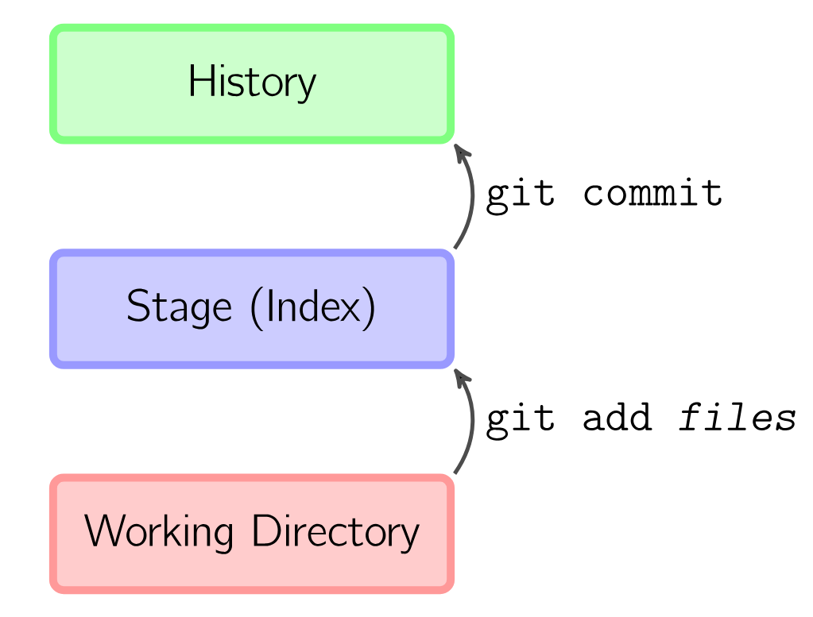
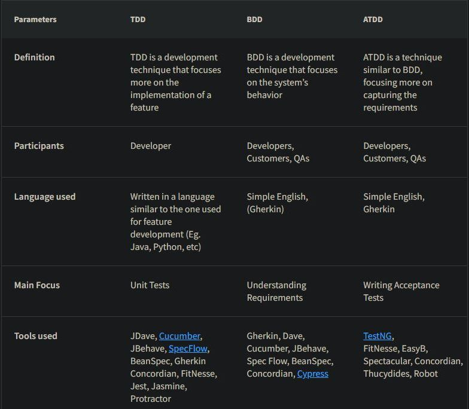

class: center, middle

## [Software Engineering](../../praesentationen.html)

#### Kapitel 3

Simon Fedrau, Sascha Hahn

---
# Inhalt
***

1. Version Control Systems

1. AI-driven development

1. Debugging

1. Agile testing workflows

1. Pair programming

1. Code reviews

1. Refactoring

1. Werkzeuge

1. Quellen

---
# Version control systems / Source code management
***
**Def.:**
Version control Systems (VSC) sind Softwaretools, die Änderungen von Datein/Projekten verwalten und versionieren.
Sie werden auch benutzt um die Zusammenarbeit von mehreren Entwicklern zu ermöglichen und zu erleichtern.
[33]

---

## Centralized vs Distributed Version Control
***
**Centralized:**
* ein zentraller Server
* alle haben eine lokale Kopie
* alle müssen mit dem Server verbunden sein um Änderungen zu machen

**Distributed :**
* jeder hat das Repository lokal
* Änderungen werden lokal gespeichert
* Änderungen werden später synchronisiert

[32]

---

## Git
Die meisten werden das VCS Git aus dem letzten Semester kennen.<br>
Git ist ein distributed VCS, das von Linus Torvalds entwickelt wurde.

---

### Relevanten git-Kommandos und -Workflows
Es gibt grundlegend drei verschiedene Bereiche mit denen man Arbeitet. Das ist die Working Copy/Directory, der Index und das Repository.

**Working Directory:** Sind alle lokalen Datein die im Bereich des Repositories fallen. Ein lokales Repository initialisiert man mit
```bash
git init
```
Alle Dateien in disem Verzeichnis sind jetzt *nur* Teil der Wirking copy


**Stage**: Dateien welche in das Repo mit aufgenommen werde sollen müssen erstmal in den stage Breich verschoben werden.
Dies geschieht mit:
```bash
git add <filename>
git add --all
```

---

### Relevanten git-Kommandos und -Workflows
***
**History/Commit:**
```bash
git commit
```
Mit diesem Befehl werden alle Änderungen der Datein die sich im Stage Bereich befinden in das Repository übernommen. Dadruch ensteht ein "Commit" welcher alle Änderungen zu seinem Vorherigen Commit enthält
<div style="display: flex; align-items: center;">
  
  <p>
  eine typische Abfolge an Befehlen wäre z.B:<br> <br>
    git add ausarbeitung.md <br>
    git add GitBasics.png <br>
    git commit -m "added chapter 3" <br>
</div>

[33,34]

---

### Remote Repositories
***
Alle Entwickler snchronisieren ihre änderungen mit dem remote mit:
```bash
git push
```
Es muss dafür einen gemeinsmen ursprungs Commit geben, von dem die Änderungen ausgehen.
---

### Branches
***
Damit Entwickler ungestört arbeiten können kann man verschiedene Branches erstellen.
Jeder arbeitet dann auf seinem Branch und führt Änderungen am Ende zusammen
```bash
git switch -c <branchname>
git push -u origin <branchname>
# pusht den Branch auf den remote

git switch main
git merge <branchname>
```
[33]

---

### Multirepos vs. Monorepos
**Multirepo:** Jedes Projekt/Teile eines Projektes werden in einzelnen Repos Versioniert<br>
**Monorepo:** Alle Projekte/Teile eines Projektes werden in einem Repo Versioniert

|      |Pro          |Con         |
|:-:   |:----------|:-----------|
|Multi| Reduziet unerwünschte Abhängigkeiten|Hinzufgügen von Abhängigkeiten schwieriger|
||Teams können unabhängiger an Teilen Arbeiten|Teilen von Code/Resourcen zwischen Projekten umständlicher|
||Einfachere Verwaltung und Skalierbarkeit durch Übersichtlichkeit einfacher|Keine Einheitliche Versionskontrolle(welche Version des einen Projekts ins kompatibel mit dem Anderen?)|
|Mono|Einfache Abhängigkeiten|Verwaltung und allgemeine Arbeit ist schwieriger, druch unübersichtlichkeit|
||Konsistente Versionskontrolle|Entwickler Teams behindern sich häufiger|
||einfache ResourcenTeilung||
[35]

---

### Submodules
***
Submodules sind Repositories die in einem anderen Repository liegen.<br>
Sie werden benutzt um Code/Resourcen zwischen Projekten zu teilen, wie z.B. eine Bibliothek.
Man kann sie mit dem folgendem Befehl hinzufügen:
```bash
git add submodule <url>
```
Ordner mit namen des Repos wird erstellt<br>
.gitmodules wird erstellt,url und pfade werden verwaltet

[36]

---

### Pull Requests
***
Pull Request sind ein Teil der Plattform Git-Hub.<br>
Git-Hub ist ein unbhängig von Git<br>
-> hostet Repositories

Bei einem Pull request stellt ein Entwickler seine Änderungen anderen Entwicklern zur verfügung.<br>
Können dann die Änderungen übernehmen oder ablehnen und kommentieren.
[33]

---

### Branching strategies
***
**Def.:**
Branching strategien sind Arbeitsweisen mit denen festfelegt wurde wie mit branches umgegangen wird und wie man das Projekt dmit sturkturiert.

#### Long-lived branches
Im Allgemeinen gibt es zwei Arten von Branches. Long-lived und Short-lived branches. Long-Lied Branches sind, jene die über einen längeren Zeitraum bestehen bleiben, wie zum Beispiel ein Release oder Version Branch.<br>
[32]

---

#### Trunk-based Development
***
Dies ist die wohl einfachste Variante der Branching strategien.<br>
Es gibt nur einen Branch, den main branch. Alle Entwickler arbeiten auf diesem Branch und commiten ihre Änderungen direkt auf diesen Branch.
Man kann aber auch auf anderen Branches Arbeiten und diese dann in den main Branch mergen und rebasen.<br>
[32]

---

#### Git Flow
***
Git Flow ist eine Branching strategie die von Vincent Driessen entwickelt wurde. Die besteht aus 3 verschiedenen Long Lived Branches und mindestens 2 Short Lived Branches.

---
##### Feature, develop, release, hotfix und main branch
***
<div style="display: flex; align-items: center;">
  
</div>

---
##### Feature, develop, release, hotfix und main branch
***
**Develop:** Ist der Hauptbranch von dem alle anderen Branches abzweigen.<br>
Auf dem Hauptbranch direkt werden aber nur kleinere Bugfixes gemacht oder ähnliches gemacht.

**Feature:** Feature Branches entspringen aus dem Develop Branch und werden benutzt um neue Features zu entwickeln.<br>
Wenn ein Feature fertig ist, wird es in den Develop Branch gemerged.<br>
Es kann beliegbig viele Feature Branches geben.

**Release:** Release Branches werden benutzt um ein Release vorzubereiten.<br>
Auf diesem Branch werden nur noch letzte Bugfixes gemacht und andere für den Release wichtige Sachen fertigestellt.<br>
Der Vorteil an dem Release Branch ist, dass man auf dem Develop schon für den nächsten Release weiter arbeiten kann.<br>
Alle Änderungen die auf dem Release Branch gemacht werden, werden auch in den Develop Branch gemerged und in den Main Branch gemerged, wenn der Release fertig ist.

---
##### Feature, develop, release, hotfix und main branch
***
**Main:** Auf der Main Branch werden alle fertigen Releases festgehalten.<br>
Jeder Release wird mit einem Tag versehen, der die Versionsnummer enthält.

**Hotfix:** Bei schwerwiegenden Bugs die es in einen Release geschafft haben, wird ein Hotfix Branch erstellt.<br>
Auf diesem Branch werden die Bugs gefixt und direkt wieder in den Main und Develop Branch gemerged.<br>
Der neue commit auf dem Main branch bekommt auch wieder einen Tag mit der neuen Versionsnummer.
[33]

---

#### Github Flow
***
Bei dem Github Flow gibt es nur einen long-lived Branch, den Main Branch. Bei Features oder Bugfixes werden weitere kurzlebige Feature Branches erstellt, welche dann später in den main gemerged werden.
Die besonderheit beim Github Flow ist jetzt, dass die Entwickler einen Merge-Request auf GitHub stellen. Der Merge-Request wird dann von anderen Entwicklern geprüft, diskutiert und dann automatisch in den main gemerged.

[33]

---

### Merging strategies
Es gibt verscheidenen Möglichkeiten Branches zu vereinigen:

#### Merge Commit
```bash
git switch main
git merge <branchname>
```
Hier wird ein neuer Commit erzeigt, welcher die Änderungen der beiden Branches zusammenführt. Wenn nur einer der beiden neuen Branches Änderungen enthält, dann geschieht ein *fast-forward*. Beide Branches zeigen dann auf den selben Commit und es wird kein neuer erstellt.
Es kann auch ein bestimmtes verhalten geforced werden mit den Parametern *--no-ff* und *--ff-only*.
[33]

---

#### Squash and Merge
***
```bash
git switch main
git merge --squash <branchname>
```
Alle commits des Branches werden zu einem zusammengefasst und dann in den main Branch gemerged.
[33]
#### Rebase and Merge
```bash
git switch main
git merge --rebase <branchname>
```
Hier werden die Commits des Branches auf den main Branch gesetzt.
Am Ende sieht es also so aus als hätte der andere Branch nie existiert und es verbleit eine chronologische reihenfolge.
[33]

---

### Aufbau und Inhalt von Commit messages
***
**Aufbau:**
1. kurzer Zusammenfassung 72 zeichen oder weniger
2. detailierte Beschreibung

**Conventions:**
* Verwende den Imperativ: "Fix Bug" nicht "Fixed Bug"
* Großschreibung am Anfang
* Kein Punkt am Ende
* beschreibe was und warum, nicht wie
[37]

---

# AI-driven development
***
Einfach gesagt ist AI-driven development die unterstützung von Entwicklern durch KI.
Zum Beispiel durch automatisches generieren von Code, automatisches testen oder auch durch automatisches debuggen.
[32]

---

### Conversational AI vs. Generative AI
***
**Conversational:**
AI-Systeme, welche auf menschliche Weise mit dem User interagieren.
Diese Sind eher bekannt unter dem Begriff Chatbot oder Sprachassistent.
Sie können Frgen beantworten Aufgaben erledigen oder einfach Informationen bereitstellen.

**Generative:**
AI-Systeme, welche neue Inhalte generieren können. Sie können Text, Bilder, Videos oder andere Inahlte generieren.
Man kann sagen sie leisten kreative Arbeoit und erschaffen etwas neues.
[38]

**Bei Vielen AI Tools überschneiden sich in diese beiden Bezeichnungen.
Für die meisten ist wahrschinlich ChatGPT das bekannteste Beispiel, welches zum einen Text generiert und informationen liefert,
aber auch neue Programmteile oder kreative Texte generieren kann.**<br>
[32]

---

### Prompt engineering
***
Prompt Engineering ist die Erstellung von Prompts oder Eingabeaufforderungen für künstliche Intelligenz-Modelle.<br>
Der Zweck ist die gewüschten Antworten und Ausgaben des Modells zu beeinflussen.<br>
[39]

---

### ChatGPT, Github Copilot
***
Wie schon erwähnt ist ChatGPT ein AI-System, welches eine Generative und conversational AI ist, die auf der GPT-3 Architektur basiert.<br>
Man kann ihr Fragen stellen, oder auffordern bestimmte Texte zu schreiben, Aufgaben zu lösen oder Code zu Programmieren.<br>
Ähnlich dazu ist der GitHub-Copilot. Dieser funktioniert wie chatGPT, nur das er auf Code spezialisiert ist.<br>
Man benutzt ihn direkt in seiner IDE und er erkennt automaitsch den Kontext anhander der Datein und schlägt Code oder Text vor.<br>
[32]

---
### Best practices für "googling"
***
* klare Schlagwörter
* mit Anfühurngszeichen knn man nach einem genauen Satz/Begriff suchen
* Man kann "OR" benutzen für alternativen
* nach der Suchanfrage Filtern nach Bildern, Videos, etc.
[40]

---

## Debugging
***

### Definition:
 Unter Debugging versteht man den Prozess der Identifizierung und Behebung von Fehlern oder Bugs in einem Softwaresystem. Es ist ein wichtiger Aspekt der Softwareentwicklung, denn Fehler können dazu führen, dass ein Softwaresystem nicht richtig funktioniert, was wiederum eine schlechte Leistung oder falsche Ergebnisse zur Folge haben kann. Die Fehlersuche kann eine zeitaufwändige und komplexe Aufgabe sein, aber sie ist unerlässlich, um sicherzustellen, dass ein Softwaresystem korrekt funktioniert.

---
## Problem solving, Root cause analysis 
***
** Die Root Cause Analysis **  ist eine Möglichkeit, um zu bestimmen, wie ein problematisches Ereignis aufgetreten ist. Dazu wird untersucht, warum, wie und wann das Problem entstanden ist. Wenn ein System nicht mehr funktioniert oder sich verändert, sollte untersucht werden, wie es zu dem Problem kam. Nur so kann es vollständig analysiert werden. 

**Methoden der Root Cause Analysis**


* fünf Warum-Fragen
Definieren Sie das Problem und stellen Sie zu jeder Antwort eine Warum-Frage. Suchen Sie weiter, bis Sie wirklich zu den Gründen kommen

* Ursache-Wirkungs-Diagramm zu erstellen, das auch als Fischgrätendiagramm bezeichnet wird.


---
## Debugging vs. Testen
***

Debuggen und Testen sind zwei unterschiedliche dinge. Das Testen konzentriert sich auf das Auffinden von Bugs, Fehlern usw., während das debuggen beginnt, nachdem ein Fehler in der Software identifiziert wurde. Das Testen dient dazu, sicherzustellen, dass das Programm korrekt ist und mit einer bestimmten Mindesterfolgsquote funktioniert. Das Testen kann manuell oder automatisiert erfolgen. Es gibt verschiedene Arten von Tests: Unit-Tests, Integrationstests, Alpha- und Beta-Tests usw. Sie kann durch einige automatisierte Tools unterstützt werden, ist aber eher ein manueller Prozess, da jeder Fehler anders ist und eine andere Technik erfordert, im Gegensatz zu einem vordefinierten Testmechanismus.

---

## Rubber Duck Debugging 
***
Es existieren mehrere Bezeichnungen für diese Methode, oft mit anderen unbelebten Objekten.

* Beim Quietscheentchen-Debugging erklärt der Programmierer den Quelltext Zeile für Zeile einem Quietscheentchen. 

* Bei der zeilenweisen Erklärung, was das Programm machen soll, im Vergleich zu dem, was es tatsächlich macht, fallen eventuelle Ungleichheiten auf.


[4] [5]

---

## Time-travel debugging (reverse debugging)
***
** Was ist Reverse Debugging? **

* Aufzeichnen aller Programmaktivitäten zur Laufzeit.
Inklusive Speicherzugriffe, Berechnungen und OS-Aufrufe.
Zurückspulen und erneutes Abspielen zur Zustandsanalyse.
Die Zeitreise-Metapher

* Reverse Debugging ermöglicht eine "Zeitreise" in den Programmzustand.
Ähnlich dem Zurückspulen einer Zeit, um Details zu untersuchen.
Ein Praxisbeispiel

* Problem: Ein seltener Absturz nach Codeänderungen.
Nur 0,1 % der Server betroffen.
Schwierig zu reproduzieren.
Die Lösung: Reverse Debugging

* Aufzeichnen, Zurückspulen, und Abspielen.
Ermöglicht das Finden der Grundursache.
Hilft bei der Problembehebung.
Vorteile von Reverse Debugging

[6] [7] 

---
## Logging / Tracing 
*** 

#### Logging 
* Der Begriff Logging beschreibt im IT-Umfeld das automatisierte Protokollieren von System- und Prozessmeldungen. Bei den protokollierten Logdaten handelt es sich um Statusinformationen oder Ereignisse.


#### Tracing

* Ein Trace ist eine direkte Visualisierung eines Requests beim Durchlauf durch eine Anwendung oder einer kompletten Anwendungslandschaft. Hierbei wird er durch eine eindeutige Trace ID identifiziert und nimmt bei jedem Arbeitsschritt Spans auf.

[8] [9] [10] 
---

## Ablauf des Debuggings
***

  * Fehlereridentifikation

  * Reproduzierbarkeit sicherstellen:

  * Fehlerisolation:
  Begrenze den Bereich, in dem du den Fehler vermutest.

  * Fehleranalyse:
  Untersuche den isolierten Bereich gründlich, um die Ursache des Fehlers zu 
  identifizieren. 

* Schrittweises Testen:
  Teste jede Änderung schrittweise und systematisch, um sicherzustellen, dass 
  der Fehler nicht nur behoben wurde, sondern auch keine neuen Fehler eingeführt wurden.

* Dokumentation:
  Halte alle durchgeführten Experimente und gefundenen Lösungen in einer geeigneten 
  Form fest.

* Abschluss:
  Wenn der Fehler behoben ist und die Anwendung wieder wie erwartet funktioniert, 
  teste gründlich, um sicherzustellen, dass keine weiteren Probleme auftreten. 
  
[11] [12] 

---
## Beispiel

```python 
def add_numbers(a, b):
    result = a * b  # Hier sollte eine Addition sein
    return result

x = 5
y = 3
result = add_numbers(x, y)
print(f'Die Summe von {x} und {y} ist {result}')
```

```python 
def add_numbers(a, b):
    result = a + b  # Hier wurde der Fehler behoben
    return result

x = 5
y = 3
result = add_numbers(x, y)
print(f'Die Summe von {x} und {y} ist {result}')
```

---

### Werkzeuge
***

* Version Control Systeme:
  * Git ermöglicht es, den Verlauf von Code-Änderungen zu verfolgen und zu vergleichen, um Fehler zu finden, die durch Codeänderungen eingeführt wurden.
* Protokollierung (Logging): 
  * Das Hinzufügen von Protokollierungsinformationen zu deinem Code kann dir dabei helfen, den Zustand deiner Anwendung zu verstehen und Fehler nachzuverfolgen.
* Profiling-Tools: 
  * Diese Tools helfen dabei, die Leistung deiner Anwendung zu analysieren und Engpässe oder ineffiziente Codeabschnitte zu identifizieren.
* Browser-Entwicklertools: 
  * Wenn du webbasierte Anwendungen entwickelst, bieten moderne Webbrowser Entwicklertools, mit denen du JavaScript-Code debuggen, Netzwerkaktivitäten überwachen und den DOM inspizieren kannst.
* Testwerkzeuge: 
  * Automatisierte Testwerkzeuge wie JUnit für Java oder unittest für Python helfen, Fehler durch gezielte Tests zu identifizieren.
[13]
---
## Agile testing workflows

* Agile Testing Workflows beziehen sich auf den Prozess des Testens von Software in einem agilen Entwicklungsumfeld. 

* Agiles Testen ist eine Methode, die eng mit den Prinzipien agiler Softwareentwicklungsmethoden verbunden ist.
 Der Schwerpunkt liegt darauf, flexibel und kontinuierlich qualitativ hochwertige Software bereitzustellen, indem Tests in den gesamten Entwicklungsprozess integriert werden. 

[14] [15]
 
---
#### TDD, BDD, ATDD
***

##### TDD
* Bei dieser Technik beginnt ein Programmierer mit dem Entwurf und der Erstellung von Testfällen für jede kleine Funktionalität einer Anwendung. Mit dieser Technik wird versucht, eine einfache Frage zu beantworten: Ist der Code gültig?
##### BDD
* Ist ein von der Methodik der Test-Driven Development abgeleiteter Testansatz.Bei BDD basieren die Tests hauptsächlich auf dem Systemverhalten. In den meisten Fällen wird der Given-When-Then-Ansatz (Gherkin) für das Schreiben von Testfällen verwendet.
##### ATDD
* ATDD ist eng mit BDD verbunden und baut auf ähnlichen Prinzipien auf. Hier sind die Hauptkomponenten von ATDD:
  * Akzeptanzkriterien
  * Zusammenarbeit
  * Entwicklung von Akzeptanztests
  * Testautomatisierung
  * Kommunikation und Transparenz


---

### Motivation, Ablauf, Inhalte, Frameworks
****




---
## Test doubles
***

* Objekte oder Prozeduren in automatisierten Einheitstests.
* Reduzieren Fehlerwahrscheinlichkeit in der Software.
* Ähneln den realen Gegenstücken, sind jedoch vereinfacht.

* Komplexe Softwarestruktur
  * Endgültige Software besteht aus vielen interagierenden Elementen.
  * Gemeinsam erzeugen sie das Endergebnis.
  * Testen dieser Komplexität kann herausfordernd sein.

* Notwendigkeit für Test Doubles
  * Vereinfachte Versionen von Objekten/Prozeduren.
  * Verhalten und Aussehen wie im Einsatz.
  * Reduzieren die Komplexität und erleichtern das Testen.

* Testdoppel - Der Meta-Begriff
  * Enthält verschiedene Varianten: Dummy, Stub, Mock, Spy.


[17] 
---

### Mocks vs Fakes vs Stubs vs Spy
***

* Mock
  * Verwendung in Unit Tests zur Simulation von Interaktionen.
  * Ahmt Verhalten von Abhängigkeiten oder externen Systemen nach.
  * Isoliert Tests und prüft, ob die Komponente korrekt mit Abhängigkeiten interagiert.

* Fake
  * Ersatz für echte Implementierung in Tests.
  * Simpler und vorhersehbares Verhalten.

* Stub
  * Einfache Implementierung oder Methodenplatzhalter.
  * Bietet vordefinierte Antworten auf Methodenaufrufe.
  * Isoliert Codeabschnitte in Tests, ohne auf echte Abhängigkeiten zuzugreifen.
* Spy
  * Überwachung von Interaktionen im Test, ohne das Verhalten zu ändern.
  * Zeichnet tatsächliche Methodenaufrufe auf.             [18]


---
# Pair Programming
***
* Was ist Pair Programming?
  * Zwei Programmierer arbeiten gemeinsam an einem Arbeitsplatz.
  * Einer schreibt Code, der andere denkt über Probleme nach und kontrolliert.
  * Sofortige Problemlösung durch Kommunikation.
  * Wechselnde Rollen und Partner

* Abwechselndes Umschalten zwischen den Rollen.
  * Häufige Änderung der Partnerzusammensetzung.
  * Ziele der Paarprogrammierung

* Verbesserung der Softwarequalität.
  * Vermeidung problematischer Lösungen durch Kontrolle.
  * Wissenstransfer über den Quellcode.
  * Learning by Doing durch Partnerrotation.


[21] 


---

## Ablauf
***
* Die Rollen
  * Driver (Pilot) - Code schreiben und kommentieren.
  * Navigator (Observer) - Beobachten, Feedback geben, strategisch denken.

* Ziel der Rollenteilung
  * Zwei Perspektiven auf den Code: Details und Gesamtbild.

* Rollenwechsel
  * Regelmäßiger Wechsel: Driver und Navigator.
  * Teamgeist, kontinuierliche Kommunikation.

* Pair Rotation
  * Nach einer Weile (z.B., 2-3 Tage oder eine Woche) Wechsel des Teams.
  * Frische Perspektiven und Energie.
  * Organisationsspezifische Entscheidungen.

[22]

---
## Best practices
***

* Bearbeiten Sie stets nur eine Aufgabe. Eine Aufgabe, ein Ziel, ein Vorgehen.

* Nutzen Sie Zeilennummern, um konkrete Codezeilen leichter identifizieren zu können.

* Spielen Sie “Ping Pong”, bspw. im Zuge von Test -Driven Development. Entwickler A schreibt einen Test (Ping), Entwickler B die Implementierung, um den Test zu bestehen (Pong). Entwickler A erweitert den Test (Ping) und Entwickler B erweitert die Implementierung (Pong).

* Es kann nützlich sein, einen Timer zu verwenden, um so zu festen Zeiten – bspw. alle 20 Minuten – die Rollen zu wechseln. Je eingespielter ein Tandem ist, desto weniger wichtig wird die Verwendung eines Timers.
* Tandem Programmierung ist auch eine Frage der Haltung. Anstelle von “Ich habe eine Idee, gib mir mal die Tastatur” wäre ein “Ich habe eine Idee. Nimm Du mal die Tastatur.” wünschenswert.

[22]

---
## Code reviews

* Überprüfung von Programmcode durch andere Entwickler.

* Qualitätssicherung und Fehlererkennung.

* Warum sind Code Reviews wichtig?
  * Identifizierung von Fehlern und Verbesserungspotenzial.
  * Wissenstransfer und Einhaltung von Coding-Standards.
* Best Practices für Code Reviews

  * Klare Ziele und Erwartungen setzen.
  * Regelmäßig und konstruktiv Feedback geben.
  * Automatisierte Tools nutzen (z.B. Linters).
* Effizienz steigern

  * Reviewer-Roulette verhindern (zu viele Beteiligte).
  * Zeitfenster für Reviews festlegen.

[23] 

---
## Conventional comments
***

* praise: Hebt etwas Positives hervor. Suchen Sie immer nach etwas, das Sie aufrichtig loben können.

* nitpick: Triviale, auf Vorlieben basierende Anfragen. Diese sollten von Natur aus nicht blockierend sein.
* suggestion: Schlägt Verbesserungen zum aktuellen Thema vor. Seien Sie explizit und klar, was vorgeschlagen wird und warum es eine Verbesserung ist.

* issue: Weist auf spezifische Probleme mit dem untersuchten Thema hin. Diese Probleme können auf der Benutzerseite oder hinter den Kulissen liegen. Es wird dringend empfohlen, diesen Kommentar mit einem Vorschlag zu verbinden.
* todo: Kleine, triviale, aber notwendige Änderungen.

* question: Geeignet, wenn Sie ein mögliches Anliegen haben, aber nicht sicher sind, ob es relevant ist oder nicht.
* typo: Tippfehler-Kommentare sind wie todo:, wobei das Hauptproblem ein Rechtschreibfehler ist.
[24] 

---
 ## Ablauf Codereview
***

* Autor stellt den Quellcodes bereit.
* Autor initiiert eine Code Review Anfrage.

* Autor führt den Prüfer durch den Code (Walktrough).

* Prüfer identifiziert Probleme (Inspektion).

* Prüfer prüft den Code und dokumentiert die Funde (Code_Review_Vorlage.docx).

* Prüfer gibt das Dokument an den Autor zurück.

* Autor arbeitet Befunde ein.
* Autor initiiert eine neue Runde des Review-Prozesses.

[25] [26] [27]

---
## Best practices
*** 

* Erstellen Sie eine Checkliste für die Codeüberprüfung

* Einführung von Metriken für die Codeüberprüfung

* Sicherstellen, dass Ihr Feedback Ihre Haltung rechtfertigt

* Prüfen Sie nicht mehr als 200-400 Codezeilen auf einmal

* Ergänzen Sie Ihre Best Practices durch Automatisierung

[28] 

---

## Refactoring
***

* Refactoring bezeichnet in der Software-Entwicklung die manuelle oder automatisierte Strukturverbesserung von Quelltexten unter Beibehaltung des beobachtbaren Programmverhaltens. 

* Dabei sollen 
  * Lesbarkeit

  * Verständlichkeit

  * Wartbarkeit 
  * Erweiterbarkeit 

  verbessert werden


[29] 

---
## Ziele des Refactorings

Ziel des Refactorings ist es Effizienter durch Beseitigung von Abhängigkeiten und Komplexitäten zu sein.

* Denn Code Wartungsfreundlicher oder wiederverwendbarer durch Erhöhung der Effizienz und Lesbarkeit zu machen.

* Sauberer organisiert, so dass er leichter zu lesen und zu verstehen ist.

* Softwareentwickler können Fehler oder Schwachstellen im Code leichter finden und beheben.


[30] 
---
## Refactoring-Patterns
***
* Errinnert an Code Smells und wie diese vermieden werden

* Extract Class: Teil eines bestehenden Objekts wird in eine neue Klasse verschoben, um die Verantwortlichkeiten aufzuteilen und den Code besser zu organisieren.

* Introduce Parameter Object: Wenn eine Methode viele Parameter akzeptiert, werden diese in ein Objekt zusammengefasst, um den Funktionsaufruf übersichtlicher zu gestalten.

* Replace Conditional with Polymorphism: Ersetzt lange if-else-Anweisungen durch die Verwendung von Polymorphismus und Vererbung, um den Code klarer und erweiterbarer zu machen.

* Remove Duplication: Identischer Code wird an einer zentralen Stelle zusammengefasst, um Redundanz zu vermeiden und Wartungskosten zu senken.

* Replace Inheritance with Delegation: Ersetzt die Vererbung durch die Delegierung von Funktionalität an andere Klassen, um die Flexibilität zu erhöhen.

[31] 
---

## Testing / Build
***
|    | Testing         |     Build        |
    |:--   |---       |          ---:|
    |  |   Tests sind Verfahren, die angewendet werden, um die Funktionalität, Leistung und Zuverlässigkeit einer Software zu überprüfen.        |     Build bezieht sich auf den Prozess der Kompilierung des Quellcodes und aller erforderlichen Ressourcen, um ein funktionsfähiges Softwareprodukt zu erzeugen.        |
    |Beispiel         |   Gradle,Ant       |  JUnit,PyTest|

---

### Github actions
***  
* GitHub Actions ist ein Dienst von GitHub, der es Entwicklern ermöglicht, automatisierte Workflows für ihre Projekte zu erstellen.

* Mit GitHub Actions können Sie Build-, Test- und Bereitstellungsprozesse automatisieren. Dies erleichtert die kontinuierliche Integration (CI) und die kontinuierliche Bereitstellung (CD).

* Sie können benutzerdefinierte Workflows erstellen, die auf bestimmte Ereignisse in Ihrem GitHub-Repository reagieren, wie z.B. das Einreichen eines Pull Requests oder das Pushen von Code in den Master-Zweig.

* GitHub Actions unterstützt verschiedene Programmiersprachen und ermöglicht die Verwendung von Containern, um komplexe Build-Umgebungen zu erstellen.
Es bietet eine Vielzahl von vorkonfigurierten Aktionen und ermöglicht es Ihnen, benutzerdefinierte Aktionen zu erstellen, um spezifische Aufgaben in Ihren Workflows auszuführen.

[32] 

---

## Bug and work tracking
***
* Bug and work tracking
  * Bug-Tracking beinhaltet das Protokollieren von Fehlern oder Problemen, die während der Entwicklung oder nach der Bereitstellung einer Software auftreten, um sicherzustellen, dass sie identifiziert, priorisiert und behoben werden.

* Arbeitsverfolgung bezieht sich auf die Zuweisung und Verfolgung von Aufgaben, die im Rahmen der Softwareentwicklung durchgeführt werden müssen.

* Ziel: Die Implementierung eines effektiven Bug- und Arbeitsverfolgungssystems ist entscheidend, um sicherzustellen, dass Softwareprojekte effizient verwaltet werden, Probleme rechtzeitig behoben werden und Aufgaben effektiv verfolgt und abgeschlossen werden, um die Produktivität und Qualität der Softwareentwicklung zu gewährleisten.

---

# Quellen
***

* [1] :https://www.geeksforgeeks.org/software-engineering-debugging/
Aufgerufen 18.10.23
* [2] :https://www.computerweekly.com/de/definition/Root-Cause-Analysis-Fehler-Ursache-Analyse
Aufgerufen 18.10.23

* [3] :https://www.geeksforgeeks.org/software-engineering-debugging/
Aufgerufen 18.10.23

* [4] :https://de.wikipedia.org/wiki/Quietscheentchen-Debugging#cite_note-2
Aufgerufen am 18.10.23
* [5] :https://web.archive.org/web/20170907213645/http://quietscheentchen.net/quietscheentchen-debugging
Aufgerufen am 18.10.23
* [6] :https://undo.io/resources/6-things-time-travel-debugging
Aufgerufen am 18.10.23
* [7] :https://engineering.fb.com/2021/04/27/developer-tools/reverse-debugging/
Aufgerufen am 18.10.23
---
* [8] :https://www.ip-insider.de/was-ist-logging-event-log-management-a-efd311ecd8621b98baa59d2405d870ad/
Aufgerufen am 18.10.23

* [9] :https://www.adesso.de/de/news/blog/logging-vs-tracing-2.jsp

* [10] :https://www.embedded-software-engineering.de/durch-traceability-lassen-sich-unbaendige-projekte-zaehmen-a-919617/

* [11] :https://aws.amazon.com/de/what-is/debugging/
* [12] :https://chat.openai.com/ Frage: beschreibe mir den Ablauf des Debuggings

* [13] :https://chat.openai.com/c/48dc5e10-62ff-4bad-af36-aed923432e5c  :was sind typische Debugging werkzteuge

* [14] :https://www.servicenow.com/de/products/strategic-portfolio-management/what-is-agile-testing.html
---
* [15] :https://miro.com/de/agile/was-ist-ein-agile-workflow/ 

* [16] :https://www.browserstack.com/guide/tdd-vs-bdd-vs-atdd

* [17] :https://en.wikipedia.org/wiki/Test_double#:~:text=In%20automated%20unit%20testing%2C%20it,for%20these%20objects%20or%20procedures

* [18] :https://www.c-sharpcorner.com/article/stub-vs-fake-vs-spy-vs-mock/

* [19] :https://www.browserstack.com/guide/best-test-automation-frameworks

* [20] :https://en.wikipedia.org/wiki/List_of_unit_testing_frameworks

* [21] :https://de.wikipedia.org/wiki/Paarprogrammierung
---
* [22] :https://t2informatik.de/wissen-kompakt/pair-programming/

* [23] :https://t2informatik.de/wissen-kompakt/code-review/

* [24] :https://dev.to/tsotsi1/enhancing-code-reviews-with-conventional-comments-2j9i#:~:text=Conventional%20Comments%20are%20a%20structured,and%20notably%2C%20non%2Dblocking%20.
  
* [25] :https://sdq.kastel.kit.edu/wiki/Codereview
* [26] :https://de.wikipedia.org/wiki/Review_(Softwaretest)#:~:text=Beim%20Code%2DReview%20wird%20ein,Gutachter%20selbst%20ein%20Softwareentwickler%20sein.

* [27] :https://wiki.hshl.de/wiki/index.php/Anleitung_zum_Code_Review#Ablauf_Code-Review

* [28] :https://www.atlassian.com/blog/add-ons/code-review-best-practices
---
* [29] :https://de.wikipedia.org/wiki/Refactoring

* [30] :https://www.computerweekly.com/de/definition/Refactoring#:~:text=Ziel%20des%20Refactoring%20ist%20es,Implementierung%20von%20Software%20zu%20verbessern.

* [31] : https://chat.openai.com/ frage : Frage : welche Refactoring-Patterns gibt es

* [32] :https://chat.openai.com/  frage: was sind GitHub Actions
---
* [33] :**Carsen Gips, Programmiermethoden Script:** https://www.hsbi.de/elearning/data/FH-Bielefeld/lm_data/lm_1359639/index.html
 
* [34] :https://marklodato.github.io/visual-git-guide/index-en.html

* [35] :https://kinsta.com/blog/monorepo-vs-multi-repo/

* [36] :https://git-scm.com/book/en/v2/Git-Tools-Submodules

* [37] :https://gist.github.com/robertpainsi/b632364184e70900af4ab688decf6f53

* [38] :https://www.datasciencecentral.com/a-complete-guide-conversational-ai-vs-generative-ai/#:~:text=Conversational%20AI%20is%20characterized%20by,art%2C%20music%2C%20and%20texts.

* [39] :https://www.promptingguide.ai/

* [40] :https://support.google.com/websearch/answer/2466433?hl=de