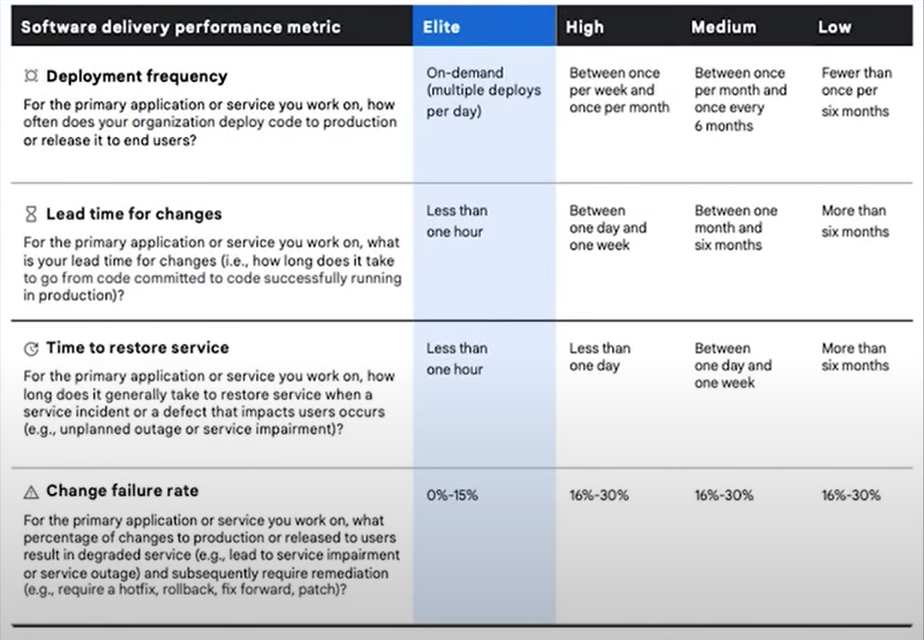

class: center, middle

## [Software Engineering](../../praesentationen.html)

#### Kapitel 4

Simon Fedrau, Sascha Hahn

---

### CAMS, CALMS, CALMAS
***
CAMS, CAMLS und CALMAS sind konzeptionelle Rahmen für die Integration zwischen Deveop(Softwareentwickler und IT-Opertors)
CALMS steht dabei für
* Culture
* Automation
* Lean
* Measurement
* Agile
* Sharing

Die beiden anderen sind dabei Vorreiter von CALMAS bei denen die/der Aspekt/Aspekte Agile und Sharing nicht vorhanden sind.

[4b]
---

### CAMS, CALMS, CALMAS
***

* **Culture:** Unternehmensweite geltende Werte, Überzeugungen und Haltungen. Beschreiben das Handeln in Entwicklung und Betrieb.

* **Automation:** Alles was Automatisiert werden kann sollte auch Atomatisiert werden.
    * Fehler reduzierung, und optimisierung 

* **Lean:** Überschuss reduzieren bei einhaltung der gewüschten Ergebnisse.
    * Meetings veringern, Teams verkleinern, Werkzeuge auf ein Minimum reduzieren

* **Measurement:** Messen der Effizienz und Qualität der Softwareentwicklung, durch Sammeln von Daten um Systeme und Ereignisse seinsehbar und transparent zu gestallten.

* **Agile:** Agile Entwicklungsmethoden, wie Scrum, Kanban, XP, etc.

* **Sharing:** Wissen und Informationen Abteilungs übergeifend teilen und weitergeben.

[4b]
---

### SPACE Framework
***
SPACE ist ein framwork um die Effizienz der Softwareentwicklung zu messen und zu verbessern.
Entwicklerinn dieser ist Nicole Forsgren, welche später nochmal bei dem Thema Dora Metriken vorkommt.
"SPACE" steht bei für Folgende Aspekte der prduktivität:

[5b]
---

### SPACE Framework
***
* ### Satisfaction and Well-being
* ### Performance
* ### Activity
* ### Communication and Collaboration
* ### Efficiency and Flow

[5b] 
---

### DevEx Framework
***
Das DevEx Framework steht für **Developer Experience** und umfasst die wahrnehmung der Entwickler bezüglich was sie über ihre Arbeit fühlen, denken und wie sie sie werten.
DevEx besteht aus 3 Kern Punkten:

* **Feedback Loops:** Schnelles Feedback, um die Effizienz zu steigern.
    * verzögerung in veröffentlichung von Feature vermeiden
    * reibungslose und schnelle Arbeit durch Kommunikation

* **Cognitive Load:** mit der schnellen Entwicklung in der SoftwareEntwicklung wächst die komplexität und kognitive Belsatung der Entwickler
    * höhere Belastung führt zu mehr Fehlern und langsamerer Entwicklung

* **Flow State:** Mentaler Zustand in dem einer Person vollständig auf die Aktivität konzentriet ist.
    * vermeidungen umgehen wie Unterbrechungen und Meetings
    * unterstütung des Zustands durch Atomation und klare Ziele

[6b]
---

### DORA Metriken
***
**Def.: Metriken zur Messung der Effizienz bei Softwareentwicklung**
* Menschen sind komplex, effizienz schwer zu messen
* DORA Metriken sind ein Versuch, die Effizienz zu messen und 
durch sie sie zu verbessern
* DORA Metriken bieten kein nachteil zwischen zwischen
geschwindigkeit und qualität

[3b, 1b]
---

### DORA Metriken
***
**Hintergrund:**
* besten Daten der Praxis der Softwarebereitstellung wurden gesammelt und analysiert
    * Ergebnisse waren bei weitem die gründlichste Untersuchung der 
    Softwareentwicklung
    State of DevOps Report
* Nicole Forsgren, Jez Humble, Gene Kim entwickeln dadurch ein paar Jahre später die DORA Metriken
    * man kann damit sicher sagen dass die DORA Metriken State of the Art sind

Im Folgenden kommen die Aspekte der DORA Metriken um effiektivität zu meßen

[3b]
---

#### Deployment Frequency
***
* Wie oft wird Software in Produktion gebracht oder veröffentlicht?
* Misst die Kosten der Entwicklung in bezug auf Geld aber auch Zeit und Arbeitskraft
* und auch die Rate in der neue Features veröffentlicht werden

[3b]
---
#### Change Lead Time
***
* Wie lange dauert es zwischen dem Beginnen einer Änderung/Feature und der Erfolgreichen Nutzund in der Produktion?
* Wie bei der Deployment Frequency werden auch hier die Kosten der Entwicklung gemessen

[3b]
---

#### Mean Time to Restore
***
* Wie lange dauert es ein Problem zu beheben, bzw. die Software wieder in einen funktionierenden Zustand zu bringen?

* Dieser Aspekt überprüft die Code Qualität, da durch einen sauberen und lesnaren code Fehler deutlich schneller erkannt und behoben werden können.

[3b]
---

#### Change Failure Rate
***
* Wie groß ist der Anteil an Software Änderungen/Ergänzugen, die später zu einem Problem/Ausfall führen? 

* Auch hier hier wird die Code Qualität überprüft. Die **Change Failure Rate** beschreib nähmlich die Quantiät der ausfälle und die Mean Failure Rate die Qualität/Schwere der Ausfälle.

[3b]
---

[3b]
---
### Ziel
***
Die DORA Metriken sollen die Effizienz der Softwareentwicklung messen 
und damit auf lange Sicht den Erfolg des Projektes steigern und nicht
kurzfristig Features um Features zu veröffentlichen. 

**Problem:**

[3b]
---

class: center
### Falsch Interpretation
***
# Menschen sind dumm

[3b]
---

### Falsch Interpretation
* Probleme mit allen Metiek ist jedoch, dass Menschen versuchen werden, sich nur aus Ansicht der Metriken zu verbessern und misinterpretieren die Metriken(Confirmation Bias)
* **Beispiel:** Staibility kann einfach nur als BugCount gewertet werden
* oder Throughput als Anzahl der Features.

[3b]
---

## DevSecOps
***
* DevSecOps steht für Development, Security und Operations.
* DevSecOps ist eine Praxis bei der man Sicherheits Test in jeden Entwicklungsschritt einbaut.
* fördert Zusammenarbeit zwischen Entwicklern, Sicherheitsspezialisten und Betriebsteams zu fördern.
* Sicherheit wird hier zu einem früheren Zeitpunkt in den Entwicklungsprozess integriert.

[7b]

---

### "Shift left"-testing
***
Shift Left Testing ist eine der Methoden von DevSecOps.
Entwickler überprüfen ihre Software auf Sicherheitslücken, bevor sie in die Produktion geht.
* **shift right:** Anitpattern. Sicherheitslücken werden erst nach release von Kunden gefunden.

[7b]
---

### Sicherheitsziele der Kryptographie
***
Sicherheitsziele sind im Allgemeinene Richtilinien an ein System, um schtützenswerte Güter zu schützen.
In der Computersicherheit sind das die Vertraulichkeit, Integrität und Verfügbarkeit von Daten.
Gefährdung dieser geschieht meist bei der übertragung von Daten.
Für die Meisten dieser Ziele schafft Kryptographie abhilfe.

[8b]
---

#### Authentizität, Integrität, Verbindlichkeit, Zurechenbarkeit, Vertraulichkeit, Verfügbarkeit
***
* **Authentizität:** Echtheit, Überprüfbarkeit und Vertrauenswürdigkeit von Daten
* **Integrität:** Daten sind unverändert und unverfälscht
* **Verbindlichkeit:** durchgeführte Handlungen können nicht abgestritten werden können. z.b. bei elekrtonischem Abschulss eines Vertrages(Signatur)
* **Zurechenbarkeit:** Handlungen müssen eine Person zugerechnet werden können
* **Vertraulichkeit:** Daten dürfen nur von Autorisitirten Personen eingesehen und verändert werden.
* **Verfügbarkeit:** Vermeidung von Systemausfällen, Zugriff auf Daten muss gewährleistet sein.

[8b]

---

### Threat Modeling (Bedrohungsmodellierung)
***
**Bedrohungmodellierung** ist eine Prozess bei dem potentielle Bedrohungen für ein System indentifiziert und bewertet wird.
Auch das Fehlen von entsprechender Schutmaßnahmen wird dabei berücksichtigt.
Gegenmanßnahmen werden hiernach priorisiert und implementiert.

[9b]

---

#### STRIDE
***
Einer der Mothden zur Bedrohungsmodellierung ist STRIDE.
STRIDE ist ein Model zur Klassifizierung von folgenden Bedrohungen:
* **Spoofing:** Fälschung von Identitäten. Angriff auf Accont eines anderen Benutzers oder eigenene Identität fälschen. 
* **Tampering:** Veränderung von Daten in einer Datenbank oder im Netzwerkverkehr.
* **Repudiation:** Verschleiern von bösartigen Handlungen in einem System.
* **Information Disclosure:** Unbefugter Zugriff auf Daten.
* **Denial of Service:** Verhindern der Verfügbarkeit eines Systems, durch zum Beispiel überlastung(eher bekannt als DDos Attacke)
* **Elevation of Privilege:** Unerlaubte erweiterung von Zufgriffsrechten.

[10b,11b]

---
class: center, middle

# Fragen?

---

# Quellen
***
[1b] :https://chat.openai.com/
[2b] :https://blog.up bound.io/developers-and-operators-complicated-relationship
[3b] :https://www.youtube.com/watch?v=hbeyCECbLhk
[4b] : https://www.computerweekly.com/de/definition/CALMS#:~:text=CALMS%20ist%20ein%20konzeptioneller%20Rahmen,)%20und%20Sharing%20(Austausch).
[5b] :https://www.swarmia.com/blog/space-framework/?utm_term=space%20framework&utm_campaign=SRH-SPACE-EU-EN&utm_source=adwords&utm_medium=ppc&hsa_acc=6644081770&hsa_cam=19643106124&hsa_grp=145044312719&hsa_ad=646821562962&hsa_src=g&hsa_tgt=kwd-567479290791&hsa_kw=space%20framework&hsa_mt=e&hsa_net=adwords&hsa_ver=3&gad_source=1&gclid=Cj0KCQjwtJKqBhCaARIsAN_yS_lvUSBQFNwT_lFYrpV_pLv4g7HcPFGqhDenxk8YrhUgQVOY5uuql88aAvDAEALw_wcB
[6b] :https://queue.acm.org/detail.cfm?id=3595878
[7b] :https://aws.amazon.com/de/what-is/devsecops/#:~:text=building%20the%20software.-,What%20does%20DevSecOps%20stand%20for%3F,they%20are%20building%20software%20applications.
[8b] :https://www.identible.de/glossar/sicherheitsziele.html
[9b] :https://en.wikipedia.org/wiki/Threat_model
[10b] :https://de.wikipedia.org/wiki/STRIDE_(IT-Sicherheit)
[11b] :https://geballte-sicherheit.de/threat-modelling-bedrohungsanalyse-4-teil-ermittlung-und-einstufung-von-bedrohungen/
