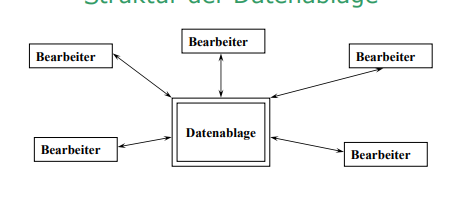
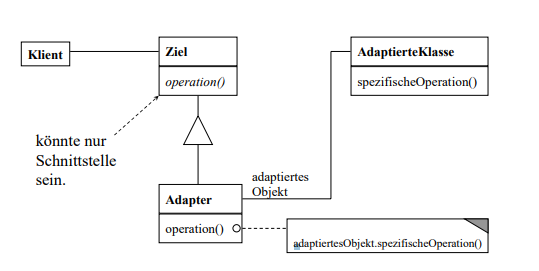
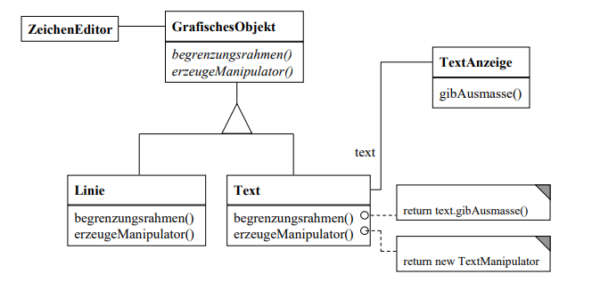
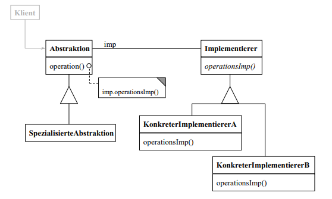
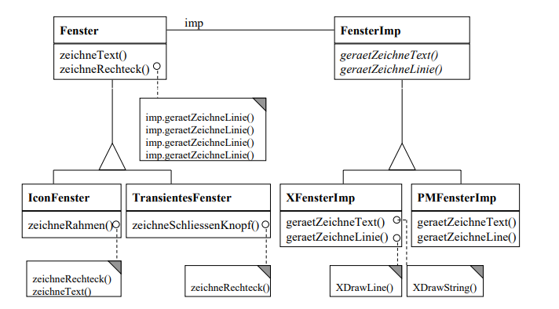
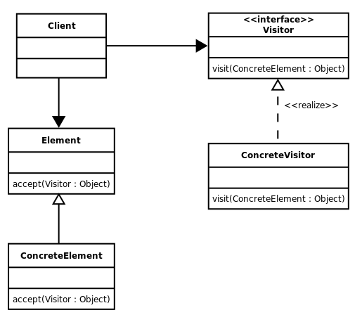

# Kapitel 7

**Autor:** Simon Fedrau, Sascha Hahn

## Lernziele
* Was ist ein Softwareentwurf und warum ist er wichtig
* Was steht in einem Softwareentwurf
* Welche Entwurfsprinzipien gibt es?
* Welche sind die Clean Code und SOLID-Prinzipien
    * Und was vermitteln diese 


## Softwareentwurf

**Was ist ein Softwareentwurf?**

Die erfolgreiche Entwicklung von Software erfordert ein ineinandergreifendes Vorgehen, das verschiedene Phasen, Informationen und Entscheidungen miteinander verbindet. Der Softwareentwurf beschreibt dabei einen Bauplan.
Laut IEEE 1990 bezeichnet der Softwareentwurf den Prozess der Definition der Architektur, Komponenten, Schnittstellen und anderer Merkmale eines Software(teil)systems.  Dort werden Grundlagen und Schlüsselthemen, Struktur und Architektur der Software, Design der Benutzeroberfläche, Design-Notationen sowie Strategien und Methoden festgelegt.

**Warum sollte ich einen Softwareentwurf machen?**

Ein Software-Entwurf ist ein Hilfsmittel für Programmiererinnen und Programmierer. Dabei wird fachspezifisches Wissen angewandt, um einen Grundriss für die Projektarbeit anzugeben.
Der Entwurf beantwortet grobe Fragen und hilft dabei das Projekt zu starten und allen Beteiligten den selben Eindruck vom Projekt zu verschaffen.


[1a] [2a]
## Tätigkeiten im Softwareentwurf

**Welche Inhalte sind in einem Softwareentwurf zu erarbeiten?**

* die Infrastruktur mit Hardware, Tools und Services (Entwicklungsumgebungen, Software Development Kits, Programmiersprachen, Bibliotheken), die von den Anwendern benutzt werden, um die Software zu entwickeln,
* die Softwarearchitektur (bspw. Client-Server-Architektur, Web-Architektur oder service-orientierte Architektur) und zu verwendende Betriebssysteme, Netzwerkprotokolle, Datenbanksysteme, etc.
* Teilsysteme sowie die Spezifikation der Schnittstellen.
* Komponenten, Module und Klassen und deren Beziehungen untereinander.

Beim Softwareentwurf geht es also darum, eine gemeinsame Basis für die Softwareentwicklung und wichtige technische Zusammenhänge zu identifizieren und festzulegen.
[1a]

**Welche Fragen sollte ich mir bei der erstellung stellen?**

*  Welche Verteilung des Systems wird benötigt?
    Bei z.B Webanwendungen wird heute in der Regel eine sogenannte 3-
    Tier-Systemarchitektur verwendet. Diese Entscheidung kann sich grundlegend auf den Bauplan, also den
    Entwurf auswirken.

*  Welche Hardware wird eingesetzt?

    Bei einem System im technischen Bereich, z.B bei der Steuerung eines Airbags, kann der Typ des verwendeten
    Microcontrollers einen wesentlichen Einfluss auf die zu konstruierende Software haben.

* Welcher Persistenzmechanismus ist erforderlich?

    Bei vielen Anwendungen werden Daten langfristig gespeichert, also ist zu überlegen, welcher Persistenzmechanismus eingesetzt werden soll

*  Welche Betriebssysteme und Rechnernetze müssen unterstützt werden?
    welchen Netzprotokollen die zu erstellende Software lauffähig sein soll.
[3a]

## Entwurfsziele

Ausgehend von der Anforderungsanalyse und einer ersten Skizze des
zu konstruierenden Systems in der Szenarioanalyse, muss im Entwurf
festgelegt werden:

*  Technische Basis/Infrastruktur

*  Softwarearchitektur

*  Entwurf der Komponenten und Klassen

Ziel ist es, eine Grundlage zu definieren, die leicht zu verstehen, zu ändern, zu erweitern und zu warten ist. Die Kunst der Entwicklung liegt nachfolgend darin, eine stabile Lösung zu etablieren, die dennoch so flexibel ist, dass sie spätere Variabilität erlaubt.
[1a]

Diese Überlegungen müssen in einer Weise notiert werden, dass sie den
Entwicklern zugänglich und verständlich sind. Sie müssen so vollständig und konsistent sein, dass eine arbeitsteilige Erstellung der Software
möglich wird.

[3a]

### Orthogonalität

In Bezug auf einen Softwareentwurf bezieht sich der Begriff "Orthogonalität" auf die Unabhängigkeit oder Trennung von verschiedenen Aspekten oder Funktionen eines Systems. Eine orthogonale Struktur bedeutet, dass Änderungen in einer Komponente oder einem Aspekt des Systems keine unerwarteten Auswirkungen auf andere Komponenten haben sollten. Es besteht also eine klare und saubere Trennung zwischen verschiedenen Funktionen oder Verantwortlichkeiten.

Die Idee der Orthogonalität basiert auf dem Prinzip der Entkopplung. Wenn verschiedene Aspekte eines Systems orthogonal sind, können sie unabhängig voneinander verändert werden, ohne dass dies zu unerwünschten Auswirkungen auf andere Teile des Systems führt. Dies trägt zur Wartbarkeit, Erweiterbarkeit und Flexibilität des Systems bei.

Ein Beispiel für Orthogonalität im Softwareentwurf könnte in der Trennung von Benutzeroberflächenlogik und Geschäftslogik liegen. Wenn diese beiden Aspekte orthogonal zueinander sind, kann die Benutzeroberfläche geändert werden, ohne dass dies Auswirkungen auf die Geschäftslogik hat, und umgekehrt.

[4a]

### Niedrige Kopplung

**Was ist Kopplung und warum sollte sie Niedrig gehalten werden?**
    
    Egal wie gut man einen Architekturplan hinbekommt, es wird zwangsläufig zu
    Abhängigkeiten zwischen den einzelnen Bausteinen kommen. Einfach weil die einzelnen
    Features eines gesamten Systems nicht völlig isoliert voneinander existieren
    können. Bei der Festlegung einer solchen Verbindung zweier Features, Kopplung genannt,
    ist es immer empfehlenswert, dies auf möglichst leichtgewichtige Art und Weise zu tun.
    Dabei kann dies einerseits bedeuten, tendenziell eine eher geringe Anzahl solcher Verbindungen zu haben, andererseits aber auch, dass im Zuge dieser Abhängigkeiten eine Komponente möglichst wenige Annahmen von der anderen Komponente treffen sollte. 
[6a]

Niedrige Kopplung:

* Kopplung = Abhängigkeiten

* Niedrige Kopplung = Einzelne Struktureinheiten sollen möglichst unabhängig voneinander sein.

**Niedrige Kopplung:**

    Es muss möglich sein, Subsystem A
    weitgehend auszutauschen oder zu
    verändern, ohne Subsystem B zu
    verändern.
    Änderungen von Subsystem B
    sollten nur möglichst einfache
    Änderungen in Subsystem A nach
    sich ziehen.

[5a]    


#### Prozedural und Objektorientiert Kopplung 

Es gibt zwei Hauptarten der Kopplung: prozedurale Kopplung und objektorientierte Kopplung

**Prozedurale Kopplung:**

Datenkopplung: Zwei Module sind datengekoppelt, wenn sie Daten miteinander teilen. Das bedeutet, dass ein Modul auf Daten einer anderen Einheit zugreift, sei es durch den direkten Zugriff auf Variablen oder durch den Austausch von Daten über Parameter.

Kontrollkopplung: Kontrollkopplung tritt auf, wenn ein Modul Informationen über den Kontrollfluss eines anderen Moduls benötigt. Das kann durch das Übergeben von Steuerinformationen über Parameter oder durch den direkten Aufruf von Steuerstrukturen wie Bedingungen oder Schleifen geschehen.

Inhaltskopplung: Inhaltskopplung tritt auf, wenn ein Modul direkt auf den internen Code eines anderen Moduls zugreift, zum Beispiel durch das Analysieren oder Modifizieren von Variablen, die im Inneren des anderen Moduls definiert sind.


**Objektorientierte Kopplung:**

Datenkopplung: 
    Ähnlich wie in der prozeduralen Kopplung teilen sich objektorientierte Module Daten. Dies kann durch das direkte Lesen oder Schreiben von Datenattributen eines anderen Objekts geschehen.

Methoden- oder Nachrichtenkopplung:
    Diese Art der Kopplung tritt auf, wenn ein Objekt eine Methode oder Nachricht eines anderen Objekts aufruft. Dies führt zu einer Abhängigkeit zwischen den beiden Klassen.

Vererbungskopplung: 
    Vererbungskopplung entsteht, wenn eine Klasse von einer anderen erbt. Änderungen in der Basisklasse können Auswirkungen auf die abgeleiteten Klassen haben.

Um niedrige Kopplung zu erreichen, ist es wichtig, die verschiedenen Arten der Kopplung zu minimieren. In der objektorientierten Programmierung wird oft die Verwendung von Schnittstellen (Interfaces) empfohlen, um die Kopplung zu reduzieren, da dies den Austausch von Implementierungen erleichtert, ohne die Schnittstelle zu ändern.

[20a] [21a]


### Hohe Kohäsion

* Kohäsion = "Zusammenhalt"
* Die Dinge sollen in Struktureinheiten zusammengefasst werden, die inhaltlich zusammengehören.

Bsp.

* Hohe Kohäsion:
    * Subsystem B darf keine Informationund Funktionalität enthalten, die zum
Zuständigkeitsbereich von A gehört
und umgekehrt.

[5a]


## Entwurfsprinzipien

### Abstraktion

Der Begriff Abstraktion wird in der Informatik sehr häufig eingesetzt und beschreibt die Trennung zwischen Konzept und Umsetzung. Strukturen werden dabei über ihre Bedeutung definiert, während die detaillierten Informationen über die Funktionsweise verborgen bleiben. Abstraktion zielt darauf ab, die Details der Implementierung nicht zu berücksichtigen und daraus ein allgemeines Schema zur Lösung des Problems abzuleiten. Ein Computerprogramm kann so unterschiedliche Abstraktionsebenen aufweisen, wobei auf jeder Ebene ein anderer Grad des Informationsgehaltes dem Programmierer preisgegeben wird. Eine Abstraktion auf niedriger Stufe beinhaltet Details zur Hardware, auf der das Programm läuft. Höher liegende Abstraktionsebenen beschäftigen sich dagegen mit der Geschäftslogik der Software.

Abstraktion beschäftigt sich also genau mit dem Detailgrad eines Objektes, der gerade im Kontext der aktuellen Perspektive benötigt wird, und kann auf die Daten sowie die Steuerung eines Programmes angewendet werden.
[7a]

### Modularität

Modularer Entwurf oder Modularität im Entwurf ist ein Entwurfsprinzip, das ein System in kleinere Teile unterteilt, die als Module bezeichnet werden (z.B. modulare Prozesskufen), die unabhängig voneinander erstellt, geändert, ersetzt oder mit anderen Modulen oder zwischen verschiedenen Systemen ausgetauscht werden können.

Modularität bezieht sich auf die Aufteilung eines Systems in unabhängige, wiederverwendbare Module oder Komponenten. Jedes Modul erfüllt eine bestimmte Funktion oder Aufgabe und kann unabhängig entwickelt, getestet, gewartet und wiederverwendet werden. Dies erleichtert die Skalierbarkeit und Wartung eins Systems.

[8a]


### Law of demeter

Das "Gesetz von Demeter" ist eine Entwurfs-Richtlinie in der objektorientierten Softwareentwicklung. Sie besagt im Wesentlichen, dass Objekte nur mit Objekten in ihrer unmittelbaren Umgebung kommunizieren sollen. Dadurch soll die Kopplung in einem Softwaresystem verringert und somit die Wartbarkeit erhöht werden. Es wird deswegen manchmal auch als „Prinzip der Verschwiegenheit“ bezeichnet.

Die Law of Demeter besagt, dass ein Modul nur mit seinen direkten Nachbarn kommunizieren sollte und nicht mit entfernten Modulen. Dies reduziert die Kopplung zwischen verschiedenen Teilen des Systems und verbessert die Wartbarkeit, da Änderungen in einem Modul weniger wahrscheinlich Auswirkungen auf andere Module haben.

[9a]


### Dependency Injection, Inversion of Control

**Inversion of Control**

Das Programmierprinzip "Inversion of Control" bezeichnet die Umkehrung des herkömmlichen Kontrollflusses eines Programms. In einem traditionellen Ansatz ruft der vom Entwickler geschriebene Programmcode Ressourcen aus Bibliotheken auf, um diese zu nutzen, und die Objekte sind statisch miteinander verbunden.

Mit IoC greift der Kontrollfluss stattdessen dynamisch aus dem Framework auf den benutzerdefinierten Code des Entwicklers zu. Dabei sind Framework und benutzerdefinierter Code nur noch lose miteinander gekoppelt.

Die Vorteile von Inversion of Control sind vielfältig:

* Locker gekoppelte Abhängigkeiten: 
    Durch IoC sind die Abhängigkeiten zwischen verschiedenen Teilen des Codes locker gekoppelt. Dies erleichtert die Wartung und Änderungen, da ein Modul unabhängig von anderen entwickelt werden kann.

* Entkoppelung von Implementierung und Ausführung: 
    IoC ermöglicht eine klare Trennung zwischen der Implementierung einer Aufgabe und ihrer Ausführung. Dies führt zu besser wartbarem und erweiterbarem Code.

* Leichtere Modularisierung: 
Programme können einfacher modular gestaltet werden, insbesondere bei komplexem Code. Module können unabhängiger voneinander gestaltet werden, was die Wartung und Entwicklung erleichtert.

* Flexibilität bei Implementierungen: 
Durch die Entkopplung können wiederverwendbare Teile des Codes unabhängig entwickelt werden. Es wird einfacher, zwischen verschiedenen Implementierungen, beispielsweise von verschiedenen Frameworks, zu wechseln.

* Einfacherer Austausch von Modulen: 
Der Austausch einzelner Module hat weniger unvorhergesehene Auswirkungen auf das Gesamtprojekt. Dies macht das System robuster gegenüber Änderungen und Erweiterungen.

* Verbessertes Testen: 
Da Komponenten besser voneinander isoliert sind, wird das Testen der Software einfacher. Änderungen an einem Modul haben weniger wahrscheinlich Auswirkungen auf andere Teile des Systems.

Zusammengefasst bietet Inversion of Control eine flexible und wartungsfreundliche Herangehensweise an die Softwareentwicklung, bei der die Steuerung des Programms nicht mehr ausschließlich vom Entwickler, sondern auch vom Framework übernommen wird. Dies führt zu locker gekoppelten, modularen und leicht wartbaren Codebasen.

[10a]

**Dependency Injection**

Hinter der Dependency Injection steht die Absicht, Objekte so weit zu entkoppeln, dass kein Client-Code geändert werden muss, nur weil ein Objekt, von dem es abhängig ist, in einen anderen geändert werden muss. Die Dependency Injection ist eine Form der umfassenderen Technik der Inversion der Kontrolle. Wie bei anderen Formen der Inversion der Kontrolle unterstützt die Dependency Injection das Prinzip der Abhängigkeitsinversion. Der Client überträgt die Verantwortung für die Bereitstellung seiner Abhängigkeiten an externen Code (den Injektor). Der Client darf den Injector-Code nicht aufrufen. Dies ist der Injection-Code, der die Dienste erstellt und den Client auffordert, sie einzuspeisen. Dies bedeutet, dass der Clientcode nicht über den einzuführenden Code Bescheid wissen muss, wie die Services erstellt werden sollen oder welche Services tatsächlich verwendet werden. Der Client muss nur die intrinsischen Schnittstellen der Services kennen, da diese festlegen, wie der Client die Services verwenden darf. Dies trennt die Verantwortlichkeiten für Nutzung und Konstruktion.
Es gibt drei gängige Mittel, mit denen ein Client eine Dependency Injection akzeptieren kann: Setter-, Schnittstellen- und Konstruktorbasierte Injektion. Setter und Konstruktorinjektion unterscheiden sich hauptsächlich darin, wann sie verwendet werden können. Die Schnittstelleninjektion unterscheidet sich dadurch, dass der Abhängigkeit die Möglichkeit gegeben wird, die eigene Injektion zu steuern. Für jedes muss ein separater Konstruktionscode (der Injektor) die Verantwortung dafür übernehmen, dass ein Client und seine Abhängigkeiten zueinander eingeführt werden

[11a]

### Separation of Concerns

Trennung von Zuständigkeiten (Separation of Concerns) ist ein Konzept welches auf Datenkapselung aufbaut.

Die Idee besteht darin Zuständigkeiten Klassen zu zuordnen.
Alle Aufgaben die in einen Bereich fallen sollen möglichst von genau einer Klasse implementiert werden. Ziel ist es, dass unabhängige Dinge auch in der Implementierung unabhängig voneinander bleiben. Hierdurch sinkt die Gesamtkomplexität und Systeme sind einfacher zu verstehen 
unterschiedliche Komponenten können unabhängig von einander gepflegt werden.
Fehler in einem Bereich sollen sich möglichst nicht in einem anderen Bereich bemerkbar machen.
Ziel ist es Klassen so zu modellieren, dass sie möglichst in sich abgeschlossen sind.

Bsp:

Die Webarchitektur
* html ist die Seitenbeschreibungssprache
* css ist die Sprache zur Beschreibung des Layouts der Seite (getrennt vom Inhalt)
* http ist das Protokoll zur Übertragung der html Seiten (getrennt vom Inhalt)

Anwendungen können – architektonisch gesehen – logisch erstellt werden, um diesen Prinzipien zu folgen, indem das grundlegende Geschäftsverhalten von der Infrastruktur und der Logik der Benutzeroberfläche getrennt wird. Im Idealfall sollten sich Geschäftsregeln und Logik in einem separaten Projekt befinden, das nicht von anderen Projekten in der Anwendung abhängig sein darf. Diese Trennung trägt dazu bei, dass das Geschäftsmodell leicht zu testen ist und sich weiterentwickeln kann, ohne dass es eng an die Details der Implementierung auf niedriger Ebene gekoppelt ist (sie ist auch dann hilfreich, wenn Infrastrukturbelange von Abstraktionen abhängen, die in der Geschäftsschicht definiert sind). Die Separation of Concerns spielt im Hinblick auf die Verwendung von Schichten in Anwendungsarchitekturen eine wichtige Rolle.

[16a] [12a]


### Keep It Stupid Simple

KISS ist ein Akronym und steht für “Keep It Simple and Stupid”, also “mache es so einfach wie möglich”. Da sich diese universelle Aussage auf sehr viele Bereiche und Situationen anwenden lässt, wird auch gerne vom KISS-Prinzip gesprochen. Als Prinzip rückt es die Einfachheit in den Fokus, sowohl als Mittel als auch als Ziel. Es fordert, Dinge nicht zu kompliziert zu sehen oder zu machen, und stets die einfachste Lösung für ein Problem zu suchen oder zu nutzen.
Dieses Prinzip hört sich einfach an, ist aber wirkungsvoll. Generell gilt, dass es in
einem komplexen System sehr schwierig sein kann, nachträglich Änderungen und Erweiterungen durchzuführen, ohne die Stabilität des Systems zu gefährden.
Dieses Prinzip sollte beherzigt werden,auch wenn seine Umsetzung nicht immer einfach ist.
Prinzipiell ist es leichter, beim Bau eines Systems eine komplexe
Systemarchitektur zu finden als eine besonders einfache. 
* Vorteile von KISS sind:
    * Einfachere Konstruktion des Systems, 
    * Einfache Systeme sind leichter zu verstehen, zu bauen, zu testen, zu ändern und zu warten als komplexe Systeme.

[14a] [13a]

### You Ain’t Gonna Need It

YAGNI ist ein Akronym und steht für “You Ain’t Gonna Need It”, also “Du wirst es nicht benötigen”. Es adressiert Entwickler, die gerne vorausdenken und zusätzliche Funktionen programmieren, in der Annahme, diese zu einem späteren Zeitpunkt zu benötigen.
Das YAGNI-Prinzip ist im Kontext des Extreme Programming entstanden und ist ein Prinzip von Clean Code. Es fordert, diese häufig gelebte Praxis zu unterbinden und lediglich die Features zu implementieren, die konkret benötigt, besprochen oder beauftragt wurden.

Das YAGNI-Prinzip und das KISS-Prinzip ergänzen sich. Das KISS-Prinzip sucht nach einer möglichst einfachen Lösung zu einer Aufgabenstellung. Aber die Kunst liegt in der Einfachheit einer Lösung. Das YAGNI-Prinzip ergänzt KISS, in dem es die Frage “brauchen wir dies wirklich” stellt, und damit die Antwort in Richtung der Vermeidung von Aufwänden lenkt.

[15a]

### Don't repeat yourself

Don’t repeat yourself (DRY, englisch für „wiederhole dich nicht“; auch bekannt als once and only once „einmal und nur einmal“) ist ein Prinzip, das besagt, Redundanz zu vermeiden oder zumindest zu reduzieren. Es handelt sich hierbei auch um ein Prinzip von Clean Code.
[17a]

Die Anwendung sollte kein Verhalten angeben, das mit einem bestimmten Konzept in mehreren Bereichen im Zusammenhang steht, da diese Methode eine bekannte Fehlerquelle ist. Zu einem späteren Zeitpunkt können geänderte Anforderungen dazu führen, dass dieses Verhalten geändert werden muss. Es ist wahrscheinlich, dass mindestens eine Instanz des Verhaltens nicht aktualisiert werden kann, und das System wird sich inkonsistent verhalten.
Kapseln Sie die Logik in einem Programmierungskonstrukt anstatt sie zu duplizieren. Machen Sie dieses Konstrukt zur einzelnen Autorität über dieses Verhalten. Ein anderer Teil der Anwendung, die dieses Verhalten erfordert, verwendet dann dieses neue Konstrukt.
[16a]

### Composition Over Inheritance

Composition Over Inheritance betont die Verwendung von Komposition anstelle von Vererbung, um die Flexibilität und Wartbarkeit des Codes zu erhöhen. Anstatt Klassen hierarchisch zu erweitern, sollten sie durch die Kombination von kleineren, unabhängigen Klassen aufgebaut werden.

Bei diesem Entwurfsprinzip werden Algorithmen, die in einer Klasse Verwendung finden können, als separate Klassen entworfen, die vorzugsweise von Schnittstellen abgeleitet sind. Die Klassen, die eventuell einen dieser Algorithmen ausführen sollen, beinhalten eine Membervariable des Typs der gemeinsamen Schnittstelle, der (auch zur Laufzeit) einer dieser Algorithmen zugewiesen werden kann. Dadurch sind die Klassen von den Algorithmen und deren Details getrennt – weitere Entwicklungen und Änderungen an den Algorithmenklassen haben kaum Einfluss auf die Klasse, was Anpassungen unnötig macht. Dadurch wird der Code nicht verändert, was wiederum ein anderes Entwurfsprinzip, das Open-Closed-Prinzip, befürwortet.
[22a]


### Clean Code SOLID-Prinzipien

Um die Erstellung guten Codes zu erleichtern, wurden mehrere Prinzipien für die Softwareentwicklung formuliert. Diese können als eine Art Checkliste gesehen werden, die in der täglichen Arbeit des Entwicklers als Hilfe dienen, die eigene Arbeit zu reflektieren bzw. von vornherein Fehler und kritische Konstrukte zu vermeiden.

Prominente Vertreter solcher Prinzipien sind die SOLID-Prinzipien. Es ist ein Akronym und steht für:

* Single-Responsibility-Prinzip
* Open-Closed-Prinzip
* Liskovsches Substitutionsprinzip
* Interface-Segregation-Prinzip
* Dependency-Inversion-Prinzip

Wenn diese Prinzipien eingehalten werden, entsteht besserer Code und die Software wird besser wartbar.
[19a]

#### Single Responsibility Principle
Das Single-Responsibility-Prinzip besagt, dass eine Klasse nur eine Verantwortlichkeit haben soll. Änderungen an der Funktionalität sollen nur Auswirkungen auf wenige Klassen haben. Je mehr Code geändert werden muss, desto höher ist das Fehlerrisiko.

Hält man sich nicht an dieses Prinzip, verursacht das zu viele Abhängigkeiten und hohe Vernetzung. Das ist wie im wirklichen Leben: Ab einer bestimmten Größe wird ein Universalwerkzeug unhandlich.

Wie kann erkannt werden, ob die Klasse mehr als eine Aufgabe erfüllt?
Die Klasse darf nur einen Grund zur Änderung haben. Wenn sich zwei Anforderungen ändern, darf nur eine davon eine Auswirkung auf die Klasse haben. Hat die Klasse mehrere Änderungsgründe, erfüllt sie zu viele Aufgaben.

Es ist also besser, viele kleine Klassen zu haben als wenige große.
Der Code wird dadurch nicht umfangreicher – er wird nur anders organisiert.
[19a]


#### Open-Closed Principle

Nach dem Open-Closed-Prinzip soll eine Klasse offen für Erweiterungen, aber geschlossen gegenüber Modifikationen sein. Das Verhalten einer Klasse darf erweitert, aber nicht verändert werden. Dieses Prinzip hilft, Fehler in schon fertigen Codeteilen zu vermeiden. Wenn eine Erweiterung nur durch Änderungen innerhalb einer Klasse erreicht werden kann, ist die Gefahr sehr groß, dass durch die Änderung schon fertig implementierte Funktionen neue Fehler bekommen.

Das Open-Closed-Prinzip lässt sich normalerweise über zwei Wege erreichen:

Vererbung:
Einsatz von Interfaces
Durch Einhalten dieses Prinzips können einer Applikation neue Funktionen hinzugefügt werden, ohne bestehende Klassen zu verändern.

Um einen eigenen Datentypen sortieren zu können, muss nicht die qsort-Funktion umgeschrieben werden. Der Algorithmus bleibt immer gleich. Der Anwender muss dem Algorithmus lediglich seine eigene Vergleichsfunktion übergeben. Damit wird eine Erweiterbarkeit erreicht, ohne den Algorithmus verändern zu müssen.


#### Liskov Substitution Principle

Das Liskovsche Substitutionsprinzip fordert, dass abgeleitete Klassen immer anstelle ihrer Basisklasse einsetzbar sein müssen. Subtypen müssen sich so verhalten wie ihr Basistyp. Das klingt selbstverständlich, aber ist es das auch? Der Compiler weiß, dass eine abgeleitete Klasse auch vom Typ der Basisklasse ist – also immer in diese konvertiert werden kann. Ist das ausreichend? Das Liskovsche Substitutionsprinzip geht weiter als der Compiler.
Wenn eine Methode einen Parameter vom Typ Base erwartet, z.B. public void TuWasTolles(Base b), darf es keinen Unterschied machen, ob ein Objekt vom Typ Base oder vom abgeleiteten Typ Derived übergeben wird. In der Klasse Derived muss sichergestellt werden, dass das Verhalten aus Sicht der Methode TuWasTolles() identisch ist wie bei der Klasse Base.

Wenn z.B. die Methode der Basisklasse keine Exceptions wirft, darf auch die Methode der abgeleiteten Klasse keine Exceptions werfen. Eine abgeleitete Klasse darf ihre Basisklasse erweitern, aber nicht einschränken oder verändern. Leider wird dieses Prinzip oft missachtet. Unit-Tests können sicherstellen, dass nicht versehentlich ein Verstoß gegen das Liskovsche Substitutionsprinzip in die Software eingebaut wird.
[19a]


#### Interface Segregation Principle

Das Interface-Segregation-Prinzip besagt, dass ein Client nicht von den Funktionen eines Servers abhängig sein darf, die er gar nicht benötigt. Ein Interface darf demnach nur die Funktionen enthalten, die auch wirklich eng zusammengehören. Die Problematik ist, dass durch „fette“ Interfaces Kopplungen zwischen den ansonsten unabhängigen Clients entstehen.

Wird ein Aspekt des Interfaces verändert, hat das Auswirkung auf alle Clients – selbst wenn sie diesen Aspekt nicht nutzen. Ein anschauliches Beispiel liefert hier die AWT-Bibliothek von Java: Soll lediglich auf das Ereignis zum Schließen des Fensters reagiert werden, müssen alle Methoden des Interfaces WindowListener implementiert werden.
Was kann getan werden, wenn so ein Interface vorliegt und nicht geändert werden kann? Es kann ein Adapter eingesetzt werden (Adapter-Entwurfsmuster). Dieser Adapter implementiert alle Methoden des Interfaces mit einer Dummy-Implementierung und stellt diese virtuell zur Verfügung. Auch hier dient die AWT-Bibliothek von Java als Beispiel. Diese stellt solch einen Adapter für das vorher gezeigte Beispiel bereit.
[19a]

#### Dependency Inversion Principle

Das Dependency-Inversion-Prinzip besagt, dass Klassen auf einem höheren Abstraktionslevel nicht von Klassen auf einem niedrigen Abstraktionslevel abhängig sein sollen. Dabei geht es nicht darum, die Abhängigkeiten einfach umzudrehen. Abhängigkeiten zwischen Klassen soll es nicht mehr geben; 
es sollen nur noch Abhängigkeiten zu Interfaces bestehen (beidseitig). Interfaces sollen nicht von Details abhängig sein, sondern Details von Interfaces.
[19a]

### Jeweils Implementierungsbeispiel

Abstraktion:

Abstraktion kann durch die Verwendung von Klassen und Methoden erreicht werden. Hier ist ein einfaches Beispiel:

```python
class Shape:
    def area(self):
        pass

class Circle(Shape):
    def __init__(self, radius):
        self.radius = radius

    def area(self):
        return 3.14 * self.radius * self.radius

class Square(Shape):
    def __init__(self, side):
        self.side = side

    def area(self):
        return self.side * self.side
```


Modularität:

Modularität kann durch die Aufteilung des Codes in unabhängige Module erreicht werden. Hier ist ein Beispiel mit zwei Modulen:


```python

def add(x, y):
    return x + y
```


```python
def multiply(x, y):
    return x * y
```

```python
from module1 import add
from module2 import multiply

result_add = add(3, 4)
result_multiply = multiply(2, 5)

print("Addition result:", result_add)
print("Multiplication result:", result_multiply)
```

Law of Demeter:
Das Law of Demeter kann durch Lockerung von Kopplungen erreicht werden. Hier ist ein Beispiel:


```python
class Engine:
    def start(self):
        print("Engine started")

class Car:
    def __init__(self):
        self.engine = Engine()

    def start(self):
        print("Car is starting")
        self.engine.start()

# Verwendung:
my_car = Car()
my_car.start()
```


Dependency Injection, Inversion of Control:
Dependency Injection und Inversion of Control können durch die Verwendung von DI-Containern erreicht werden. Hier ist ein einfaches Beispiel ohne Container:

```python
class Engine:
    def start(self):
        print("Engine started")

class Car:
    def __init__(self, engine):
        self.engine = engine

    def start(self):
        print("Car is starting")
        self.engine.start()

# Verwendung:
my_engine = Engine()
my_car = Car(my_engine)
my_car.start()

```

Separation of Concerns
Separation of Concerns kann durch die Trennung von Geschäftslogik und Präsentation erreicht werden. Hier ist ein einfaches Beispiel:

```python
class Calculator:
    def add(self, x, y):
        return x + y

class CalculatorPresenter:
    def present_result(self, result):
        print("Result:", result)

# Verwendung:
calculator = Calculator()
presenter = CalculatorPresenter()

result = calculator.add(3, 4)
presenter.present_result(result)
```


Keep It Stupid Simple (KISS)
KISS kann durch die Verwendung einfacher und klarer Implementierungen erreicht werden. Hier ist ein einfaches Beispiel:

```python
def add(x, y):
    return x + y

result = add(3, 4)
print("Result:", result)
```

You Ain’t Gonna Need It (YAGNI)
YAGNI kann durch das Vermeiden von unnötigen Funktionen erreicht werden. Hier ist ein Beispiel:

```python
# Nicht benötigt
def unnecessary_feature():
    print("This feature is not needed")
```

Don't Repeat Yourself (DRY)
DRY kann durch die Vermeidung von redundantem Code erreicht werden. Hier ist ein Beispiel:

```python
# Redundanter Code
def calculate_area(radius):
    return 3.14 * radius * radius

def calculate_volume(radius, height):
    return 3.14 * radius * radius * height
```

Verbesserter Ansatz:

```python
# DRY
def calculate_area(radius):
    return 3.14 * radius * radius

def calculate_volume(radius, height):
    return calculate_area(radius) * height
```

Composition Over Inheritance
Composition Over Inheritance kann durch die Kombination von Klassen anstelle von Vererbung erreicht werden. Hier ist ein Beispiel:

```python
class Engine:
    def start(self):
        print("Engine started")

class Car:
    def __init__(self):
        self.engine = Engine()

    def start(self):
        print("Car is starting")
        self.engine.start()
```

## Entwurfsmuster (Design Patterns)
Design Patterns sind bestimmte Code Strukutren, die schonmal ein grobes Muster zur Lösung eines Coding Problemes geben.
Design Patterns erhöhen die Wiederverwendbarkeit von Code und die Lesbarkeit, da Entwickler direkt ein Muster erkennen,
was sie schonmal gesehen haben.
Hauptsächlich verbessern Design Patterns aber die Code Qualität und veringern die Zeit die es braucht um ein Problem zu lösen.

### Vergleich von Mustern, Algorithmen und Frameworks
Es gibt generell drei verschiedene Hauptkategorien von Design Patterns.

Das erste wären Struktursmuster, sie sind für die Strukturierung von Beziehungen zwischen Klassene und Objekten zuständig.
Hierbei soll eine gewisse Abstraktion der Klasse geschaffen werden und mit Schnittstellen gearbeitet werden.

Eine weiterss Muster sind Verhaltensmuster (Behavioral Patterns), mit ihnen werden bestimmte Prozesse oder
Verhaltensweisen des Programms gesteuert.
Ein Stichwort hierbei sind Algorythmen. Behavioral Patterns gebene eine Grundstruktur um komplexe Algorythmen
zu implementieren und zu vereinfachen.

Die letze Kategorie sind Erzeugnungmuster (Creational Patterns), sie sind für die Erzeugung von Objekten zuständig,
was eine vereinfachte Prozessdarstellung für bestimmte Instazen ermöglicht.

[1b]
### Entkopplungsmuster
Mit Entkopplungsmustern wird ein Systemm ein entkoppelte Teile gegliedert, die unabhängig voneinander funktionieren.
Die einzlnen Teile kommunizieren dann über Schnittstellen.
Der Vorteil dabei ist, dass einzelne Teile des Systems unabhängig voneinander entwickelt werden können.
Es muss also nicht überall im System etwas verändert werden, um an einer bestimmten Stelle eine änderung vorzunehmen.

Im Folgenden werden einige dieser Entkopplungsmuster vorgestellt.

[2b]
#### Repository-, Plugin-, Bridge-, Visitor-Pattern
* **Repository-Pattern:**
Damit viele unabhängige Teile eins Systems miteinander kommunizieren können wird eine zentralle Ablage erstellt.
Hierbei werden Elemente in die zentralle Ablgage abgelegt und auch wieder von anderen herausgeholt.
Beispiele für solche Ablagen sind Datenbanken Hypertextsysteme oder auch Dateisysteme.



Bsp. Online Shop:
Mehrere Teile des Systems müssen auf eine große Menge an verscheidenen Produktdaten zugreifen.
Die UI des OnlineShops braucht die Daten der Produkte die sie anzeigen soll, die bestell Software muss den Preis
und verfügbarkeit der Produkte wissen, und Mitarbeiter in der Logistik brauchen auch gewisse Daten.
Damit alle Teile des Systems die gleichen und fehlerfreie Daten haben, macht es Sinn diese an einer zerntrallen Stelle zu speichern,
auf die alle Zugreifen können.


* **Plugin-Pattern:**
Bei dem Plugin-Pattern wird die Schnittstelle einer Klasse an eine andere Klasse angepasst.
Zwischen diesen liegt die Plugin-Schnittstelle, die die Kommunikation ermöglicht.
Vorteil hierbei ist, dass die bereits funktionierenden bestehenden Klasse sind refactored werden müssen.



Bsp. Anzeige von Texten in einem Zeicheneditor:
Wir haben ein ZeichenProgramm in dem wir auch Texte einfügen wollen.
Dazu brauchen wir eien Klassenbibliothek, die uns die Masse, sprites, berechnungen/formatierung, etc. zur verfügung stellt.
Zum gerenellen erstellen von Visuellen Objekten haben wir die "GrafischesObjekt" Klasse.
Diese vererbt bereits schon an die "Linie" Klasse.
Um jetzt Text einfügen zu können brauche wir eine weitere Klasse "Text" welche die Methoden von "GrafischesObjekt" implementiert.
die Klasse verwendet die Methoden der Bibliotheck aber von aussen kann man mit den gewohnten methoden arbeiten.




* **Bridge-Pattern:**
Bei dem Bridge-Pattern wird die Schnittstelle(Interface) einer Klasse unabhängig von der Implementierung entwickelt.
Das Problem ist dass er sehr unübersichtlich werden kann wenn man die Schnittstelle und Implementation gleichzeitig wetierentwickelt.
Hierfür wird die erweiterung der Schnitsstelle durch weitere Schnitstellen die erbene ermöglicht.
Die Hauptimplementation implementiert dann von der Hauptschnittstelle und weitere Klassen erben dann von dieser.



Bsp. Implementierung verschieder Arten von Fenstern:
Wir haben eine Schnittstelle Fenster die von mehreren Fenster klassen implementiert wird.
Jetzt wollen wir aber eine weitere unterkategorie an Fenstern erstellen, die auch wieder viele gemeinsame Methoden haben.
Diese können wir nicht in der Schnittstelle implementieren, da sie sonst alle Arten von Fenster haben müssten.

Dazu benutzen wir das Bridge Pattern um die Methoden in einer Schnittstelle zu definieren und dabei struktur zu behalten.
Wir erstellen Interfaces die von Fenster erben und die verschiedenen unterkategorien an Fenster darstellen.
Alle implentierungen voin Fenster können jetzt trotzdem von der Haupt Implementierung erben.




* **Visitor-Pattern:**
Das Visitor Pattern wird verwendet wenn mehrere nicht verwandte Objekte gleiche Operationen/Berechnungen ausführen müssen.
Hierfür wird eine Besucher Klasse bereitgestellt auf die alle unabghängig voneinander zugreifen können.



[2b,3b,4b]

## Entwurf des Datenmodells
Ein Datenmodell ist ein Modell, das beschreibt wie Daten verarbeitet werden.
Die Datenmodulierung dient dazu eine gewisse Struktur für große Datenmengen zu erstellen
und festzulegen wie ein System diese Daten verarbeitet/liest,schreibt.

[5b]
### Domain-Driven Design
Domain-driven Design(DDD) ist eine Ansatz der Softwareentwicklung, bei dem die Probleme der Geschätsbereiche in den Vordergrund gestellt werden, um sie besser zu verstehen und zu Lösen.
Dies wird umgesetzt durch die verwendung einer einheitlichen Sprache (Fachbegiffe) unter den verschiedenen Geschäftsbereichen.
Mit DDD wird die Geschäftslogik klar in der Software representiert, um die Zusammenarbeit zu fördern.

#### Domain vs. Model
Die Domain bezieht sich auf das Fachgebiet/Problemfeld, für die die Software da ist.
Sie umfasst die Aspekte der Geschäftsprozzesse und modeliert die Geschäftsanforderungene und Prozesse dementsprechend.

Bei dem Model handelt es sich um die strukturierte Darstellung der Elemente die die Domäne umfasst.
Das Model ist die Representation der Domain in Code/Software form. Es Dient dazu,
die komplexität der Domäne übsersichtlich darzustellen/verwalten und die Kommunikation zwischen den
Fachexperten zu schaffen.

[5b,6b]
#### Domain-Driven Design Prozess
Der DDD Prozess ist ein systematischer Ansatz zur Entwicklung von Software, der sich auf die Modellierung und Lösung komplexer Probleme in einem bestimmten Fachgebiet konzentriert.
Also generell die entwicklung eines DDD Models.
Dazu müssen Fachexperten und Entwickler zusammen ein Modell erstellen.
Die Fachexperten bringen ihr Wissen über die Domäne mit und die Entwickler sorgen dafür,
dass das Modell in Software umgesetzt wird und eine gewisse Struktur hat.

[5b,6b]
#### Entities, value objects, aggregates, services, factories
* **Entities:**<br>
Entities sind Objekte die eine Identität haben und über die Zeit verändert werden können.
Entitäten sind unabhängig von ihren Attributen und eine änderung der Attribute ändert nicht die Identität.
z.B: Benutzer mit einer ID.

* **Value Objects:**<br>
Value Objects sind objektähnliche Strukturen ohne eine eigene Identität.
Sie repräsentieren eher Werte oder Konzepte.
Die Gleichheiten von Value Objects werden durch ihre Attribute definiert.
z.B: Koordinaten als Objekt mit den Attributen x und y.

* **Aggregates:**<br>
Aggregates sind Gruppen von miteinander verbundenen Objekten, die als eine einzige Einheit betrachtet werden.
Sie besitzen eine Wurzel, die der einzige zugangspunkt voin außen ist(Schnittstelle).

* **Services:**<br>
Services repräsentieren Operationen oder Aufgaben, die nicht natürlich zu einem bestimmten Aggregate oder einer Entity gehören.
Sie können Domäne übergreifende Operationen bereitstellen und sind unabhängig von den Aggregates, sowie zustandslos.
z.B: Ein Berechnungsservice, der Steuern üfr einen Einkaufsborb berechnet.

* **Factories:**<br>
Factories sind Mechanismen zur Erzeugung von komplexen Objekten oder Aggregaten(vgl. Faktory Pattern).
Faktories kapseln den Erstellungsprozess und sorgen für eine gewisse konstitenz der Objekte.
z.B: Eine "User-Faktory" die einen neuen User mit standard Attributen ertsellt.

[5b,6b]

#### Ubiquitäre Sprache
Eine Hauptmerkmal eines DDD ist die ubiquitäre Sprache.
Sie beschreibt die Fachlichen gegbenheiten der Domänen und wird überall in der Software benutzt.
Zum Beispiel wird bit der ubiquitären Sprache Elemente, Prozesse oder Konzepte der Domänen beschrieben.
Dadurch wird die Kommunikation zwischen den Fachexperten und Entwicklern vereinfacht, da Missverständisse und
Fehlinterpretationen vermieden werden.

[5b]

#### Anemic Domain Model
Das Anemic Domain Model ist ein Anti-Patter, bei dem das Domönemodell zwar Objekte für diese enthält,
diese aber nur Datenstrukturen sind die keine geschäftslogische Funktionalität beseitzen.
Die Datenstrukutren(Entitäten und Objekte) sind nur Datencontainer, sie besitzen keine funktionalität.
Die eigentliche Geschäftslogik wird in externene Services ausgelagert.
Die Domäne Objekte haben aber nur minimale Funktionen um ihr verhalten auszudrücken. 

[6b,7b]
#### Vorteile, Nachteile
Durch eine DDD können Fachexpertene ein besseres Verständniss der verschiedenen Domänen haben,
was die Zusammenarbeit/Kommunikation fördert.
Besoners wird die Kommunikation auch dadruch gefördert da eine einheitliche(ubiquitäre) Sprache definiert wird.
Auch eine Einheitliche Struktur der Software wird durch DDD gefördert, da die Domäne in der Software klar repräsentiert wird.

Ein Nachteil ist, dass die Einführung von DDD Zeitintensiv ist.
Davon sind auch alle Fachexperten der Domäne betroffen, da sie sich mit der Entwicklung des System beschäftigen müssen
und auch über die anderen Domänen lernen müssen.
Auch ist die DDD nicht immer Notwendig bei kleinen Domänen, da die Kommunikation und Strukturierung nicht so komplex ist.

## Entwurf der Benutzerschnittstelle
Eine Benutzerschnittstelle(User Interface, UI) ist die Schnittstelle zwischen einem Benutzer und einem System, welche die
einfache Benutzung eines Systems ermöglicht.
Sie können in verschiedenen Formen auftreten und bieten vielfältige Möglichkeiten für die Kommunikation zwischen Benutzern und der Software.

Im Folgenden werden einige Aspekte der modelierung von Benutzerschnittstellen vorgestellt.
[8b]

### UI Modelling
UI Modelling ist der Prozess der Erstellung einer Benutzerschnittstelle.
Er umfasst einige Aspekte, um eine gute zu Bediennde UI zu erstellen.
Bei der Modelligierung einer UI muss man darauf achten, dass man ein ansprechendes Design hat,
die Benutzung einfach ist, die UI auch die gewünschten Funktionen hat und eine gute Dokumentation für die User vorhanden ist.
Im folgenden werden einige Schritte angezeigt um diese Aspekte zu erfüllen.

[6b,9b]

#### Wireframe vs Storyboard vs Wireflow vs Mockup vs Prototyping
* **Wireframe:**<br>
Ist eine Grundlegende Visuelle Darstellung der UI.
Es beinhlatet die grundlegende Pltziereung voin Text, Bilderun, Buttons, etc.
Hierbei wird kein Fokus auf die Designästhetik gelegt, sondern nur die Bernutzerfreundliche Platzierung der Elemente.

* **Storyboard:**<br>
Ein Storyboard ist eine Sammlung von Visuellen Darstellungen die den Ablauf von verschiedenene Interaktionen darstellen(Use-Cases).
Dadruch können mögliche Benutzererfahrungen simuliert werden und gegebenfalls angepasst und erweitert werden.

* **Wireflow:**<br>
Ein Wireflow ist eine Kombination aus Wireframe und Storyboard, um die verbindung zwischen den Interaktionen und der UI zu zeigen.
Es zeigt nicht nur die die Struktur der "Screens", sondern auch die Verbindungen zwischen den einzelnen Screens.

* **Mockup:**<br>
Ein Mockup ist eine visuelle Darstellung, die mehr Details und Designästhetik als ein Wireframe enthält.
Es enthält schon Elemente wie Bilder, Farben und generelles Design. Es soll einn ersten realistischereren Eindruch der UI geben, bevor ein erster Prototyp erstellt wird.
Mit vollendeung dieser Phase kann man dann schonmal erstes Feedback einholen und das Mockup anpassen.

* **Prototyping:**<br>
Zu letzt wird ein Prototyp erstellt, welches eine Interaktive Simulation der UI ist.
Mit Simulation ist hier gemeit, dass die UI noch nicht mit Code umgesetzt wird, sondern mit simplereren Methodiken,
die noch keinerlei funktionale Logikl bieten(Click Dummy).
Mit dem Prototyp kann man die Benutzererfahrung testen und Aspekte wie die Benutzerfreundlichkeit, Design, etc. verbessern.

[6b,9b]

### Usability vs. User experience (UX) vs. Customer experience (CX)
Die Begriffe Usability, User Experience (UX) und Customer Experience (CX) sind alle eng miteinander verbunden, beziehen sich jedoch auf unterschiedliche Aspekte und Perspektiven im Kontext von Design und Kundeninteraktion. Hier sind die Unterschiede zwischen ihnen:

* **Usability:**<br>
Usability bezieht sich auf die Benutzerfreundlichkeit oder Gebrauchstauglichkeit der Software.
Es misst und konzentriet sich darauf, wie effektiv, effizient und zufriedenstellend Benutzer bestimmte Aufgaben mit einem Produkt ausführen können.
z.B.: Ein einfach zu bediendendes Formular mit klaren Anweisungen und Struktur die angibt wo was einzutragen ist.

* **User Experience (UX):**<br>
Die User Experience umfasst alle Aspekte der Wechselwirkung eines Benutzers mit der Software, einschließlich seiner Wahrnehmungen, Emotionen und Reaktionen während und nach der Interaktion.
Es bezieht sich auf die gesamte Erfahrung des Benutzers mit dem Produkt, es umfast also auch sowas wie Design und Ästhetik.
z.B.: Wenn unser Formular zwar sehr einfach zu Bedienen ist, aber das Design ein sehr schlichtes grelles neon grün ist, wird die UX nicht so gut sein.

* **Customer Experience (CX):**<br>
Die Customoer Experience geht noch einen Schritt weiter.
Es umfasst nicht nur die Erfahrung mit der UI sondern auch generell die Erfahrung, die ein Kunde mit einem Unternehmen macht.
Es betont die gesammte Reise/Interktion die ein Kunde mit dem Unternehmen macht, vom ersten Kontakt bis zum Kauf und darüber hinaus.

z.B Ein Kunde hat unser Formular für eine bestellung ausgeführt, aber die Lieferung hat lange gedauert und der Kundenservice war schlecht.

[6b,10b]

### Nielsen's 10 Usability Heuristic Prinzipien für das UI-Design
Nielsen's 10 Usability Heuristic Prinzipien sind 10 Prinzipien die bei der Erstellung einer UI beachtet werden sollten.
1. Das System sollte User mittels Feedback darüber informieren, was gerade passiert.
1. Gemeinsamkeit zwischen dem System und der realen Welt. Die Anweundung sollte die Sprache des Benuters sprechen. Dieser kann wahrscheinlich nicht mit Programierspezifischen Begriffen umgehen.
1. User machen Fehler. Das System sollte darauf ausgelegt sein, dass Fehler passieren und die möglichkeite bieten diese rückgängig zu machen.
1. Einheitliches Design und Strutur sollte eingehalten werden.
1. Noch besser als Fehlerrückgängig machen ist die Fehler eines Users komplett zu vermieden. Das System sollte so gestaltet sein, dass Fehler nur schwer passieren können.
1. Einfache Anleitung und sichtbare Informationen
1. Flexibilität und Effektivität. Der User sollte die Möglichkeit haben abkürzungen zu benutzen was die UI auch für erfahrenen benutzer effektiv macht.
1. Die UI sollte minimalistisch designed sein. Es sollten nur die nötigsten Informationen angezeigt werden.
1. Die UI sollte dem User auch helfen Fehler zu erkene und zu vermeiden, um zukünfitge Fehler zu vermeiden.
1. Hilfe und Dokumentation. Die UI sollte dem User die Möglichkeit geben sich zu informieren und Hilfe zu holen.

[11b]

## Referenzen

[1a] : https://t2informatik.de/wissen-kompakt/softwareentwurf/
[2a] : https://www.dev-insider.de/was-ist-ein-software-entwurf-a-ac9e018da98039bb8e4744beaa9a126f/
[3a] : https://esb-dev.github.io/mat/swt-entwurf-l.pdf
[4a] : https://chat.openai.com/c/e5ef4299-1f76-491e-b216-d702c8ec98ae frage: was ist was ist Orthogonalität im Entwurfsziel?
[5a] : https://www.isf.cs.tu-bs.de/cms/teaching/2012w/se1/VL5.pdf 
[6a] : https://beckassets.blob.core.windows.net/product/readingsample/23641827/23641827_leseprobe.pdf
[7a] : https://de.wikipedia.org/wiki/Abstraktion_(Informatik)
[8a] : https://de.wikipedia.org/wiki/Modularit%C3%A4t#Funktionsprinzipien
[9a] : https://de.wikipedia.org/wiki/Gesetz_von_Demeter#:~:text=Das%20Gesetz%20von%20Demeter%20(englisch,ihrer%20unmittelbaren%20Umgebung%20kommunizieren%20sollen.

[10a] : https://www.dev-insider.de/was-bedeutet-inversion-of-control-a-1110688/
[11a] : https://it-talents.de/it-wissen/was-ist-dependency-injection/
[12a] : http://www.scalingbits.com/java/javakurs1/oop/architektur
[13a] : https://t2informatik.de/wissen-kompakt/kiss-prinzip/
[14a] : Entwurfsprinzipien und Konstruktionskonzepte der Softwaretechnik : Link zum Buch : https://link.springer.com/chapter/10.1007/978-3-658-20055-8_3
[15a] : https://t2informatik.de/wissen-kompakt/yagni-prinzip/ 
[16a] : https://learn.microsoft.com/de-de/dotnet/architecture/modern-web-apps-azure/architectural-principles
[17a] : https://de.wikipedia.org/wiki/Don%E2%80%99t_repeat_yourself
[18a] : https://de.wikipedia.org/wiki/Komposition_an_Stelle_von_Vererbung
[19a] : https://www.microconsult.de/blog/2019/05/fl_solid-prinzipien/
[20a] : https://it-talents.de/it-wissen/prozedurale-vs-objektorientierte-programmierung/
[21a] : https://chat.openai.com/c/e5ef4299-1f76-491e-b216-d702c8ec98ae frage: was ist prozedural und objektorientiert Kopplung
[22a] : https://de.wikipedia.org/wiki/Komposition_an_Stelle_von_Vererbung
[23a] : https://chat.openai.com/c/d2358263-c323-47b3-a0a7-43b1be51bf85 Frage: Gib mir Beispiele zu * Abstraktion, Modularität, Law of demeter, Dependency Injection, Inversion of Control, Separation of Concerns, Keep It Stupid Simple, You Ain’t Gonna Need It, Don't repeat yourself, Composition Over Inheritance

[1b] :https://www.ionos.de/digitalguide/websites/web-entwicklung/was-sind-design-patterns/

[2b] :https://www.inf.fu-berlin.de/lehre/WS02/SWT/slides4pdf/24_LE_23B.pdf

[3b] :https://de.wikipedia.org/wiki/Besucher_(Entwurfsmuster)#:~:text=Der%20Besucher%20(englisch%20visitor%20oder,dient%20der%20Kapselung%20von%20Operationen

[4b] : https://www.hsbi.de/elearning/data/FH-Bielefeld/lm_data/lm_1359639/pattern/visitor.html

[5b] : https://de.wikipedia.org/wiki/Datenmodell

[6b] : https://chat.openai.com/

[7b] : https://martinfowler.com/bliki/AnemicDomainModel.html

[8b] : https://de.wikipedia.org/wiki/Schnittstelle

[9b] : https://en.wikipedia.org/wiki/User_interface_modeling

[10b] : https://usabilitygeek.com/confuse-user-experience-customer-experience/#:~:text=UXers%20tend%20to%20be%20aware,a%20particular%20app%20or%20website.

[11b] : https://usersnap.com/de/blog/usability-nielsen/