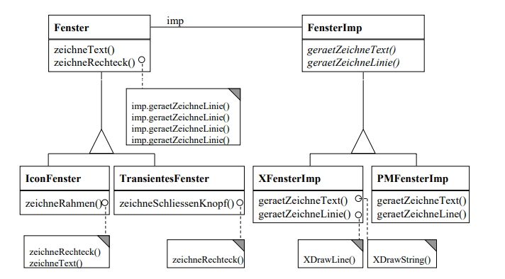
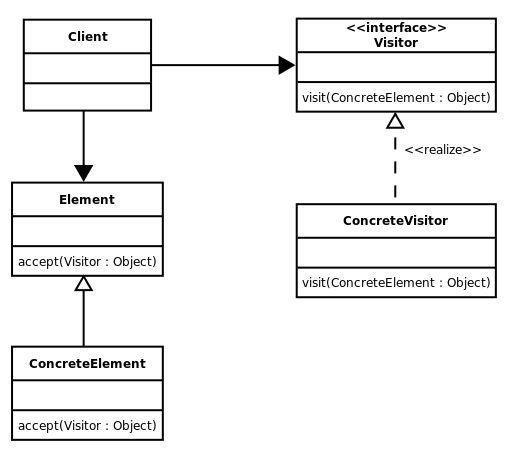

class: center, middle

## [Software Engineering](../../praesentationen.html)

#### Kapitel 7

# Softwareentwurf

Simon Fedrau, Sascha Hahn

---

# Inhalt
***
1. Entwurfsmuster (Design Patterns)

1. Entwurf des Datenmodells

    1. Domain-Driven Design

1. Entwurf der Benutzerschnittstelle
    
    1. UI Modelling

    1. Usability vs. User experience (UX) vs. Customer experience (CX)

    1. Nielsen's 10 Usability Heuristic Prinzipien für das UI-Design

1. Zusammenfassung

1. Quellen

---

## Softwareentwurf
## Tätigkeiten im Softwareentwurf
## Entwurfsziele
### Orthogonalität
### Niedrige Kopplung
#### Arten: prozedural und objektorientiert
### Hohe Kohäsion
## Entwurfsprinzipien
### Abstraktion
### Modularität
### Law of demeter
### Dependency Injection, Inversion of Control
### Separation of Concerns
### Keep It Stupid Simple
### You Ain’t Gonna Need It
### Don't repeat yourself
### Composition Over Inheritance
### Clean Code SOLID-Prinzipien
#### Single Responsibility Principle
#### Open-Closed Principle
#### Liskov Substitution Principle
#### Interface Segregation Principle
#### Dependency Inversion Principle
### Jeweils Implementierungsbeispiel

---

## Entwurfsmuster (Design Patterns)
***
Design Patterns sind bestimmte Code Strukutren, die schonmal ein grobes Muster zur Lösung eines Coding Problemes geben.
* ### **Vorteile:** 
    * ### Wiederverwendbarkeit von Code
    * ### Lesbarkeit
    * ### Code Qualität
    * ### Zeitersparnis

---

### Vergleich von Mustern, Algorithmen und Frameworks
***
Es gibt generell drei verschiedene Hauptkategorien von Design Patterns.

* **Strukturmuster:** 
    Strukturmuster sind für die Strukturierung von Beziehungen zwischen Klassene und Objekten zuständig. 
    Hierbei soll eine gewisse Abstraktion der Klasse geschaffen werden und mit Schnittstellen gearbeitet werden.

* **Verhaltensmuster:** 
    Verhaltensmuster sind für die Steuerung von bestimmten Prozessen oder Verhaltensweisen zuständig. 
    Sie geben eine Grundstruktur für komplexe Algorithmen und vereinfachen diese.

* **Erzeugungsmuster:** 
    Erzeugungsmuster sind für die Erzeugung von Objekten zuständig. 
    Sie vereinfachen die Erzeugung von Objekten und ermöglichen eine vereinfachte Prozessdarstellung für bestimmte Instanzen.

[1b]

---

### Entkopplungsmuster
***
Mit Entkopplungsmustern wird ein Systemm ein entkoppelte Teile gegliedert, die unabhängig voneinander funktionieren.
* einzelne Teile kommunizieren über Schnittstellen

* **Vorteil:** Änderungen an einem Teil des Systems haben keine Auswirkungen auf andere Teile des Systems

 
 
 

Im Folgenden werden einige dieser Entkopplungsmuster vorgestellt.

[2b]

---

#### Repository-, Plugin-, Bridge-, Visitor-Pattern
### Repository-Pattern
***
Damit viele unabhängige Teile eins Systems miteinander kommunizieren können wird eine zentralle Ablage erstellt. 
Hierbei werden Elemente in die zentralle Ablgage abgelegt und auch wieder von anderen herausgeholt. 
Beispiele für solche Ablagen sind Datenbanken Hypertextsysteme oder auch Dateisysteme.

[2b,3b,4b]

---

### Repository-Pattern
***

[2b,3b,4b]

---

### Repository-Pattern
***

#### Bsp. Online Shop:
Mehrere Teile des Systems müssen auf eine große Menge an verscheidenen Produktdaten zugreifen. 
Die UI des OnlineShops braucht die Daten der Produkte die sie anzeigen soll, die bestell Software muss den Preis
und verfügbarkeit der Produkte wissen, und Mitarbeiter in der Logistik brauchen auch gewisse Daten. 
Damit alle Teile des Systems die gleichen und fehlerfreie Daten haben, macht es Sinn diese an einer zerntrallen Stelle zu speichern,auf die alle Zugreifen können.

[2b,3b,4b]

---

#### Repository-, Plugin-, Bridge-, Visitor-Pattern
### Plugin-Pattern
***
Bei dem Plugin-Pattern wird die Schnittstelle einer Klasse an eine andere Klasse angepasst. 
Zwischen diesen liegt die Plugin-Schnittstelle, die die Kommunikation ermöglicht. 
Vorteil hierbei ist, dass die bereits funktionierenden bestehenden Klasse sind refactored werden müssen. 

[2b,3b,4b]

---

### Plugin-Pattern
***

[2b,3b,4b]

---

### Plugin-Pattern
***
#### Bsp. Anzeige von Texten in einem Zeicheneditor:
Wir haben ein ZeichenProgramm in dem wir auch Texte einfügen wollen. 
Dazu brauchen wir eien Klassenbibliothek, die uns die Masse, sprites, berechnungen/formatierung, etc. zur verfügung stellt. 
Zum gerenellen erstellen von Visuellen Objekten haben wir die "GrafischesObjekt" Klasse. 
Diese vererbt bereits schon an die "Linie" Klasse. 
Um jetzt Text einfügen zu können brauche wir eine weitere Klasse "Text" welche die Methoden von "GrafischesObjekt" implementiert. 
die Klasse verwendet die Methoden der Bibliotheck aber von aussen kann man mit den gewohnten methoden arbeiten. 

[2b,3b,4b]

---

### Plugin-Pattern
***

[2b,3b,4b]

---

#### Repository-, Plugin-, Bridge-, Visitor-Pattern
### Bridge-Pattern
***

Bei dem Bridge-Pattern wird die Schnittstelle(Interface) einer Klasse unabhängig von der Implementierung entwickelt. 
Das Problem ist dass er sehr unübersichtlich werden kann wenn man die Schnittstelle und Implementation gleichzeitig wetierentwickelt. 
Hierfür wird die erweiterung der Schnitsstelle durch weitere Schnitstellen die erbene ermöglicht. 
Die Hauptimplementation implementiert dann von der Hauptschnittstelle und weitere Klassen erben dann von dieser. 

[2b,3b,4b]

---
### Bridge-Pattern
***

[2b,3b,4b]

---

### Bridge-Pattern
***
Bsp. Implementierung verschieder Arten von Fenstern:
Wir haben eine Schnittstelle Fenster die von mehreren Fenster klassen implementiert wird. 
Jetzt wollen wir aber eine weitere unterkategorie an Fenstern erstellen, die auch wieder viele gemeinsame Methoden haben. 
Diese können wir nicht in der Schnittstelle implementieren, da sie sonst alle Arten von Fenster haben müssten. 

Dazu benutzen wir das Bridge Pattern um die Methoden in einer Schnittstelle zu definieren und dabei struktur zu behalten. 
Wir erstellen Interfaces die von Fenster erben und die verschiedenen unterkategorien an Fenster darstellen. 
Alle implentierungen voin Fenster können jetzt trotzdem von der Haupt Implementierung erben. 

[2b,3b,4b]

---

### Bridge-Pattern
***

[2b,3b,4b]

---

#### Repository-, Plugin-, Bridge-, Visitor-Pattern
### Visitor-Pattern
***
Das Visitor Pattern wird verwendet wenn mehrere nicht verwandte Objekte gleiche Operationen/Berechnungen ausführen müssen. 
Hierfür wird eine Besucher Klasse bereitgestellt auf die alle unabghängig voneinander zugreifen können. 

[2b,3b,4b]

---
### Visitor-Pattern
***

[2b,3b,4b]

---

## Entwurf des Datenmodells
***
Ein Datenmodell ist ein Modell, das beschreibt wie Daten verarbeitet werden. 
Die Datenmodulierung dient dazu eine gewisse Struktur für große Datenmengen zu erstellen
und festzulegen wie ein System diese Daten verarbeitet/liest,schreibt. 

[5b]

---
### Domain-Driven Design
***
Domain-driven Design(DDD) ist eine Ansatz der Softwareentwicklung, bei dem die Probleme der Geschätsbereiche in den Vordergrund gestellt werden, um sie besser zu verstehen und zu Lösen. 
Dies wird umgesetzt durch die verwendung einer einheitlichen Sprache (Fachbegiffe) unter den verschiedenen Geschäftsbereichen. 
Mit DDD wird die Geschäftslogik klar in der Software representiert, um die Zusammenarbeit zu fördern. 

---

#### Domain vs. Model
***
Die Domain bezieht sich auf das Fachgebiet/Problemfeld, für die die Software da ist. 
Sie umfasst die Aspekte der Geschäftsprozzesse und modeliert die Geschäftsanforderungene und Prozesse dementsprechend. 

Bei dem Model handelt es sich um die strukturierte Darstellung der Elemente die die Domäne umfasst. 
Das Model ist die Representation der Domain in Code/Software form. 
Es Dient dazu,die komplexität der Domäne übsersichtlich darzustellen/verwalten und die Kommunikation zwischen den
Fachexperten zu schaffen. 

[5b,6b]

---

#### Domain-Driven Design Prozess
***
Der DDD Prozess ist ein systematischer Ansatz zur Entwicklung von Software, der sich auf die Modellierung und Lösung komplexer Probleme in einem bestimmten Fachgebiet konzentriert. 
Also generell die entwicklung eines DDD Models. 
Dazu müssen Fachexperten und Entwickler zusammen ein Modell erstellen. 
Die Fachexperten bringen ihr Wissen über die Domäne mit und die Entwickler sorgen dafür,
dass das Modell in Software umgesetzt wird und eine gewisse Struktur hat. 

[5b,6b]

---

#### Entities, value objects, aggregates, services, factories
***
* **Entities:** 
Entities sind Objekte die eine Identität haben und über die Zeit verändert werden können. 
Entitäten sind unabhängig von ihren Attributen und eine änderung der Attribute ändert nicht die Identität. 
z.B: Benutzer mit einer ID. 

* **Value Objects:** 
Value Objects sind objektähnliche Strukturen ohne eine eigene Identität. 
Sie repräsentieren eher Werte oder Konzepte. 
Die Gleichheiten von Value Objects werden durch ihre Attribute definiert. 
z.B: Koordinaten als Objekt mit den Attributen x und y. 

[5b,6b]

---

#### Entities, value objects, aggregates, services, factories
***

* **Aggregates:** 
Aggregates sind Gruppen von miteinander verbundenen Objekten, die als eine einzige Einheit betrachtet werden. 
Sie besitzen eine Wurzel, die der einzige zugangspunkt voin außen ist(Schnittstelle). 

* **Services:** 
Services repräsentieren Operationen oder Aufgaben, die nicht natürlich zu einem bestimmten Aggregate oder einer Entity gehören. 
Sie können Domäne übergreifende Operationen bereitstellen und sind unabhängig von den Aggregates, sowie zustandslos. 
z.B: Ein Berechnungsservice, der Steuern üfr einen Einkaufsborb berechnet. 

* **Factories:** 
Factories sind Mechanismen zur Erzeugung von komplexen Objekten oder Aggregaten(vgl. Faktory Pattern). 
Faktories kapseln den Erstellungsprozess und sorgen für eine gewisse konstitenz der Objekte. 
z.B: Eine "User-Faktory" die einen neuen User mit standard Attributen ertsellt. 

[5b,6b]

---

#### Ubiquitäre Sprache
***
Eine Hauptmerkmal eines DDD ist die ubiquitäre Sprache. 
Sie beschreibt die Fachlichen gegbenheiten der Domänen und wird überall in der Software benutzt. 
Zum Beispiel wird bit der ubiquitären Sprache Elemente, Prozesse oder Konzepte der Domänen beschrieben. 
Dadurch wird die Kommunikation zwischen den Fachexperten und Entwicklern vereinfacht, da Missverständisse und
Fehlinterpretationen vermieden werden. 

[5b]

---

#### Anemic Domain Model
***
Das Anemic Domain Model ist ein Anti-Patter, bei dem das Domönemodell zwar Objekte für diese enthält,
diese aber nur Datenstrukturen sind die keine geschäftslogische Funktionalität beseitzen. 
Die Datenstrukutren(Entitäten und Objekte) sind nur Datencontainer, sie besitzen keine funktionalität. 
Die eigentliche Geschäftslogik wird in externene Services ausgelagert. 
Die Domäne Objekte haben aber nur minimale Funktionen um ihr verhalten auszudrücken.  

[6b,7b]

---

#### Vorteile, Nachteile
***
**Vorteile:** 
* Fachexperten haben ein besseres Verständniss der verschiedenen Domänen
    * fördert Zusammenarbeit und kommunikation
* Durch einheitliche(ubiqquitäre) Sprache wird die Kommunikation besonders gefördert
* Einheitliche Struktur der Software
    * Domäne wird klar repräsentiert

---

#### Vorteile, Nachteile
***
**Nachteile:** 
* Einführung der DDD ist sehr Zeitintensiv
    * Fachexperten müssen sich mit der Entwicklung der Software beschäftigen
    * Fachexperten müssen sich mit anderen Domänen beschäftigen
    * Entwickler müssen sich mit der Domäne und Software beschäftigen
* Nicht immer notwendig
    * Bei kleinen Domänen ist die Kommunikation und Strukturierung nicht so komplex

---

## Entwurf der Benutzerschnittstelle
***
Eine Benutzerschnittstelle(User Interface, UI) ist die Schnittstelle zwischen einem Benutzer und einem System, welche die
einfache Benutzung eines Systems ermöglicht. 
Sie können in verschiedenen Formen auftreten und bieten vielfältige Möglichkeiten für die Kommunikation zwischen Benutzern und der Software. 

Im Folgenden werden einige Aspekte der modelierung von Benutzerschnittstellen vorgestellt.  
[8b]

---

### UI Modelling
***
UI Modelling ist der Prozess der Erstellung einer Benutzerschnittstelle. 
Er umfasst einige Aspekte, um eine gute zu Bediennde UI zu erstellen. 
Bei der Modelligierung einer UI muss man darauf achten, dass man ein ansprechendes Design hat,
die Benutzung einfach ist, die UI auch die gewünschten Funktionen hat und eine gute Dokumentation für die User vorhanden ist. 
Im folgenden werden einige Schritte angezeigt um diese Aspekte zu erfüllen. 

[6b,9b]

---

#### Wireframe vs Storyboard vs Wireflow vs Mockup vs Prototyping
***
**Wireframe:** 
* Grundlegede Visuelle Darstellung
* platziereung von Text, Bilderun, Buttons, etc.
* Kein Fokus auf Designästhetik
* Benutzerfreundliche Platzierung der Elemente

**Storyboard:** 
* Sammlung von Visuellen Darstellungen
* Darstellung von Interaktionen
* Simulation von Benutzererfahrungen
    * User-Cases

**Wireflow:** 
* Kombination aus Wireframe und Storyboard
* Verbindung zwischen Interaktionen und UI
* Darstellung der Struktur der "Screens" und Verbindungen zwischen diesen

[6b,9b]

---

#### Wireframe vs Storyboard vs Wireflow vs Mockup vs Prototyping
***
**Mockup:** 
* Visuelle Darstellung der UI
* Mehr Details und Designästhetik als Wireframe
* Erster realistischerer Eindruck der UI
    * Enthält Bilder, Farben und generelles Design

letzter Schritt bevor ersten Prototyp erstellt wird

* **Prototyping:** 
* Interaktive Simulation der UI
    * Noch keine funktionale Logik(Click Dummy)
* Testen der Benutzererfahrung
* Verbesserung von Aspekten wie Benutzerfreundlichkeit, Design, etc.

[6b,9b]

---

### Usability vs. User experience (UX) vs. Customer experience (CX)
***
Die Begriffe Usability, User Experience (UX) und Customer Experience (CX) sind alle eng miteinander verbunden, beziehen sich jedoch auf unterschiedliche Aspekte und Perspektiven im Kontext von Design und Kundeninteraktion. Hier sind die Unterschiede zwischen ihnen:

* **Usability:** 
Usability bezieht sich auf die Benutzerfreundlichkeit oder Gebrauchstauglichkeit der Software. 
Es misst und konzentriet sich darauf, wie effektiv, effizient und zufriedenstellend Benutzer bestimmte Aufgaben mit einem Produkt ausführen können. 

**z.B.:** Ein einfach zu bediendendes Formular mit klaren Anweisungen und Struktur die angibt wo was einzutragen ist. 

[6b,10b]

---

* **User Experience (UX):** 
Die User Experience umfasst alle Aspekte der Wechselwirkung eines Benutzers mit der Software, einschließlich seiner Wahrnehmungen, Emotionen und Reaktionen während und nach der Interaktion. 
Es bezieht sich auf die gesamte Erfahrung des Benutzers mit dem Produkt, es umfast also auch sowas wie Design und Ästhetik. 

**z.B.:** Wenn unser Formular zwar sehr einfach zu Bedienen ist, aber das Design ein sehr schlichtes grelles neon grün ist, wird die UX nicht so gut sein. 

* **Customer Experience (CX):** 
Die Customoer Experience geht noch einen Schritt weiter. 
Es umfasst nicht nur die Erfahrung mit der UI sondern auch generell die Erfahrung, die ein Kunde mit einem Unternehmen macht. 
Es betont die gesammte Reise/Interktion die ein Kunde mit dem Unternehmen macht, vom ersten Kontakt bis zum Kauf und darüber hinaus. 

**z.B** Ein Kunde hat unser Formular für eine bestellung ausgeführt, aber die Lieferung hat lange gedauert und der Kundenservice war schlecht. 

[6b,10b]

---

### Nielsen's 10 Usability Heuristic Prinzipien für das UI-Design
***
Nielsen's 10 Usability Heuristic Prinzipien sind 10 Prinzipien die bei der Erstellung einer UI beachtet werden sollten. 
1. Das System sollte User mittels Feedback darüber informieren, was gerade passiert.
1. Gemeinsamkeit zwischen dem System und der realen Welt. Die Anweundung sollte die Sprache des Benuters sprechen. Dieser kann wahrscheinlich nicht mit Programierspezifischen Begriffen umgehen.
1. User machen Fehler. Das System sollte darauf ausgelegt sein, dass Fehler passieren und die möglichkeite bieten diese rückgängig zu machen.
1. Einheitliches Design und Strutur sollte eingehalten werden.
1. Noch besser als Fehlerrückgängig machen ist die Fehler eines Users komplett zu vermieden. Das System sollte so gestaltet sein, dass Fehler nur schwer passieren können.

[11b]

---

### Nielsen's 10 Usability Heuristic Prinzipien für das UI-Design
***
6 . Einfache Anleitung und sichtbare Informationen 
7 . Flexibilität und Effektivität. Der User sollte die Möglichkeit haben abkürzungen zu benutzen was die UI auch für erfahrenen benutzer effektiv macht. 
8 . Die UI sollte minimalistisch designed sein. Es sollten nur die nötigsten Informationen angezeigt werden. 
9 . Die UI sollte dem User auch helfen Fehler zu erkene und zu vermeiden, um zukünfitge Fehler zu vermeiden. 
10 . Hilfe und Dokumentation. Die UI sollte dem User die Möglichkeit geben sich zu informieren und Hilfe zu holen. 

[11b]

---

class: center, middle

# Fragen?

---

# Quellen
***

[1b] :https://www.ionos.de/digitalguide/websites/web-entwicklung/was-sind-design-patterns/

[2b] :https://www.inf.fu-berlin.de/lehre/WS02/SWT/slides4pdf/24_LE_23B.pdf

[3b] :https://de.wikipedia.org/wiki/Besucher_(Entwurfsmuster)#:~:text=Der%20Besucher%20(englisch%20visitor%20oder,dient%20der%20Kapselung%20von%20Operationen

[4b] : https://www.hsbi.de/elearning/data/FH-Bielefeld/lm_data/lm_1359639/pattern/visitor.html

[5b] : https://de.wikipedia.org/wiki/Datenmodell

[6b] : https://chat.openai.com/

---

# Quellen
***

[7b] : https://martinfowler.com/bliki/AnemicDomainModel.html

[8b] : https://de.wikipedia.org/wiki/Schnittstelle

[9b] : https://en.wikipedia.org/wiki/User_interface_modeling

[10b] : https://usabilitygeek.com/confuse-user-experience-customer-experience/#:~:text=UXers%20tend%20to%20be%20aware,a%20particular%20app%20or%20website.

[11b] : https://usersnap.com/de/blog/usability-nielsen/