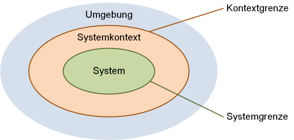

# Ausarbeitung 8
**Autor:** Simon Fedrau, Sascha Hahn

## Lernziele:
 
- Lernen, was Use Cases ist und welche Ziele er hat.
- Wissen, was hinter INVEST steckt.
- Unterscheiden zwischen einen guten und schlechten User Storys

## Use Cases

 **Es handelt sich um eine schriftliche Anleitung, die erklärt, wie Benutzer Aufgaben auf Ihrer Website durchführen können**

## Systemkontext und Systemgrenze

  **Systemkontext**: Dies umfasst die Darstellung der Wechselwirkung eines Systems mit seiner Umgebung.

  **Systemgrenze**: Es markiert dabei die Abgrenzung zwischen dem analysierten System und seiner Umgebung

### Ziele

|            |Systemkontext |Systemgrenze |
|---         |---           | ----        |
|       |  Definiert, welche Funktionen das System bereitstellen soll, sowie die Schnittstellen zu externen Systemen       |     Isoliert das geplante System von seiner Umgebung, wodurch der anpassbare Teil der Entwicklung von Aspekten in der Umgebung abgegrenzt wird, die durch den Entwicklungsprozess nicht verändert werden.        |

 ### Szenario
 
* **Kontextanalyse:**
  Es wird untersucht wie das System mit der Umgebung interagiert. Zu betrachten sind auch externe Faktoren wie andere Systeme, Benutzer oder auch Umwelteinflüssen

* **Stakeholder-Analyse:**
  Erkennung und Zuordnung von Personen oder Gruppen, die ein Interesse am System haben, dazu gehören Nutzer, Kunden, Lieferanten und andere relevante Parteien.

* **Anforderungen identifizieren:**
  Aufnahme und Analyse der Bedürfnisse sowie Erwartungen der Stakeholder, um sicherzustellen, dass das System in der Lage ist, diesen Anforderungen gerecht zu werden.

* **Risikobewertung:** 
  Analyse möglicher Risiken sowohl innerhalb als auch außerhalb des Systems. Dies beinhaltet technische, betriebliche und organisatorische Risiken.

### Spezifikation
  Bestimmt die Umgebung und den Umfang eines Systems. Dies beinhaltet:

  Systemgrenzen: Klare Definitionen, die die Abgrenzungen des Systems festlegen, was inbegriffen ist und was außerhalb liegt.

  * Kontextanalyse: Beschreibung, wie das System mit seiner Umgebung (andere Systeme, Benutzer, externe Faktoren) interagiert.
   
  * Schnittstellen: Identifizierung und Beschreibung der Berührungspunkte mit externen Elementen oder Systemen.

  * Stakeholder: Auflistung und Beschreibung der betroffenen oder beteiligten Parteien.

  * Anforderungen: Zusammenfassung der funktionalen und nichtfunktionalen Anforderungen, die durch den Kontext und die Grenzen des Systems beeinflusst werden.
 

### Use Case Diagramm

  Ein Use Case-Diagramm (auch Anwendungsfalldiagramm genannt) ist ein Verhaltensdiagramm und visualisiert die von außen sichtbare Interaktion von Akteuren mit dem zu entwickelnden System. Das Diagramm besteht aus dem System, zugehörigen Anwendungsfällen und Akteuren und setzt diese miteinander in Beziehung:
 [1]

## User Stories

  Eine User Story ist eine informelle, allgemeine Erklärung eines Software-Features, die aus der Sicht des Endbenutzers verfasst wurde. Ihr Zweck ist es, zu zeigen, welchen Wert ein Software-Feature für einen Kunden hat.

### Persona vs Theme vs Epic vs User Story vs Task

  * Persona: Fiktive Darstellung eines typischen Nutzers, hilft, Nutzerbedürfnisse zu verstehen.
  
  * Theme: Hochrangiges Ziel oder Fokus, das verschiedene Aspekte des Projekts umfasst.
  
  * Epic: Große, breite Anforderung, die in kleinere Teile aufgeteilt wird, oft über mehrere Sprints hinweg.
  
  * User Story: Detaillierte Anforderung aus Nutzerperspektive, spezifisch und mit klaren Erfolgskriterien.
  
  * Task: Konkrete Arbeitsschritte innerhalb einer User Story, sehr spezifisch und  ausführungsorientiert.

 

### Functional User Story vs. Technical User Story
    
  * Funktionale User Story: 
  Konzentriert sich auf die Benutzererfahrung und -bedürfnisse, beschreibt, was der Benutzer mit dem System tun können soll.

  * Technische User Story: 
  Fokussiert auf interne technische Aspekte wie Architektur und Performance, wichtig für die Systementwicklung und -wartung, aber oft nicht direkt sichtbar für den Endbenutzer.

 ---

### Aufbau / Bestandteile einer User Story

  Der Aufbau einer User Story umfasst drei wesentliche Elemente:
     
  * Rolle (Wer): Der zukünftige Nutzer der zu entwickelnden Lösung.

  * Funktion (Was): Die Erwartungen des zukünftigen Nutzers an die Software.

  * Nutzen (Warum): Der spätere Mehrwert der zu entwickelnden Lösung.

### Definition of ready vs Definition of Done

  |       |      Ready     |     Done      |
  |   ---    |      ---     |    ---       | 
  |  Zweck     |    Bestimmt, wann eine User Story oder ein Arbeitselement bereit ist, in den Entwicklungsprozess aufgenommen zu werden.  | Legt fest, wann eine User Story oder ein Arbeitselement als abgeschlossen betrachtet werden kann.     |
  |       Inhalt        |      Enthält Kriterien, die sicherstellen, dass die Arbeit gut definiert, verstanden und planbar ist. Dies kann beinhalten, dass die User Story klar formuliert ist, Akzeptanzkriterien hat, durch das Team geschätzt wurde, und dass alle notwendigen Informationen verfügbar sind.        |        Enthält eine Liste von Kriterien, die erfüllt sein müssen, bevor eine Arbeit als "fertig" betrachtet wird. Diese können Aspekte wie Code-Reviews, Testing, Dokumentation, Einhaltung von Coding-Standards und Kundenzufriedenheit umfassen.             |
  |         Wichtigkeit           |        Stellt sicher, dass die Teams nicht mit unklaren oder unvollständigen Anforderungen arbeiten, was zu Verzögerungen oder Qualitätsproblemen führen könnte.              |           Stellt die Qualität und Vollständigkeit der gelieferten Arbeit sicher und verhindert, dass unvollendete Features in späteren Phasen des Projekts Probleme verursachen.           |

   ### Akzeptanzkriterien mit Beispielen

  Sind bestimmte Voraussetzungen, die ein Arbeitsergebnis erfüllen muss, damit es von Kund*innen akzeptiert und abgenommen wird.

  Bsp:
    User Story: "Als Besucher eines Online Shops möchte ich die angebotenen Waren nach Kategorien filtern können, um nicht alle Produkte durchzugucken, sondern will schnell meine Produkte finden."
    
  * Akzeptanzkriterien:
    * Produkte können nach Kategorien wie 'Bekleidung', 'Musik' und 'Wohnen' gefiltert werden.
    * Die Filterung zeigt sofort die relevanten Produkte an.
    * Filtereinstellungen bleiben während der  Browsersession erhalten.

### Prinzipien für effektive ("gute") User Stories

  * Spezifisch und Verständlich: Deutliche und leicht verständliche Formulierungen, die von allen Teammitgliedern klar nachvollzogen werden können.
  * Benutzerzentriert: 
  Der fokus sollte auf dem Nutzer und seinen Bedürfnissen liegen.
  * Kurz: 
  sollten sehr kurz und pregnant sein.
  * Realisierbar: 
  Es sollte technisch und zeitlich im Rahmen der Projektressourcen liegen.

  * Testbar: 
  Die Akzeptanzkriterien sollten klar sein, um die FErtigstellung überprüfen zu können.

  * Wertvoll: 
  Es sollte ein durchaus erkennbarer Mehrwert für den Endbenutzer geliefert werden.

  * Priorisiert: 
  Wichtige und Dringliche Punkte sind klar erkennbar.
  
  * Verhandelbar: 
  Offen gegenüber Anpassungen sowie Verfeinerungen im Prozess.  
  
  * Unabhängig: 
  Möglichst unabhängig von anderen Stories, um einzeln entwickelt werden zu können.

### Formulierungsfehler, die zu vagen ("schlechten") User Stories führen

* Unklare Beschreibung:
    * Fehler: "Benutzer soll Funktion X verbessern."

* Allgemeine Aussagen:
    * Fehler: "Verbessere das Design."

* Fehlende Spezifität:
    * Fehler: "Benutzer soll neue Funktion verwenden können."

* Unkonkrete Akteure:
    * Fehler: "Admin soll auf das Dashboard zugreifen können."
    Korrektur: "Der Systemadministrator soll über ein sicheres Login auf das Administrator-Dashboard zugreifen können."

* Ungenügende Akzeptanzkriterien:
    * Fehler: "Benutzer soll Produkt kaufen können."

* Fehlende Kontextinformationen:
    * Fehler: "Benutzer soll auf die Benachrichtigung reagieren."
    

* Mangelnde Priorisierung:
    * Fehler: "Benutzer soll neue Funktionen nutzen können."
    
* Vage Zeitvorgaben:
    * Fehler: "Implementiere Funktion X schnell."

[3] 

### Card, Conversation, Confirmation
    
  * **Card:** 
    * User Stories sollten kurz und klar sein und auf einer Karteikarte festgehalten werden. Wenn der  Platz auf der Karte nicht ausreicht, ist die Story wahrscheinlich zu umfangreich. Die Karte dient als Erinnerung an die wichtigsten vereinbarten Punkte.

  * **Conversation:** 
    * Wichtiger als die schriftliche Festlegung ist der Austausch zwischen dem Kunden und dem   Entwicklungsteam. User Stories werden oft in Gesprächen, Workshops und Planungssitzungen diskutiert, um ein gemeinsames Verständnis zu schaffen. Zusätzliche Dokumentationen wie Mockups können zur Klärung beitragen.

  * **Confirmation:** 
    * Für jede User Story werden verbindliche Akzeptanzkriterien definiert, die vor Beginn der  Umsetzung festgelegt werden. Diese Kriterien dienen als Basis für die Abnahme der implementierten Story, wobei Akzeptanztests zur Überprüfung der Erfüllung dieser Kriterien nützlich sind.

  * **INVEST-Kriterien**
    
  //Bild heraussuchen
  
     

   ### User-Stories vs. Use Case

  |             |      User Stories    |      Use Cases    |
  |    ---      |    ---               |     ---           | 
  |      **Format**      |        Kurz und narrativ, folgen oft dem Schema „Als Rolle, möchte ich Aktion, um  Nutzen.“              |       Ausführlicher und strukturierter, beschreiben Interaktionen zwischen Benutzern und dem System.            | 
  |        **Fokus**     |          Stark benutzerzentriert, betonen den Wert oder Nutzen für den Endbenutzer.            |        Auf die Funktionalität und die Abläufe innerhalb des Systems.           | 
  |        **Detailgrad**     |             In der Regel weniger detailliert, eher auf das "Was" und "Warum" als auf das "Wie" konzentriert.         |          In der Regel detaillierter, beschreiben spezifische Schritte oder Abläufe.          | 
  |      **Flexibilität**       |         Sind offen für Diskussionen und können sich während des Entwicklungsprozesses anpassen.              |         Eher festgelegt, mit weniger Spielraum für Änderungen während der Entwicklung.          | 
  |           **Einsatz**              |           Häufig in agilen Entwicklungsmethoden verwendet, wie Scrum oder Kanban.               |          Oft in traditionelleren, plangetriebenen Entwicklungsansätzen wie dem Wasserfallmodell.           |
  |              **Ziel**           |         Schnelle, iterative Entwicklung mit Fokus auf Benutzerbedürfnissen.                |      Klare Definition der Systemanforderungen und -abläufe.               |

     
  #### Misuse Stories

  Sind kurze narrative Szenarien, die potenzielle Missbrauchs- und Angriffswege in einem Softwaresystem beschreiben. Sie dienen dazu, Sicherheitsrisiken und Schwachstellen zu identifizieren, um präventive Maßnahmen in der Softwareentwicklung zu ergreifen.

  #### Priorisierung

  Bestimmt die Reihenfolge, in der Aufgaben, Features oder User Stories bearbeitet werden. Sie basiert auf Faktoren wie dem geschäftlichen Wert, Kundenbedürfnissen, Abhängigkeiten zwischen Aufgaben, Risiken, Kosten-Nutzen-Analyse, Dringlichkeit, Teamkapazität und Stakeholder-Input. Effektive Priorisierung sorgt dafür, dass wichtige und wertvolle Aspekte des Projekts zuerst angegangen werden. 

  #### Schätzung

  Bezieht sich die Schätzung auf den Prozess der Bewertung des Aufwands und der Zeit, die benötigt werden, um bestimmte Aufgaben, Features oder User Stories zu implementieren.
 
  * Aspekte der Schätzung:

    * Team-Basiert: 
    Schätzungen werden oft vom Entwicklungsteam durchgeführt, da sie die nötige Erfahrung und Kenntnisse über die technischen Anforderungen und Herausforderungen haben.

  * Relative Schätzung: 
    * Anstatt spezifische Stunden oder Tage anzugeben, verwenden Teams oft relative Schätzungsmethoden wie Story Points oder T-Shirt-Größen, um die Komplexität im Vergleich zu bekannten Aufgaben zu bewerten.

  * Planungspoker: 
    * Eine beliebte Technik in agilen Methoden, bei der Teammitglieder ihre Schätzungen durch Karten mit Zahlen oder Story Points anzeigen und dann über Abweichungen diskutieren, um einen Konsens zu finden.

  * Historische Daten: 
    * Frühere Erfahrungen und historische Daten von ähnlichen Projekten oder Aufgaben können als Referenz für Schätzungen verwendet werden.

  * Iterative Anpassung: 
    * Schätzungen können und sollten im Laufe des Projekts angepasst werden, wenn mehr Informationen verfügbar sind oder sich die Bedingungen ändern.

  * Transparenz und Kommunikation: 
    * Offene Kommunikation über Unsicherheiten und Risiken während des Schätzungsprozesses ist wichtig, um realistische Erwartungen zu setzen.

* Story Mapping:
  * Ist eine Technik, mit der ausgehend von der User Experience das Big Picture der Anforderungen übersichtlich dargestellt werden kann. Dabei bleibt stets der Kundenfokus erhalten.
    
     

---

### Wiederholungsfragen

* **Priorisierung**
  * Was versteht man unter Priorisierung in der Softwareentwicklung?
  * warum ist sie wichtig?

* **Prinzipien für effektive ("gute") User Stories**
  * Was ist das Hauptziel einer effektiven User Story in der agilen Softwareentwicklung?
  * Warum ist es wichtig, dass User Stories unabhängig voneinander sind?

* **Formulierungsfehler, die zu vagen ("schlechten") User Stories führen**
  * Was sind die Hauptmerkmale einer "vagen" User Story?
  * Welche Rolle spielen Akzeptanzkriterien bei der Vermeidung vager User Stories?

## **Quellenverzeichnis**

[1a]  : https://www.microtool.de/wissen-online/was-ist-ein-use-case-diagramm/
[2a]  : https://t2informatik.de/wissen-kompakt/use-case-diagramm/
[3a]  : https://chat.openai.com/c/f8ca6995-a5d5-47ff-ba20-c3cb31905501 frage : was sind Formulierungsfehler, die zu vagen ("schlechten") User Stories führen
[4a]  : https://www.usability.gov/how-to-and-tools/methods/use-cases.html.
[5a]  : https://t2informatik.de/wissen-kompakt/systemkontext/.
[6a]  : https://www.fhnw.ch/plattformen/iwi/2020/06/17/homeoffice-und-onlinekonferenzen-4-9-2-3-2-7/.
[7a]  : https://www.microtool.de/wissen-online/was-ist-der-systemkontext/.
[8a]  : https://www.microtool.de/wissen-online/was-ist-ein-use-case-diagramm/.
[9a]  : https://www.visual-paradigm.com/scrum/theme-epic-user-story-task/.
[10a] : https://www.brainformatik.com/blog/user-story/
[11a] : https://t2informatik.de/wissen-kompakt/akzeptanzkriterien/.
[12a] : https://www.me-company.de/magazin/akzeptanzkriterien/#:~:text=Akzeptanzkriterien%20sollten%20einfach%20zu%20verstehen,wie%20die%20Kund*innen%20hat.
[13a] :  https://produktwerker.de/herausforderung/gute-user-stories-schreiben-formulieren/#:~:text=Zu%20den%20wichtigsten%20Eigenschaften%20einer,die%20Prinzipien%20des%20Akronyms%20INVEST.
[14a] : https://bbv-software.de/user-stories/.
[15a] : https://blog.seibert-media.net/blog/2011/03/09/user-story-scrum-card-conversation-confirmation/.
[16a] : https://www.visual-paradigm.com/guide/agile-software-development/user-story-vs-use-case/.
[17a] : https://www.software-quality-lab.com/wissen/blog/blogeintrag/user-story-oder-use-case-was-denn-nun/.
[18a] : https://en.wikipedia.org/wiki/Misuse_case#From_use_to_misuse_case
[19a] : https://karrierebibel.de/priorisierung/.
[20a] : https://www.it-agile.de/agiles-wissen/agiles-produktmanagement/story-mapping/.
