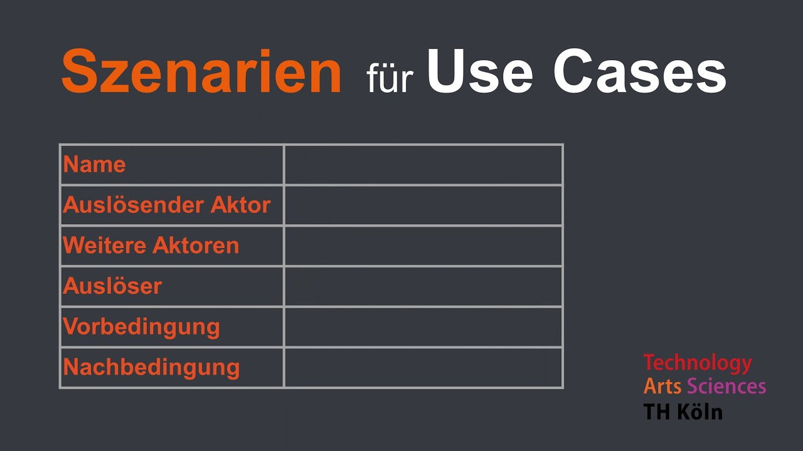
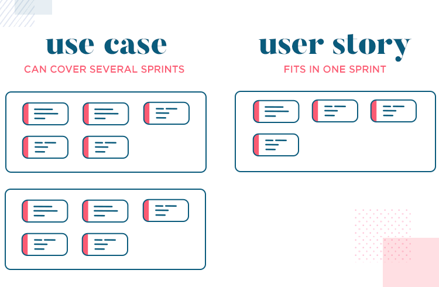
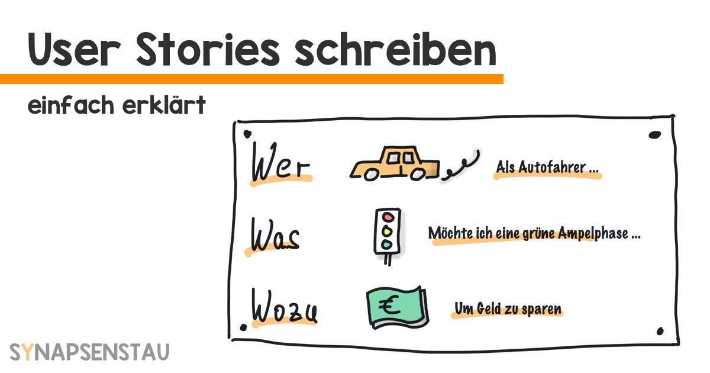
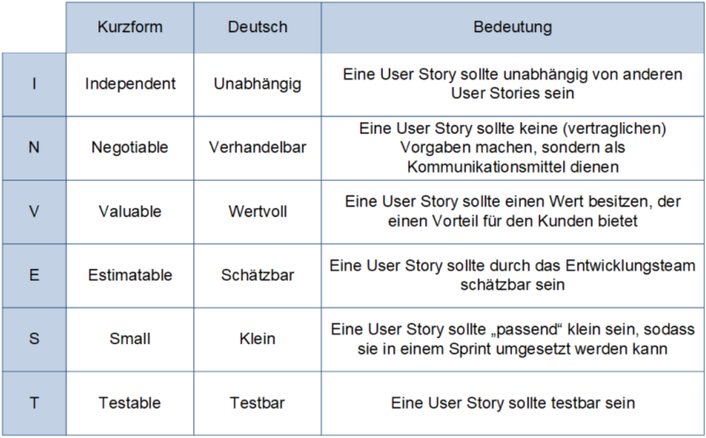
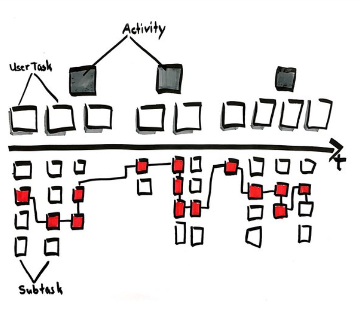

class: center, middle

## [Software Engineering](../../praesentationen.html)

#### Kapitel 8
Wael Eskeif, Angelo Mavridis
---

# Inhalt
 ---
 * Use Cases

 * User Stories

---

## Requirements Engineering
***
Bei Requirements Engineering handelt es sich um einen Prozess, der die Anforderungen an ein System oder eine Software erfasst, analysiert, dokumentiert und verwaltet.
Es ist ein wichtiger Bestandteil des Softwareentwicklungsprozesses, da es sicherstellt, dass das entwickelte System die Bedürfnisse und Erwartungen der Stakeholder erfüllt.
Wichtiger Bestandteil ist die Anforderungen genau zu erfassen, diese so gut es geht zu spezifizieren und zu verwalten.

[1a]

---

### Definition für "Anforderung" ("Requirement")
***
Anforderungen sind formulierte Bedingungen oder Spezifikationen, die beschreiben, welche Funktionen, Eigenschaften oder Qualitätsmerkmale ein System oder Produkt erfüllen oder besitzen muss, um den Bedürfnissen und Erwartungen der Stakeholder gerecht zu werden.
Anforderungen können unterschiedliche Formen annehmen, darunter funktionale Anforderungen, nichtfunktionale Anforderungen, Benutzeranforderungen und Systemanforderungen auf die später noch eingegangen werden.
In der Praxis können Anforderungen verschiedenen Stufen von abstraktion und Detail beinhlten.

[2a]

---

### Problemraum vs. Lösungsraum
***
Bei dem Problemraum handelt es sich um die Zielsetzung und die Anforderungen an das System.
Der Lösungsraum beschreibt entspricht der Realisierung/Architektur, also wie die definierten Ziele des Problemraums umgesetzt werden.
Bestimmte Anweundungsfälle können den Problemraum beschreiben, um die Erfordernisse einzugrenzen.

[3a]

---

### Arten von Anforderungen
***
Wie bereits erwähnt kann man Anforderungen in verscheidenen Kathegorien einteilen.
Darunter Fallen zum Beispiel Funktionale und  Nicht-funktionale Anforderungen.

---

#### Funktional
***
Funktionale Anforderungen haben einen direkten Bezug zur Zweckbestimmung(was das Produkt machen soll) zu dem Produkt.
Sie sind Produkt spezifisch und beschreiben die Funktionen, die ein bestimmtes Produkt erfüllen soll.

**Beispiel:**
Eine Software soll einen Wert X nach einer Formel auch genau 4 nachkommstellen berechnen.

[4a]

---

#### Nicht-funktional
***
Nicht-funktionale Anforderungen sind meist unspezifisch für ein bestimmtes Produkt
und gelten allgemein für eine Reihe von Produkten.
Es sins quasi generelle Rahmenbedingungen die generell eingahelten werden sollten.

**Beispiele:**
* Dei Software muss mindestens nach 10ms auf eine Eingabe reagieren.
* Die Software muss auf allen gängigen Browsern laufen.
* Die Software muss in der Lage sein 1000 Anfragen pro Sekunde zu verarbeiten.

[4a]

---

##### Qualitätsanforderungen
***
Qualitätsanforderungen sind spezifische Anforderungen an ein System, die sich auf qualitative Aspekte beziehen, die die Leistung, Zuverlässigkeit, Effizienz und Benutzbarkeit des Systems betreffen.

Qualitätsanforderungen lassen sich meist mit der übergruppe der Nicht-funktionalen Anfordereungen zuordnen.

Qualitätsanforderungen sind entscheidend, um sicherzustellen, dass ein Softwareprodukt nicht nur funktioniert, sondern auch bestimmte Qualitätsstandards erfüllt. Diese Anforderungen sind oft eng mit den Erwartungen und Bedürfnissen der Benutzer, Stakeholder und des Unternehmens verbunden.

[4a]

---

##### Randbedingungen
Der Begriff "Randbedingungen" bezieht sich auf die äußeren Umstände, Rahmenbedingungen oder Voraussetzungen, die Einfluss auf ein System oder Projekt haben.

Diese Bedingungen können die Entwicklung, Implementierung oder Nutzung eines Systems beeinflussen.

**Beispiele:**
* Das System muss mit einer bestimmten Version eines Datenbankmanagementsystems kompatibel sein.
* Die Implementierung der neuen Softwareversion muss bis zum Ende des Quartals abgeschlossen sein.
* Das Budget für die Entwicklung des Systems ist begrenzt,
und das Projekt muss innerhalb dieser finanziellen Vorgaben bleiben.

[4a]

---

##### Rechtlich-vertragliche Anforderungen
***
Wie der Name bereits ähnen lässt, behndeln die Rechtlich-vertragliche Anforderungen die spezifischen Vorgaben und Verfplichtungen
die durch Vorschriften oder vertragliche Vereinbarungen festgelegt sind.

Diese Anforderungen sind entscheidend, um sicherzustellen, dass die entwickelte Software den rechtlichen Rahmenbedingungen entspricht und dass alle vertraglichen Vereinbarungen eingehalten werden.

Beispiele für solche sind Datenschutzbestimmungen, Urheberrechtsbestimmungen oder Haftungsfragen.

[4a]

---

##### Technologische Anforderungen
***
Technologische Anforderungen in Requirements Engineering beziehen sich auf die spezifischen technischen Voraussetzungen, die erfüllt sein müssen, damit das System erfolgreich entwickelt, implementiert und betrieben werden kann.

Diese Anforderungen umfassen Aspekte wie Hardware, Software, Datenbanken, Netzwerke und andere technologische Ressourcen.

[4a]

---

##### Anforderungen an die Benutzungsoberfläche
***
Anforderungen an die Benutzeroberfläche (UI) beschreiben die Anforderungen an die Benutzerfreundlichkeit und das Design der Benutzeroberfläche eines Systems.

Diese Anforderungen sind wichtig, um sicherzustellen, dass das System für die Benutzer einfach zu bedienen und zu navigieren ist und dass die Benutzeroberfläche ein positives Benutzererlebnis bietet.

[4a]

---

### Merkmale "guter" Anforderungen
***
Anforderungen sollten **Atomar** beschrieben sein, das heißt sie sollten unteilbar sein und
nicht mehrere Anforderungen in sich vereinen.
Sie sollten in einer Iteration abgeschlossen werden können.

Außerdem sollten sie **Eindeutig** sein, was eine selbstverständliche annahme ist.
Genau heißt das aber, dass die eine einheitliche Interpretation bieten sollen und
keine zweifel bei dem verständniss der Anforderung aufkommen sollten.

**Testbarkeit** ist auch ein wichtiger Punkt. Damit die Anforderung auch im nachhinein überprüft werden kann,
muss der Aspekt der von der Anforderung beschrieben wird verifiziert und validiert werden können.

Als letzten müssen Anforderungen **Notwendig** sein, damit man nicht unnötige Anforderungen hat
und in einem haufen an Anforderungen untergeht. Solche Anforderungen würden viel Zeit kosten, da man sie
umständlich herausfiltern muss.

[5a]

---

### Anforderungsanalyse
***
1. Um mit einem Projekt anzufngen müssen Anforderungen erstmal analysiert werden.

1. Nach der erstellung der Anforderungen müssen sie klassifiziert und bewertet werden.

    Das heißt, dass sie in den bereits beschriebenen Kategorien eingeordnet werden und ihnen eine Priorität zugewiesen wird.
    Außerdem werden sie auf Vollständigkeit überprüft und Durchgängigkeit.

1. Als nächstes werden die Anforderungen detailiert beschrieben und schrifflich festgehalten.

    Hier werden auch wieder Anwedungsfälle beschrieben, die die Anforderungen genauer beschreiben.

1. Ein letzter optionaler Schritt ist Anforderungen kontinuierlich während der Implementation zu überprüfene und zu verbessern.
So können sich neue Projektzyklen ergeben, die neue Anforderungen mit sich bringen.

[6a]

---

##### Motivation (Warum macht man das überhaupt?)
***
Ziel einer Anfordereungsanalyse ist es, diese in ein durchfürhbares Projekt umzuwandeln.

Sie werden konkretisiert, strukturiert und geprüft um die sicherzustellen, dass es keine Wiedersprüche enstehen,
die Anforderungen umsetzbar sind und die Anforderungen vollständig sind.

Andernfalls kann es dazu führen, dass in Mitten der Entwicklung neue Anforderungen auftauchen
oder Anforderungen rausgeworfen werden, da sie als nicht umsetzbar erachtet werden,
was den Projektvortschritt zurückwerfen kann.

[7a]

---

##### Herausforderungen und Probleme bei der Anforderungsanalyse
***
* Wenn wichtige Stakeholder nicht ausreichend in den Analyseprozess eingebunden sind, besteht die Gefahr, dass wichtige Anforderungen übersehen oder falsch verstanden werden.

* Außerdem können Stakeholder notwendige Änderungen der Anforderungen nicht annehmen oder akzeptieren, wenn sie nicht ausreichend in den Prozess eingebunden sind oder das Know-How haben.

* Ach Fehlende Fachkentnisse innerhalb des Entwicklungs-Teams können zu Missverständnissen und Fehlinterpretationen führen, was zu falschen Anforderungen und einer schlechten Umsetzung führen kann.

* Eine Erfolgreiche Anforderungsanalyse erfodert eine gute, reibungslose Kommunikation zwischen allen Stakeholdern und dem Entwicklungsteam. Auch kontinuierliches Feedback sind ein Schlüsselaspekt.

[8a]

---

##### Stakeholder
***
In den letzten Kapiteln wurde bereits mehrmals der Begriff "Stakeholder" erwähnt, welcher Die Anfoderungen an ein Projekt stellt, aber wer sind eigentlich Stakeholder?

Stakeholder sind Personen oder Organistionen die von dem Ergebniss eines Projekts betroffen sind oder einen Einfluss auf das Projekt haben. Sie verfolgen individuelle Interessen und versuchen die Projektleitung zu ihrem vorteil zu "beeinflussen".

 Stakeholder sind z.B Kunden, Geschäftsführer, Entwickler, Tester, Marketing, Vertrieb, etc. sein.

Das heißt im Umkehrschluss, dass jeder ein Stakeholder sein kann, der von dem Projekt betroffen ist.

Stakeholder ist einfach nur ein allgemeiner Begriff der nicht eine bestimmmte Role in der Entwicklung beschreibt.

[9a]

---

##### SMART-Ziele
***
SMART ist ein Akronym für die Kriterien, die ein Ziel erfüllen sollte, um effektiv zu sein.
Es besteht aus folgenden Kriterien:

* **Spezifisch:** Das Ziel sollte klar und konkret formuliert sein.

* **Messbar:** Das Ziel sollte messbar sein und zuordenbar sein.

* **Assignable:** Es muss einen klaren Verantwortlichen geben.

* **Realistisch:** Das Ziel muss mit den Mitteln, Randbedingungen und der Zeit erreichbar sein.

* **Terminiert:** Das Ziel sollte einen klaren Zeitrahmen und Deaadline haben.

[10a]

---

##### Anforderungsquellen und Ermittlungstechniken
***
Anforderunungsquellen und Ermittlungstechniken beschreiben woher oder von wem die Anforderungen überhaupt erstellt werden.

Anforderungen können aus verschiedenen Quellen stammen, wie z.B. aus dem Kunden, dem Entwicklerteam, Berechtgen, Interviews, 
generell Beobachtungen, Brainstorming oder auch aus der Konkurrenz (Wettbewerbsanalyse).

Techniken um an Anforderungen zu kommen sind z.B. Use-Case Analysen, Storybording, Prototyping, Fragebogen oder andere Kreativitätstechniken.

[11a]

---

##### Anforderungskategorien nach Kano
***
Kategorien von Anforderungen wurden bereits erklärt, nun soll es aber um die Kategorien nach Kano geheb,
welche besonders die Anforderungen der Kunden umfassen.

Bei dem Kano modell geht es nähmlich um den Zusammenhang zwischen der Zufriedenheit des Kunden und der Erfüllung derer Anforderungen.

Das hört sich etwas redundant an, es geht aber im Grunde darum, dass zum Beispiel Anforderungen, die der Kunde als selbstverständlich erachtet noch nicht zu seiner Zufriedenheit führen müssen. Anders gesagt die beseitigung von Buggs führt nicht zu einer höheren Zufriedenheit.

Man muss also eine gute Mitte finden die bestimmte grund Erwartungen erfüllen aber auch eigene mit einbringen, die den Kunden positiv überraschen.

[12a]

---

##### Phasen und Haupttätigkeiten
***
Die Anforderungsanalyse kann in mehrere Phasen und Haupttätigkeiten unterteilt werden:

1. Als erstes werden die relevanten Stakeholder identifiziert und Ziele der Anforderungsanalyse festgelegt.

1. Als nächstes werden Zeit und Recourcen des Projektes geplannt, um Anforderungen richtig bewerten zu können.

1. Jetzt werden auch tatsächlich die Anforderungen erfasst. Dies geschieht durch die wie bereits aufgeführten Techniken und Quellen.
    Auch werden bereits vorhandene Dokumente und Prjekte analysiert, um allgemeine Anforderungen festzulegen.

1. Dannach werden Anforderungsdokumente erstellt, die alle gesammelten Anforderungen strukturiert und verständlich darstellen.
    Dabei werden auch Anwendungsfälle und Use-Cases mit eingebracht.

1. Die Anforderungen werden anschließend priorisiert und spezifiziert, sowie validiert und verifiziert.

1. Als letztes wird Feedback der Stakeholder eingholt und die Anfoderungen freigegeben.
[4a]

---

#### Dokumentation und Spezifikation von Anforderungen
***
Im folgenden werden Aspekte der Dokumentation und Spezifikation von Anforderungen erläutert.

Dabei werden verschiedene Methoden und Techniken vorgestellt die Anforderungen zu kathegorisieren, sturkturieren
und zu verwalten.

---

##### Lastenheft und Pflichtenheft
***
Lastenheft und Pflichtenheft sind Dokumente, die die Anforderungen an ein System oder eine Software beschreiben.
Als erstes wird hierbei das Lastenheft erstellt.
Diese wird hauptsächlich vom Kunden erstellt und beschreibt die rohen Anforderungen aus Sicht des Kunden.
Das Lastenheft beinhltet Kontextinformationen zu z.B. Unternehmensgröße oder IT-Infrastuktur des Kunden, sowie Funktionale und nicht funktionale Anforderungen.

Nachdem das Lastenheft bei dem Entwickler angekommen ist wird die Anforderungsanalyse begonnen.
Während dieser wird das Pflichtenheft erstellt. Dieses beinhaltet dann auch die technischen Anforderungen und die Umsetzung dieser.
Es ist nur für die Implementierung und die Abnahme des Systemes relevnat.
Außerdem ist das Pflichtenheft auch rechtlich bindend, der Kunde muss also das  Pflichtenheft abnehmen.
Es stellt sozusgen die Funktionen und Eigenschaften des Systems für den Kunden dar.

[13a]

---

##### Business Requirement Document (BRD)
***
Bei dem Business Requirement Document werden Informationen wie der Projekthintergrund, die Ziele, der Umfang, die beteiligten Stakeholder und ihre spezifischen Anforderungen, funktionale und nicht-funktionale Aspekte, Risiken, Annahmen, der Zeitplan, das Budget und andere relevante Details festgehalten.

Das BRD dient als zentrales Referenzdokument für alle Projektbeteiligten und bildet die Grundlage für die Planung, Umsetzung und Überwachung des Projekts.
Es unterstützt auch das Änderungsmanagement, indem es einen Prozess für die Handhabung von Anpassungen oder Ergänzungen zu den Anforderungen bereitstellt.

Anders als beim Lasten- und  Pflichtenheft konzentriert sich das BRD darauf warum das Projekt durchgeführt wird, welche Probleme es lösen soll und welche Chancen es bietet.
[14a]

---

##### Functional Requirement Document (FRD)
***
Das FRD beschreibt die spezifische funktionale Anforderungen an ein Projekt oder System . Anders als das Business Requirement Document (BRD), das die geschäftlichen Anforderungen und Ziele eines Projekts im Allgemeinen abdeckt, konzentriert sich das FRD auf die konkreten Funktionen und Features, die das Endprodukt bereitstellen soll.

Im Detail beschreibt es die funktionalen Anforderungen, die detailierten spezifikationen der Funktionen und die Testanforderungen.
[15a]

---

##### Software Requirement Specification (SRS)
Das SRS dient als formale Referenz für alle Beteiligten im Softwareentwicklungsprozess, einschließlich Entwicklern, Designern, Testern und anderen Stakeholdern. Es beinhaltet alle Anforderungen, sowie die Zielsetzung und Probleme die das System lösen soll,
die Anforderungen an die Benutzeroberfläche, die Systemarchitektur, die Datenbankstruktur, die Sicherheitsanforderungen, die Leistungsanforderungen, die Qualitätssicherungs- und Testanforderungen, die Anforderungen an die Dokumentation und die Anforderungen an die Wartung und das Support.

Bei dem SRS werden also alle Aspekte des Prjekts beschrieben und richtet sich demnach auch an alle beteiligten,
wie Entwickler, Tester, Designer, Stakeholder, etc.
[16a]

---

# Use Cases
***

**Es handelt sich um eine schriftliche Anleitung, die erklärt, wie Benutzer Aufgaben auf Ihrer Website durchführen können**

---

### Der Unterschied zwischen Systemkontext und Systemgrenze
 ---

| Kriterium       | Systemkontext                                                              | Systemgrenze                                                             |
|-----------------|----------------------------------------------------------------------------|--------------------------------------------------------------------------|
| **Bedeutung**   | Beschreibt, wie ein System mit seiner Umgebung interagiert.                | Definiert die Grenze zwischen dem System und seinem Umfeld.              |
| **Ziele**       | Bestimmt die Funktionalitäten des Systems und die Schnittstellen zu        | Trennt das System von seiner Umgebung, um den Entwicklungsrahmen         |
|                 | externen Systemen.                                                         | klar abzugrenzen und nicht beeinflussbare Umgebungsaspekte               |
|                 |                                                                            | auszuschließen.                                                          |

---
### Szenario
 ---
* Kontextanalyse

* Stakeholder-Analyse

* Anforderungen identifizieren

* Risikobewertung

---
### Spezifikation
 ---
- Kontextanalyse

- Schnittstellen

- Stakeholder

- Anforderungen

- Use Case Diagramme

---
### User Stories
***

---
### Persona vs Theme vs Epic vs User Story vs Task
 ---

 - **Persona**: Fiktive Darstellung eines typischen Nutzers, hilft, Nutzerbedürfnisse zu verstehen.
     
 - **Theme**: Hochrangiges Ziel oder Fokus, das verschiedene Aspekte des Projekts umfasst.
     
 - **Epic**: Große, breite Anforderung, die in kleinere Teile aufgeteilt wird, oft über mehrere Sprints hinweg.
     
 - **User Story**: Detaillierte Anforderung aus Nutzerperspektive, spezifisch und mit klaren Erfolgskriterien.
     
 - **Task**: Konkrete Arbeitsschritte innerhalb einer User Story, sehr spezifisch und ausführungsorientiert.

---
### Functional User Story vs. Technical User Story
 ---
| Aspekt                 | Funktionale User Story                      | Technische User Story                       |
|------------------------|--------------------------------------------|--------------------------------------------|
| **Fokus**              | Auf Benutzerbedürfnisse und -erfahrungen    | Auf technische Implementierung und Lösungen |
| **Zielgruppe**         | Endbenutzer, Geschäftsanalysten, Stakeholder| Entwickler, technische Teams                |
| **Beschreibung**       | Beschreibt, was der Benutzer tun möchte     | Beschreibt, wie etwas technisch umgesetzt wird|

---

### Bestandteile einer User Story
 ---
1. Rolle (Wer):
  * späterer Nutzer der zu entwickelnden Lösung.

2. Funktion (Was): 
  * Erwartung des späteren Nutzers an die Software.

3. Nutzen (Warum)
  * späterer Mehrwert der zu entwickelnden Lösung.

---
### Der Unterschied zwischen Ready und Done
 ---
| Kriterium      | Definition of Ready                           | Definition of Done      |
|----------------|-------------------------------------------------------|-----------------------------------------------------|
| **Zweck**      | Stellt sicher, dass ein Arbeitspaket startklar ist.   | Definiert, wann ein Arbeitspaket vollendet ist.     |
| **Inhalt**     | Klare Anforderungen, Ressourcenverfügbarkeit,         | Erfüllte Anforderungen, erfolgreiche Tests,         |
|                | Stakeholder-Zustimmung.                               | finale Integration und Dokumentation.              |
| **Wichtigkeit**| Vermeidet Arbeitsbeginn an unzureichend vorbereiteten Aufgaben. | Sichert Qualität und Klarheit über die Fertigstellung von Aufgaben.|                              

---
### Prinzipien für effektive ("gute") User Stories
 ---
- Spezifisch und Verständlich
- Benutzerzentriert
- Kurz
- Realisierbar
- Testbar
- Wertvoll
- Priorisiert
- Verhandelbar
- Unabhängig
---
### Formulierungsfehler, die zu vagen ("schlechten") User Stories führen
 ---
- Vermeiden von zu großem Umfang
- Klarheit des Problems
- Unabhängigkeit von Anforderungsdokumenten
- Berücksichtigung nicht-funktionaler Anforderungen
- Vermeidung konkreter Lösungswege
---
### Card, Conversation, Confirmation
 ---

| Three C's         | Beschreibung                                                               |
|-------------------|----------------------------------------------------------------------------|
| **Card**          | - Symbolisiert die User Story selbst.                                      |
|                   | - Dient als Erinnerungshilfe und Übersicht über die Anforderung.           |
|                   | - Beinhaltet grundlegende Informationen wie Titel und kurze Beschreibung.  |
| **Conversation**  | - Bezieht sich auf die Diskussionen um die User Story.                     |
|                   | - Wichtiger Bestandteil für das Verständnis und die Klärung der Details.   |
|                   | - Umfasst Fragen, Antworten und Vereinbarungen zwischen Team und Stakeholdern.|
| **Confirmation**  | - Bestätigung, dass die Anforderungen erfüllt sind.                        |
|                   | - Oft durch Akzeptanzkriterien definiert.                                  |
|                   | - Stellt sicher, dass alle Parteien ein gemeinsames Verständnis haben.     |

---
### INVEST-Kriterien
***

---
### User-Stories vs. Use Case
 ---

| Kriterium    | User Stories                                                 | Use Cases                                              |
|--------------|--------------------------------------------------------------|--------------------------------------------------------|
| Format   | Kurz, narrativ; "Als [Rolle], möchte ich [Aktion], um [Nutzen]." | Ausführlicher, detaillierte Systeminteraktionen.       |
| Fokus    | Benutzerzentriert, Wert für Endbenutzer.                     | Funktionalität und Systemabläufe.                      |
| Detailgrad | Weniger detailliert, fokussiert auf "Was" und "Warum".     | Detailliert, spezifische Schritte/Abläufe.             |
| Flexibilität | Anpassbar, offen für Diskussionen.                         | Festgelegt, wenig Änderungsspielraum.                  |
| Einsatz  | In agilen Methoden wie Scrum, Kanban.                        | In traditionellen Ansätzen wie dem Wasserfallmodell.   |
| Ziel     | Schnelle, iterative Entwicklung, Benutzerbedürfnisse.       | Klare Definition von Systemanforderungen und -abläufen. |

---
### Was ist Misuse Stories?
***

 Sind kurze narrative Szenarien, die potenzielle Missbrauchs- und Angriffswege in einem Softwaresystem beschreiben. Sie dienen dazu, Sicherheitsrisiken und Schwachstellen zu identifizieren, um präventive Maßnahmen in der Softwareentwicklung zu ergreifen.

---
### Was ist Priorisierung?
***

Bestimmt die Reihenfolge, in der Aufgaben, Features oder User Stories bearbeitet werden.

---
### Was ist Schätzung?
***

Bezieht sich die Schätzung auf den Prozess der Bewertung des Aufwands und der Zeit, die benötigt werden, um bestimmte Aufgaben, Features oder User Stories zu implementieren.

---
### Aspekte der Schätzung
***

- Team-Basiert
- Relative Schätzung
- Planungspoker
- Historische Daten
- Iterative Anpassung
- Transparenz und Kommunikation
---
### Story Mapping
***

---
class: center, middle

# Fragen?

---

# Quellen
***

- Department of Health and Human Services. (o. D.). Use cases | Usability.gov. https://www.usability.gov/how-to-and-tools/methods/use-cases.html.
- t2informatik GmbH. (2023, 8. Juni). Was ist der Systemkontext? - Wissen kompakt - T2Informatik. https://t2informatik.de/wissen-kompakt/systemkontext/.
- kathrin.hubli@fhnw.ch. (2020, 18. Juni). Systemgrenzen und Modellierung von Systemen - Wirtschaftsinformatik reloaded. Wirtschaftsinformatik reloaded. https://www.fhnw.ch/plattformen/iwi/2020/06/17/homeoffice-und-onlinekonferenzen-4-9-2-3-2-7/.
- Was ist der Systemkontext? (2023, 31. Oktober). microTOOL. https://www.microtool.de/wissen-online/was-ist-der-systemkontext/.
- Was ist ein Use Case-Diagramm? (2023, 31. Oktober). microTOOL. https://www.microtool.de/wissen-online/was-ist-ein-use-case-diagramm/.
- Theme vs Epic vs user story vs task. (o. D.). https://www.visual-paradigm.com/scrum/theme-epic-user-story-task/.
- Krieger, F. (2023, 3. April). User Story - Definition, Aufbau und Beispiele. https://www.brainformatik.com/blog/user-story/

---
- t2informatik GmbH. (2023b, September 11). Was sind akzeptanzkriterien? - Wissen kompakt - T2Informatik. https://t2informatik.de/wissen-kompakt/akzeptanzkriterien/.
- Wynhoven, D. (2023, 12. Mai). Akzeptanzkriterien: So erfüllen Sie Kundenanforderungen. Me & Company. https://www.me-company.de/magazin/akzeptanzkriterien/#:~:text=Akzeptanzkriterien%20sollten%20einfach%20zu%20verstehen,wie%20die%20Kund*innen%20hat.
- Die Produktwerker. (2023, 30. August). Gute User Stories schreiben bzw. formulieren - die Produktwerker. https://produktwerker.de/herausforderung/gute-user-stories-schreiben-formulieren/#:~:text=Zu%20den%20wichtigsten%20Eigenschaften%20einer,die%20Prinzipien%20des%20Akronyms%20INVEST.
- Was macht eine schlechte User Story aus?.https://bbv-software.de/user-stories/.
- Von Bittenfeld, P. H. (2011, 9. März). Die drei CS einer User Story: card, conversation, confirmation. Nachrichten, Tipps & Anleitungen für Agile, Entwicklung, Atlassian-Software (JIRA, Confluence, Bitbucket, . . .) und Google Cloud. https://blog.seibert-media.net/blog/2011/03/09/user-story-scrum-card-conversation-confirmation/.
- User story vs use case for agile software development. (o. D.). https://www.visual-paradigm.com/guide/agile-software-development/user-story-vs-use-case/.
- User story oder Use case? Was denn nun? (o. D.). Software Quality Lab. https://www.software-quality-lab.com/wissen/blog/blogeintrag/user-story-oder-use-case-was-denn-nun/.

---

- Wikipedia contributors. (2023c, November 1). Misuse case. Wikipedia. https://en.wikipedia.org/wiki/Misuse_case#From_use_to_misuse_case
- Rassek, A. (2020, 30. Oktober). Priorisierung: so einfach ist das mit Prioritäten! karrierebibel.de. https://karrierebibel.de/priorisierung/.
- Was ist Agiles Schätzen? (2023, 29. Juni). it-agile GmbH. https://www.it-agile.de/agiles-wissen/agile-teams/was-ist-agiles-schaetzen/.
- Story mapping. (2023, 29. Juni). it-agile GmbH. https://www.it-agile.de/agiles-wissen/agiles-produktmanagement/story-mapping/.

---

