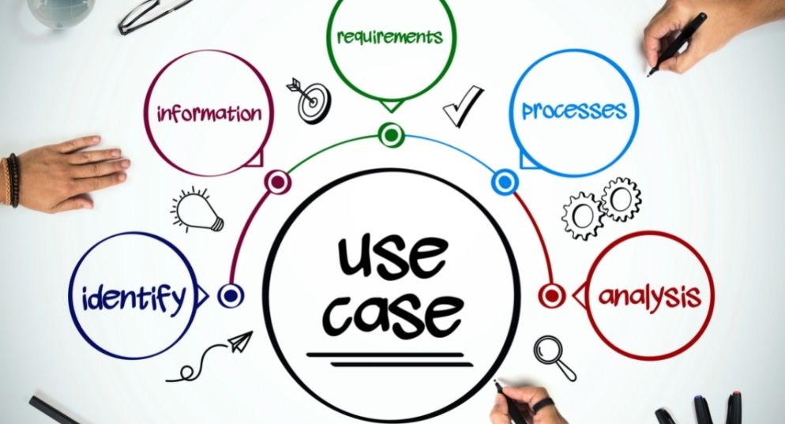

class: center, middle

## [Software Engineering](../../praesentationen.html)

#### Kapitel 8
Simon Fedrau
---

# Inhalt
 ---
 * Use Cases

 * User Stories

---

# Use Cases
***

**Es handelt sich um eine schriftliche Anleitung, die erklärt, wie Benutzer Aufgaben auf Ihrer Website durchführen können**

[1]
---

### Der Unterschied zwischen Systemkontext und Systemgrenze
 ---

| Kriterium       | Systemkontext                                                              | Systemgrenze                                                             |
|-----------------|----------------------------------------------------------------------------|--------------------------------------------------------------------------|
| **Bedeutung**   | Beschreibt, wie ein System mit seiner Umgebung interagiert.                | Definiert die Grenze zwischen dem System und seinem Umfeld.              |
| **Ziele**       | Bestimmt die Funktionalitäten des Systems und die Schnittstellen zu        | Trennt das System von seiner Umgebung, um den Entwicklungsrahmen         |
|                 | externen Systemen.                                                         | klar abzugrenzen und nicht beeinflussbare Umgebungsaspekte               |
|                 |                                                                            | auszuschließen.                                                          |

[7a] [5a]
---
### Szenario
 ---
* Kontextanalyse

* Stakeholder-Analyse

* Anforderungen identifizieren

* Risikobewertung

---

### Spezifikation
***

- Kontextanalyse

- Schnittstellen

- Stakeholder

- Anforderungen

- Use Case Diagramme

---
### User Stories
***

---

### Persona vs Theme vs Epic vs User Story vs Task
***

* **Persona**: Fiktive Darstellung eines typischen Nutzers, hilft, Nutzerbedürfnisse zu verstehen.
    
* **Theme**: Hochrangiges Ziel oder Fokus, das verschiedene Aspekte des Projekts umfasst.
    
* **Epic**: Große, breite Anforderung, die in kleinere Teile aufgeteilt wird, oft über mehrere Sprints hinweg.
    
* **User Story**: Detaillierte Anforderung aus Nutzerperspektive, spezifisch und mit klaren Erfolgskriterien.
    
* **Task**: Konkrete Arbeitsschritte innerhalb einer User Story, sehr spezifisch und ausführungsorientiert.

[9a] [14a]

---

### Functional User Story vs. Technical User Story
 ---
| Aspekt                 | Funktionale User Story                      | Technische User Story                       |
|------------------------|--------------------------------------------|--------------------------------------------|
| **Fokus**              | Auf Benutzerbedürfnisse und -erfahrungen    | Auf technische Implementierung und Lösungen |
| **Zielgruppe**         | Endbenutzer, Geschäftsanalysten, Stakeholder| Entwickler, technische Teams                |
| **Beschreibung**       | Beschreibt, was der Benutzer tun möchte     | Beschreibt, wie etwas technisch umgesetzt wird|

---

### Bestandteile einer User Story
***

1. Rolle (Wer):
  * späterer Nutzer der zu entwickelnden Lösung.

2. Funktion (Was): 
  * Erwartung des späteren Nutzers an die Software.

3. Nutzen (Warum)
  * späterer Mehrwert der zu entwickelnden Lösung.

[10a]

---
### Akzeptanzkriterien mit Beispielen
***
  Sind bestimmte Voraussetzungen, die ein Arbeitsergebnis erfüllen muss, damit es von Kund*innen akzeptiert und abgenommen wird.

  Bsp:
    User Story: "Als Besucher eines Online Shops möchte ich die angebotenen Waren nach Kategorien filtern können, um nicht alle Produkte durchzugucken, sondern will schnell meine Produkte finden."
    
  * Akzeptanzkriterien:
    * Produkte können nach Kategorien wie 'Bekleidung', 'Musik' und 'Wohnen' gefiltert werden.
    * Die Filterung zeigt sofort die relevanten Produkte an.
    * Filtereinstellungen bleiben während der  Browsersession erhalten.

[11a]

---
### Der Unterschied zwischen Ready und Done
***
 ---
| Kriterium      | Definition of Ready                           | Definition of Done      |
|----------------|-------------------------------------------------------|-----------------------------------------------------|
| **Zweck**      | Stellt sicher, dass ein Arbeitspaket startklar ist.   | Definiert, wann ein Arbeitspaket vollendet ist.     |
| **Inhalt**     | Klare Anforderungen, Ressourcenverfügbarkeit,         | Erfüllte Anforderungen, erfolgreiche Tests,         |
|                | Stakeholder-Zustimmung.                               | finale Integration und Dokumentation.              |
| **Wichtigkeit**| Vermeidet Arbeitsbeginn an unzureichend vorbereiteten Aufgaben. | Sichert Qualität und Klarheit über die Fertigstellung von Aufgaben.|                              

---
### Prinzipien für effektive ("gute") User Stories
***
- Spezifisch und Verständlich
- Benutzerzentriert
- Kurz
- Realisierbar
- Testbar
- Wertvoll
- Priorisiert
- Verhandelbar
- Unabhängig

[22a]
---
### Formulierungsfehler, die zu vagen ("schlechten") User Stories führen
***

- Vermeiden von zu großem Umfang
- Klarheit des Problems
- Unabhängigkeit von Anforderungsdokumenten
- Berücksichtigung nicht-funktionaler Anforderungen
- Vermeidung konkreter Lösungswege
---
### Card, Conversation, Confirmation
***

| Three C's         | Beschreibung                                                               |
|-------------------|----------------------------------------------------------------------------|
| **Card**          | - Symbolisiert die User Story selbst.                                      |
|                   | - Dient als Erinnerungshilfe und Übersicht über die Anforderung.           |
|                   | - Beinhaltet grundlegende Informationen wie Titel und kurze Beschreibung.  |
| **Conversation**  | - Bezieht sich auf die Diskussionen um die User Story.                     |
|                   | - Wichtiger Bestandteil für das Verständnis und die Klärung der Details.   |
|                   | - Umfasst Fragen, Antworten und Vereinbarungen zwischen Team und Stakeholdern.|
| **Confirmation**  | - Bestätigung, dass die Anforderungen erfüllt sind.                        |
|                   | - Oft durch Akzeptanzkriterien definiert.                                  |
|                   | - Stellt sicher, dass alle Parteien ein gemeinsames Verständnis haben.     |

[15a]
---
### INVEST-Kriterien
***

---
### User-Stories vs. Use Case
 ---

| Kriterium    | User Stories                                                 | Use Cases                                              |
|--------------|--------------------------------------------------------------|--------------------------------------------------------|
| Format   | Kurz, narrativ; "Als [Rolle], möchte ich [Aktion], um [Nutzen]." | Ausführlicher, detaillierte Systeminteraktionen.       |
| Fokus    | Benutzerzentriert, Wert für Endbenutzer.                     | Funktionalität und Systemabläufe.                      |
| Detailgrad | Weniger detailliert, fokussiert auf "Was" und "Warum".     | Detailliert, spezifische Schritte/Abläufe.             |
| Flexibilität | Anpassbar, offen für Diskussionen.                         | Festgelegt, wenig Änderungsspielraum.                  |
| Einsatz  | In agilen Methoden wie Scrum, Kanban.                        | In traditionellen Ansätzen wie dem Wasserfallmodell.   |
| Ziel     | Schnelle, iterative Entwicklung, Benutzerbedürfnisse.       | Klare Definition von Systemanforderungen und -abläufen. |

[17a]
---
### Was ist Misuse Stories?
***

 Sind kurze narrative Szenarien, die potenzielle Missbrauchs- und Angriffswege in einem Softwaresystem beschreiben. Sie dienen dazu, Sicherheitsrisiken und Schwachstellen zu identifizieren, um präventive Maßnahmen in der Softwareentwicklung zu ergreifen.

[18a]
---
### Was ist Priorisierung?
***

Bestimmt die Reihenfolge, in der Aufgaben, Features oder User Stories bearbeitet werden.

[19a]
---

### Was ist Schätzung?
***

**Bezieht sich die Schätzung auf den Prozess der Bewertung des Aufwands und der Zeit, die benötigt werden, um bestimmte Aufgaben, Features oder User Stories zu implementieren.**

---
### Aspekte der Schätzung
***

* Team-Basiert

* Relative Schätzung

* Planungspoker

* Historische Daten

* Iterative Anpassung

* Transparenz und Kommunikation

[23a]
---
### Story Mapping
***

---
class: center, middle

# Fragen?

---

## Quellen
***

[1a]  : https://www.microtool.de/wissen-online/was-ist-ein-use-case-diagramm/

[2a]  : https://t2informatik.de/wissen-kompakt/use-case-diagramm/

[3a]  : https://chat.openai.com/c/f8ca6995-a5d5-47ff-ba20-c3cb31905501 frage : was sind Formulierungsfehler, die zu vagen ("schlechten") User Stories führen

[4a]  : https://www.usability.gov/how-to-and-tools/methods/use-cases.html.

[5a]  : https://t2informatik.de/wissen-kompakt/systemkontext/.

[6a]  : https://www.fhnw.ch/plattformen/iwi/2020/06/17/homeoffice-und-onlinekonferenzen-4-9-2-3-2-7/.

[7a]  : https://www.microtool.de/wissen-online/was-ist-der-systemkontext/.

[8a]  : https://www.microtool.de/wissen-online/was-ist-ein-use-case-diagramm/.

---
[9a]  : https://www.visual-paradigm.com/scrum/theme-epic-user-story-task/.

[10a] : https://www.brainformatik.com/blog/user-story/

[11a] : https://t2informatik.de/wissen-kompakt/akzeptanzkriterien/.

[12a] : https://www.me-company.de/magazin/akzeptanzkriterien/#:~:text=Akzeptanzkriterien%20sollten%20einfach%20zu%20verstehen,wie%20die%20Kund*innen%20hat.

[13a] :  https://produktwerker.de/herausforderung/gute-user-stories-schreiben-formulieren/#:~:text=Zu%20den%20wichtigsten%20Eigenschaften%20einer,die%20Prinzipien%20des%20Akronyms%20INVEST.

[14a] : https://bbv-software.de/user-stories/.

[15a] : https://blog.seibert-media.net/blog/2011/03/09/user-story-scrum-card-conversation-confirmation/.

[16a] : https://www.visual-paradigm.com/guide/agile-software-development/user-story-vs-use-case/.

[17a] : https://www.software-quality-lab.com/wissen/blog/blogeintrag/user-story-oder-use-case-was-denn-nun/.

[18a] : https://en.wikipedia.org/wiki/Misuse_case#From_use_to_misuse_case

---
[19a] : https://karrierebibel.de/priorisierung/.

[20a] : https://www.it-agile.de/agiles-wissen/agiles-produktmanagement/story-mapping/.

[21a] : https://en.wikipedia.org/wiki/Use_case

[22a] : https://asana.com/de/resources/user-stories#:~:text=Independent%20(Unabh%C3%A4ngig)%3A%20Eine%20User,sie%20l%C3%A4sst%20Spielraum%20f%C3%BCr%20Diskussionen.

[23a] : https://asana.com/de/resources/story-points
---